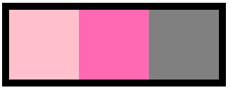
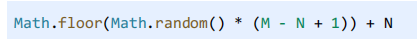

# welcome

<i class="iconfont icon-iconzhucetouxiang"></i>  嗨，是我了，这里是为了成为程序媛而发疯<i class="iconfont icon-avatar1"></i>的四月说，本网站会更新记录我的学习笔记，如果你有什么话想和我说，可以到<i class="iconfont icon-xiaohongshu"></i>上面搜四月说私信即可~

# 基于GitHub搭建个人网站

使用 Docsify 来搭建个人网站非常简单，特别适合用于文档展示或个人博客。下面是一步一步的指南来在 GitHub Pages 上部署 Docsify 网站：

1. **创建 GitHub 仓库**：首先，创建一个 GitHub 仓库，仓库名可以是你的用户名（例如，`<your-username>.github.io`）或者其他名字。这个仓库将用于托管你的网站。

2. **安装 Docsify**：在你的本地开发环境，安装 Docsify CLI（命令行工具），使用以下命令：

   ```
   npm i docsify-cli -g
   ```

3. **初始化 Docsify 项目**：在你的本地文件夹中，创建一个用于存储你的网站内容的目录。进入这个目录，然后运行以下命令来初始化 Docsify 项目：

   ```
   docsify init ./docs
   ```

   这将创建一个 `docs` 目录，其中包含一个 `index.html` 文件和一个 `README.md` 文件。

4. **编辑文档**：将你的文档内容编写在 `docs` 目录中的 Markdown 文件中。你可以创建子目录来组织文档。 Docsify 会自动将这些 Markdown 文件转换为网站页面。

5. **配置 Docsify**（可选）：你可以编辑 `docs/index.html` 文件以自定义网站的外观和配置。你可以设置标题、侧边栏、导航栏等等。

6. **预览你的网站**：在你的项目根目录下运行以下命令来预览你的网站：

   ```
   docsify serve docs
   ```

   这会启动一个本地服务器，并显示你的网站。你可以在浏览器中访问 `http://localhost:3000` 来查看你的网站。

7. **将项目推送到 GitHub**：一旦你满意了你的网站，将整个项目（包括 `docs` 目录）推送到你在步骤1中创建的 GitHub 仓库。

8. **启用 GitHub Pages**：进入你的 GitHub 仓库，点击 "Settings" 选项卡，然后滚动到 "GitHub Pages" 部分。在 "Source" 下拉菜单中，选择 "main branch"（或者你的默认分支），然后点击 "Save"。GitHub Pages 将会自动部署你的网站。

9. **访问你的网站**：一旦 GitHub Pages 部署完成，你可以在浏览器中访问 `https://<your-username>.github.io`（或者你的仓库名）来查看你的 Docsify 网站。

现在，你已经成功地使用 Docsify 搭建了个人网站，并将其部署在 GitHub Pages 上。你可以继续编辑和更新你的文档，并推送到 GitHub 仓库，你的网站会自动更新。

10. **若访问网站报错**：可以检查你的仓库文件列表里面是否有index.html


# Git
## 1.将项目推送到GitHub的步骤

- 1.初始化Git仓库（如果你的项目还没有关联Git仓库）：在你的项目目录中打开终端（命令行界面），运行以下命令来初始化Git仓库：

```powershell
git init
```

- 2.**将文件添加到暂存区**：运行以下命令将所有文件添加到 Git 的暂存区（暂存区是一个临时存储修改的地方）：

```powershell
git add .
```

这会将当前目录下的所有文件和文件夹添加到暂存区。

- 3.**提交到本地仓库**：运行以下命令将暂存区的文件提交到本地 Git 仓库：

```powershell
git commit -m "Initial commit"
```

这个命令会创建一个新的提交，提交信息为 "Initial commit"，你可以根据需要修改提交信息。

- 4.**关联远程 GitHub 仓库**：在 GitHub 上创建了仓库后，将本地 Git 仓库与远程 GitHub 仓库关联。在以下命令中，将 `<your-username>` 替换为你的 GitHub 用户名，`<your-repository>` 替换为你的仓库名：

```powershell
git remote add origin https://github.com/<your-username>/<your-repository>.git
```

- **推送到 GitHub**：运行以下命令将本地仓库的内容推送到 GitHub:

```powershell
git push -u origin main
```

> 如果你使用的是 Git 版本较老的仓库，可能需要将 `main` 替换为 `master`，这取决于你的默认分支名称。可以通过git branch查看本地分支列表以及当前所在的分支。

完成以上步骤后，你的项目就会被推送到 GitHub 仓库中了。在 GitHub 页面上刷新，你应该能够看到你的项目文件和文件夹。请确保你具有推送到仓库的权限。如果你的仓库是 private 的，你可能需要提供 GitHub 的用户名和密码或者使用个人访问令牌进行推送。

## 2.将修改后的代码推送到GitHub的步骤
- 1.添加修改的文件到暂存区：
```powershell
git add .
```
`这将会将所有修改的文件添加到暂存区`。如果你只想添加`特定文件`，可以使用 `git add 文件名 的方式`。
- 2.提交更改：
提交暂存区中的修改到本地仓库，可以使用如下命令：
```powershell
git commit -m "描述你的修改"
```
`将 "描述你的修改" 替换成对你所做修改的简要描述`。
- 3.推送到GitHub:
使用以下命令将本地的提交推送到你在GitHub上的远程仓库：
```powershell
git push origin 分支名
```
  将 "分支名" 替换成你要推送的分支的名称（通常是 main 或 master）。

  如果这是你第一次推送到GitHub，可能需要提供你的GitHub凭证来进行验证。

- 4.查看更新：

  刷新GitHub仓库页面，你应该能够看到刚刚推送的更新。

  现在，你的GitHub仓库应该包含了你所做的最新修改。

# HTML + CSS
## 1.盒模型

> 盒模型分为`标准盒模型和IE盒模型（怪异盒模型）`

- 标准盒模型：
  - width等于content的宽度
  - 总宽度:width+左右padding+左右border+margin左右
- IE盒模型：
  - 宽度width是整个盒子所占的宽度（content宽+左右padding+左右border）
  - 总宽度：width + margin左右
- CSS当中哪个属性可以定义计算一个元素的总宽度和总高度
  - box-sizing
  - 属性值为border-box时为IE盒模型（width 和 height 属性包括内容，内边距和边框，但不包括外边距）
  - 属性值为content-box时为标准盒模型（默认值，标准盒子模型。width 与 height 只包括内容的宽和高）

## 2.包含块

> - 子元素的宽高百分比是参考`包含块`来计算的，`不是参考父元素`：

- 1.如果元素的`position是relative或static（默认值）`，其包含块则是：`离他最近的块容器的内容区域（content area）`；
- 2.如果元素的`position是absolute`,则包含块为离它最近的`position值不为static`的祖先元素的`内边距区域`(加上padding区域)；
- 3.如果元素的`position是fixed,则包含块由视口建立`；
- 包含块不仅仅只是用来计算宽高的百分比，定位的top left 都是按照包含块来计算的；

## 3.BFC

​	BFC是`块级格式化上下文`（Block Formatting Context）的缩写。它是一个`独立的块级渲染区域`，`只有块级盒子参与`，该区域拥有一套渲染规则来约束块级盒子的布局，且与区域外部无关。

- **现象：一个盒子不设置height，当它的子元素都浮动时，无法撑起父元素，父元素没有高度，这个盒子就没有形成BFC**
- 如何给没有形成的盒子创建BFC：
  - 1.float的值不是none；
  - 2.position的值不是static或者relative
  - 3.display的值是inline-block.flex.或者inline-flex
  - 4.`overflow：hidden`【这种方式最好】

```js
<style>
    .father {
      border: 1px solid black;
      /* float: left; */
      /* position: absolute; */
      /* display: inline-block; */
      overflow: hidden;
    }

    .son {
      float: left;
      width: 300px;
      height: 300px;
      background-color: blue;
    }
</style>
<body>
  <div class="father">
    <div class="son"></div>
    <div class="son"></div>
    <div class="son"></div>
  </div>
</body>
```

- BFC的其他作用：
  - 1.`BFC可以取消盒子的margin塌陷`

```js
<style>
    .father {
      width: 200px;
      height: 300px;
      background-color: blueviolet;
    }

    .son {
      width: 100px;
      height: 100px;
      background-color: blue;
      margin-top: 20px; 
      /*我们想要的效果，子元素距离父元素顶部20px，但是实际效果是：子元素会带着父元素一起距离顶部有20px；
      BFC可以解决margin塌陷，所以我们可以让父盒子形成BFC加上overflow: hidden;*/
    }
  </style>
</head>

<body>
  <div class="father">
    <div class="son"></div>
  </div>
</body>
```

- 2.BFC可以阻止元素被浮动元素覆盖

```js
<style>
  .son {
    width: 200px;
    height: 200px;
    background-color: blue;
    float: left;
  }

.son-last {
  width: 200px;
  height: 300px;
  background-color: red;
  overflow: hidden;
  /* 实际情况：因为前面两个son元素设置了浮动，所以会覆盖掉son-last，所以son-last只会露出最下面的100px；
       因为BFC可以阻止元素被浮动元素覆盖，所以可以让被覆盖的盒子形成BFC，加上overflow: hidden; */
}
</style>
</head>

<body>
   <div>
  	<div class="son"></div>
		<div class="son"></div>
		<div class="son-last"></div>
	</div>
</body>
```


## 4.margin合并

- **相邻兄弟元素之间的下外边距和上外边距会合并**;
- **发生场景(块元素且上下结构)** ：
  - 外边距合并的设计初衷是为了` 解决段落之间垂直方向的空隙`，因此`只会发生在垂直方向`，不是水平方向；
  - `只发生在块级元素`；

```html
// d1和d2的外边距会合并，我们想设置两个盒子的外边距为40，但是只有20
<style>
  div {
    width: 200px;
    height: 200px;
  }

  .d1 {
    background-color: pink;
    margin-bottom: 20px;
  }

  .d2 {
    background-color: hotpink;
    margin-top: 20px;
  }
</style>
</head>

<body>
  <div class="d1"></div>
  <div class="d2"></div>
</body>
```

- 外边距计算：
  - 正数&&正数：取最大的数；50 20 取50
  - 负数&&负数：取绝对值最大的数；-50 -30 取-50
  - 正数&&负数：取相加的和；-50 30 取-20
- 解决方式：只给其中一个盒子设置margin即可；

## 5.margin塌陷

- 1.父子关系，`子元素设置了margin-top，但是看起来像是被父元素“抢走了”，就是父元素带着子元素一起往下移动了`；
- 解决方法：取消子级margin，**给父盒子加padding .border-top或形成BFC**
  - 现在父元素只有内容，没有任何边界，可以给父元素设置padding或者border，但是这样改变了盒子的大小，不建议；
  - 让盒子形成BFC：overflow：hidden；触发BFC

```html
<style>
  .father {
    width: 200px;
    height: 300px;
    background-color: gray;
    /* 触发BFC */
    overflow：hidden；
  }

  div div {
    width: 100px;
    height: 100px;
  }

  .son1 {
    background-color: pink;
    margin-bottom: 50px;
    margin-top: 30px;
  }

  .son2 {
    background-color: hotpink;
  }
</style>

<body>
  <div class="father">
    <div class="son1"></div>
    <div class="son2"></div>
  </div>
</body>
```

- 2.平时若给子元素设置了高度可以撑开未设置高度的父元素，但是**子元素如果设置了float元素之后就会导致未设置高度的父元素消失**

```html
<style>
  .father {
    border: 10px solid #000;
    width: 300px;
    background-color: gray;
  }

  div div {
    float: left;
    width: 100px;
    height: 100px;
  }

  .son1 {
    background-color: pink;
  }

  .son2 {
    background-color: hotpink;
  }
</style>
<body>
  <div class="father">
    <div class="son1"></div>
    <div class="son2"></div>
  </div>
</body>
```

- 解决方式：1).父盒子形成BFC：overflow：hidden；触发BFC

  ​			    2).清除浮动：双伪元素法
```html
<style>
    .father {
      border: 10px solid #000;
      width: 300px;
      background-color: gray;
      /* overflow: hidden; */
    }

    /* 父盒子清除浮动 */
    .clearfix::before,
    .clearfix::after {
      content: '';
      display: block;
    }

    .clearfix::after {
      clear: both;
    }

    div div {
      float: left;
      width: 100px;
      height: 100px;
    }

    .son1 {
      background-color: pink;
    }

    .son2 {
      background-color: hotpink;
    }
</style>
<body>
  <div class="father clearfix">
    <div class="son1"></div>
    <div class="son2"></div>
  </div>
</body>
```

## 6.flex布局

- 弹性布局，任何一个容器都可以指定为flex布局
- 当父盒子设为flex布局以后，资源的float.clear.和vertical-align属性将失效
- 采用flex布局的元素称为flex容器，所有子元素自动称为容器成员，成为flex项目，简称项目

> 通过给父盒子添加flex属性，来控制子盒子的位置和排列方式

- **1：父项常见属性**

  - **flex-direction**：设置主轴(一般可以理解为X轴)的方向，属性值：
    - row：默认值 从左到右
    - column：从上到下
    - row-reverse：从右到左
    - column-reverse：从下到上


  - **justify-content：设置主轴上的子元素排列方式**
    - `flex-start：默认值从头部开始 如果主轴是x轴，则从左到右`
    - flex-end：从尾部开始排列
    - `center：在主轴居中对齐 (如果主轴是x轴则 水平居中）`
    - ``space-around：平分剩余空间`
    - `space-between：先两边贴边 再平分剩余空间 (重要)`
    - `space-evenly`：项目会平均地分布在行里，包括两端的间距。


  - **flex-wrap：设置子元素是否换行：wrap换行，nowrap不换行**
  - align-content：设置侧轴(一般可以理解为Y轴，交叉轴)上的子元素的排列方式（特指多行，单行情况下无效）
    - flex-start：多行在弹性容器的交叉轴的起始位置对齐。
    - flex-end：在侧轴的尾部开始排列
    - `center：在侧轴中间显示`
    - space-around：子项在侧轴平分剩余空间
    - space-between：子项在侧轴先分布在两头，再平分剩余空间
    - stretch：设置子项元素高度平分父元素高度


  - **align-items**：设置侧轴上的子元素排列方式（单行）:
    - `flex-start`：项目在交叉轴的起始位置对齐。
    - `flex-end`：项目在交叉轴的末尾位置对齐。
    - `center`：项目在交叉轴的中间位置对齐。
    - `baseline`：项目以基线对齐。
    - `stretch`：项目被拉伸以适应容器。

  > 单行找align-items 多行找align-content；

  - flex-flow：复合属性，相当于同时设置了flex-direction和flex-wrap

- **2：felx布局子项常见属性**

  - flex：定义子项目分配剩余空间，用flex来表示占多少份数。
  - align-slef：控制**子项自己**在侧轴的排列方式，align-self 属性允许单个项目有与其他项目不一样的对齐方式，可覆盖 align-items 属性。
    默认值为 auto，表示继承父元素的 align-items 属性，如没有父元素，则等同于 stretch。
  - order属性定义子项的排列顺序（前后顺序），数值越小，排列越靠前，默认为0.


## 7.圣杯布局

​	圣杯布局是一种网页布局技术，通常用于创建具有三个主要部分的网页布局：一个`固定宽度的左边和右边列`，以及`中间主要内容的自适应列`。主要内容区域会自动占据剩余的可用空间，使其在不同屏幕尺寸下能够自适应宽度。常见场景：搜索框

```css
.container {
  display: flex;
}

.main {
  flex: 1; // 剩下的空间独占
  height: 300px;
  background-color: green;
  margin-left: 20px;
  margin-right: 20px;
}

.left {
  width: 100px;
  height: 300px;
  background-color: red;
  order: -1 // order 属性控制在布局中的顺序，因为圣杯布局的html解构必须要保证main区域在第一位
}

.right {
  width: 200px;
  height: 300px;
  background-color: blue;
  order: 1
}

<body>
  <div class="container">
    <div class="main"></div>
    <div class="left"></div>
    <div class="right"></div>
  </div>
</body>
```

## 8.定位

- 相对定位relative：`不脱标，会占位，标签显示模式特点不变`；
- 绝对定位absolute：`脱标，不占位，标签显示模式改变，设置宽高生效（具备行内块元素的特点）；参照物找离自己最近的已经定位的祖先元素`；

```html
// 定位居中：子绝父相，子元素设置左，上移动50%，然后水平.垂直偏移50%；
<style>
  .fa {
    position: relative;
    border: 1px solid #000;
    width: 200px;
    height: 200px;
  }

  .son {
    position: absolute;
    width: 100px;
    height: 100px;
    top: 50%;
    left: 50%;
    transform: translate(-50%, -50%);
    background-color: pink;
  }
</style>

<body>
  <div class="fa">
    <div class="son"></div>
  </div>
</body>
```


## 9.透明度opacity

- background：rgba只能让背景变透明，opacity: 0.5;可以设置整个元素的透明度（包含背景和内容）

## 10.移动端适配问题
- rem（rem 单位的意思是“根元素的字体大小”）

  - rem是相对于html的字体大小
    比如，根元素设置的font-size:12px; 非根元素设置width:2rem, 则转换成px就是24px;

    优势：可以通过修改html的文字大小来改变页面中元素的大小，**可以整体控制**

- media媒体查询(CSS3新语法)，media + rem

```html
// 通过媒体查询做移动端适配 用rem非常适合
<style>
  /* 默认样式 */
  p {
    font-size: 2rem;
  }

  /* 当屏幕宽度小于600px时应用以下样式 */
  @media (max-width: 600px) {
    p {
      font-size: 1rem;
    }
  }
</style>
```

- vm：`vm` 是一种相对长度单位，通常用于前端开发中的 CSS 样式。它表示视窗（viewport）的百分比，并根据视窗的大小进行计算。`1vm` 等于视窗宽度或高度的 1%。这意味着，如果你设置一个元素的宽度或高度为 `10vm`，它将占据视窗宽度的 10%（或高度的 10%）的空间，无论视窗的实际尺寸如何。
- media + vm

```html
<style>
/* 当视窗宽度小于 600px 时，文本大小为视窗宽度的 5% */
@media (max-width: 600px) {
  p {
    font-size: 5vw;
  }
}
</style>
```

## 

## 11.CSS练习题
### 11.1 css 动画 从左到右 时间2S
```css
div {
  position: relative;
  width: 100px;
  height: 100px;
  background-color: red;
  animation: move 2s linear;
}

@keyframes move {
  0% {
    left: 0px;
  }

  100% {
    /* calc(100% - 100px)，表示元素相对于父容器的左边距离是父容器宽度减去元素宽度。这样就可以实现从左到右的动画效果 */
    left: calc(100% - 100px);
  }
}
```
> 在CSS中，如果要应用动画效果，元素的定位必须是相对的，绝对的或固定的，而不能是静态的。这是因为动画本质上是基于元素的位置变化，而静态定位是不会引起元素位置的改变的。当你将元素的定位设置为相对定位时，它会在文档流中保留自己的空间，并可以使用 top.right.bottom 和 left 属性来调整其位置。因此，在你的代码中，当你给div元素设置了position: relative;时，它才能够响应left属性的变化，从而实现动画效果。这个属性告诉浏览器该元素的位置是相对于它在文档流中的初始位置而言的。

### 11.2 实现0.5px的细线
```css
<style>
  p {
    border-bottom: 1px solid #000;
    transform: scale(1, 0.5)
  }
</style>
<body>
  <p></p>
</body>
```

# JS基础
- 变量、常量、数据类型、类型转换、运算符、语句、数组、函数、对象

## 1.JS介绍

### 1.1 JS组成
  JS是运行在客户端（浏览器）的编程语言，由ESCMscript、web APIS（BOM、DOM）组成；

    - `ES规定了js基础语法核心知识`，比如变量、分支语句、循环语句、对象等等；
    - DOM是文档对象模型，是`浏览器提供用来操作网页内容的`，可以开发网页内容特效和实现用户交互
    - DOM对象：浏览器根据html标签生成的JS对象，DOM的核心就是把网页内容当做对象来处理；
    - BOM是浏览器对象模型，定义了一套操作浏览器窗口的API；

### 1.2 预编译

```js
// 作用域的创建阶段 就是预编译的阶段
// 预编译的时候做了哪些事情：
// 函数作用域创建阶段：js的变量对象(AO对象) 供JS引擎自己去访问

/*  1、创建ao对象 
    2、找形参和变量的声明 作为AO对象的属性名 值是undefined
    3、实参和形参相统一 
    4、找函数声明 若函数声明和变量声明的名称一致 会覆盖变量的声明 
*/

function fn(a, c) {
  console.log(a) // function a() { }
  var a = 123
  console.log(a) // 123
  console.log(c) // function c() { }
  function a() { } // 函数声明
  if (false) {
    var d = 678
    }
  console.log(d) // undefined
  console.log(b) // undefined
  var b = function () { } // 函数表达式
  console.log(b) // function () {}
  function c() { } // 函数声明
  console.log(c) // function c() { }
}

fn(1, 2)
/* AO:{
      a:undefined 1 function a() { }
      c:undefined 2 function c() { }
      d:undefined
      b:undefined
  } 

  预编译结束 JS的解释执行 逐行执行
*/
```

## 2.数据类型

- 基本数据类型：**Number、String 、 Boolean、 Undefined 、Null、  Symbol**(ES6新增，表示唯一且不可变的值，通常用于对象属性的键)
- 复杂数据类型：**Object**，**Map 和 Set**：是 ES6 引入的数据结构，用于存储键值对（Map）或唯一值（Set）


- `基本数据类型存在在栈中`，变量名和值都在栈中，`复杂数据类型的变量名存储在栈中，值存储在堆中，变量名保留了值这个对象在堆当中地址的引用`
- null和undefined的区别：undefined表示没有赋值，null表示赋值了，但是内容为空；

## 3.隐式转换

规则：

1、`+号两边只要有一个是字符串，都会把另外一个转成字符串` ；

2、`除了+以外的算术运算符，都会把数据转成数字类型`；

3、`空数组在进行类型转换时，会被转换为一个空字符串 ""，空对象在进行类型转换时，会被转换为字符串类型的值"[object Object]"`；

小技巧：`+号作为正号解析可以转换成数字型、任何数据和字符串相加结果都是字符串`


> 表单 prompt取过来的值都是字符串型，此时无法直接简单的进行数字运算，需要做类型转换；let age = prompt('请输入你的年龄：')，如果输入21，age=’21’，此时我们可以在prompt前面加上加号'+'，就可以隐式转换为数字类型了.


- 腾讯2018年前端笔试题


## 4.显示转换

- 转为数字型Number（数据）：
  - 如果数据里面有非数字，转换失败时结果为NaN；
- ParseInt(数据)：只保留整数
- ParseFloat(数据)：可以保留小数
- 转为字符型：String(数据) or 变量.toString()

## 5.运算符
> 除了false、0、’’、undefined、null、NaN的值为false，其他都为true；

  三元运算符：条件？满足条件执行的代码 ：不满足条件执行的代码


## 6.语句

- 表达式是可以被求值的代码，语句是一段可以执行的代码
- 语句分为分支和循环语句，分支有单分支 双分支 和多分支语句

## 7.循环语句

- if和switch的共同点和区别：都能实现多分支选择，但switch语句一般用于等值判断，if适合于区间判断；

switch语句进行判断后直接执行到程序的语句效率很高。当分支比较多用switch效率高；

- while循环就是在满足条件期间重复执行代码块；
  - **while循环需要三大要素：变量起始值、终止条件、变量变化量（自增或自减）**
- for循环：作用也是重复执行代码，如果**明确了循环的次数**推荐用for循环；一般用于循环数组
  - **for（变量起始值；终止条件；变量变化量）**

- 当**不明确循环次数**的时候用while循环；

## break和continue和return的区别

- break：退出整个循环，一般用于结果已经得到，后续的循环不需要的时候；
- continue：退出本次循环，继续下次循环，一般用于排除或者跳过某一个选项的时候；

## 8.索引

  索引是指对数据结构中元素的快速访问机制，它允许你通过指定位置或者标识符来获取或操作元素，不需要遍历整个数据结构。索引在很多数据结构中都存在（数组，字符串，队列，堆，哈希表），并且提供了一种高效访问元素的方式。

## 9.数组基础


## 10.对象基础
- 遍历对象用for in，for k in obj，k是对象的属性，获得对象的属性值是obj[k]
- 内置对象Math


- 如何生成N~M的随机整数



### 10.1 random练习题：获取20~50随机数

```js
//  Math.random() [0, 1)] 
function getNumber() {
   console.log(Math.random() * 30 + 20)
 }
getNumber()

// Math.round() 用于将一个数字四舍五入到最接近的整数
function randomNumber(min, max) {
  const range = max - min
  return Math.round(Math.random() * range + min)
}

randomNumber(20, 50)
```

## 11.数组练习题

### 11.1 手写实现数组map和数组filter

> 主要区别总结：

- `map` 用于对数组中的每个元素进行操作，并返回一个新数组，长度与原数组相同。
- `filter` 用于根据条件筛选数组中的元素，并返回一个新数组，长度可能不同于原数组，取决于满足条件的元素数量。
- `map` **负责转换数组元素**，`filter` **负责筛选数组元素**。


```js
const arr = [1, 2, 3]
console.log(arr.map(v => v + 1))
// 1、手写map函数
// 1.1、传入的是一个回调函数
// 1.2、会返回一个新的数组
// 调用者是一个数组 返回一个新的数组
Array.prototype.myMap = function (fn) {
  var newArr = []
  // this指向的就是调用者 
  for (var i = 0; i < this.length; i++) {

    newArr.push(fn(this[i]))
  }
  return newArr
}
console.log(arr.myMap(v => v + 1));
```

```js
// 2、手写filter方法，
// 2.1、传入的是一个回调函数
// 2.2、调用者是数组  返回一个新数组
Array.prototype.myFilter = function (fn) {
  let arr1 = []
  for (let i = 0; i < this.length; i++) {
    if (fn(this[i])) {
      arr1.push(this[i])
    }
  }
  return arr1
}
console.log(arr.myFilter(v => v > 2))
```

### 11.2 数组的reduce方法

```js
// reduce方法用于将数组中的所有元素按照指定的回调函数进行累积操作，最终返回一个单一的值。这个方法通常用于计算或累积数组中的值
arr.reduce(function(pre,cur,index,arr){
  ...
},init)

// arr表示操作的数组；pre表示上一次调用回调函数时的返回值，或者初始值init，如果没有初始值，那么pre的值就是数组的第一项。cur表示当前正在处理的数组元素。index(可选)表示当前正在处理的数组元素的索引，若提供init值，则索引为0，否则索引为1；init表示初始值。arr（可选）表示操作的数组；

// 应用1：将二维数组转化为一维数组
let arr = [[0, 1], [2, 3], [4, 5]]
let newArr = arr.reduce((pre, cur)=> {
  return pre.concat(cur)
}, []) 

// 应用2：将多维数组转化为一维数组
let arr = [[0, 1], [2, 3], [4, [5, 6, 7]]] 
let newArr = function(arr) {
  return arr.reduce((pre, cur) => {
   	return pre.concat(Array.isArray(cur) ? newArr(cur) : cur)
	}, [])
}

// 对象里的属性求和
var result = [
  {
    object: 'math',
    score: 10
  },
  {
    object: 'chinese',
    score: 80
  },
  {
    object: 'english',
    score: 20
  }
]

function getSum(arr) {
  return arr.reduce((pre, cur) => {
    // console.log(pre, cur.score);
    return pre += cur.score
  }, 0)
}
```

### 11.3 字符串中哪个字符出现次数最多，次数是多少

```js
let str = 'aaaaaaaccrrrr'
// reduce方法：pre用于存储中间计算结果，cur是当前处理的数组元素
// pre的初始值设置为一个空对象{}，最后返回pre；
function getNum(str) {
  let strArr = str.split('')
  return strArr.reduce((pre, cur) => {
    if (cur in pre) {
      pre[cur]++
    } else {
      pre[cur] = 1
    } 
    return pre
  }, {})
}
console.log(getNum(str)) // {a: 7, c: 2, r: 4}
let obj = getNum(str)
let maxStr = null
let max = 0
for (let key in obj) {
  if (max < obj[key]) {
    max = obj[key]
    maxStr = key
  }
}
console.log(`出现次数最多的是${maxStr},一共出现了${max}次`) 
// 出现次数最多的是a,一共出现了7次
```

### 11.3 数组的includes方法

> 用于检查数组是否包含特定的元素，并返回一个布尔值，指示是否包含。如果数组中包含指定的元素，该方法返回 true，否则返回 false。

- 语法：array.includes(searchElement, fromIndex)
  - searchElement 是要查找的元素。
  - fromIndex 是可选的，表示从数组的哪个索引开始搜索。如果省略 fromIndex，则默认从数组的第一个元素(索引为0)开始搜索。

  ```js
  const fruits = ["apple", "banana", "cherry", "date"];

  console.log(fruits.includes("banana")); // true
  console.log(fruits.includes("grape"));  // false
  console.log(fruits.includes("cherry", 2)); // true  从索引2开始搜索"cherry"
  ```

#### 11.3.1 使用includes优化代码
```js
const fruits = ["apple", "banana", "cherry", "date"];

console.log(fruits.includes("banana")); // true
console.log(fruits.includes("grape"));  // false
console.log(fruits.includes("cherry", 2)); // true  从索引2开始搜索"cherry"

function printAnimals(animal) {
  if(animal === 'dog' || animal === 'cat') {
    console.log(` I have a ${animal}`)
  }
}
printAnimals('dog')

// 上述代码改写 includes可以代替上面大量的或操作
function printAnimals(animal) {
  const animals = ['dog', 'cat', 'hamster']
  if (animals.includes(animal)) {
    console.log(`I have a ${animal}`)
  }
}
printAnimals('dog')
```

#### 11.3.2 网易面试题目【提前退出/返回】

```js
// 优化以下代码
function printAnimalsDetails(animal) {
  var result = null
  if(animal) {
    if(animal.type) {
      if(animal.name) {
        if(animal.gender) {
          result = `${animal.name} is a ${animal.gender} - ${animal.type}`
        } else {
          result = 'no animal gender'
        }
      } else {
        result = 'no animal name'
      }
    } else {
      result = 'no animal type'
    }
  } else {
    result = 'no animal'
  }
  return result
}
```

```js
// 优化后
// 考点：提前退出 和 提前返回 
  // ({type, name, gender} = {}) 这部分代码是一个ES6的解构赋值语法，用于函数的参数默认值和解构赋值。
    const printAnimalsDetails = ({type, name, gender} = {}) => {
      if(!type && !name && !gender) return 'no animal'
      if (!type) return 'no animal type'
      if (!name) return 'no animal name'
      if (!gender) return 'no animal gender'

      // 如果走到这一行 说明这个动物有类型 名字和性别
      return `${name} is a ${gender} - ${type}`
    }

    console.log(printAnimalsDetails({name: 'mike'}))
```

## 11.4 数组去重
### 11.4.1 展开运算符+Set

```js
const arr = [1, 1, 2, 4, 4, 5, 5, 6]
// 容易想到的方式
const arr1 = Array.from(new Set(arr)) // [1, 2, 4, 5, 6]
const arr2 = [...new Set(arr)] // [1, 2, 4, 5, 6]
```

### 11.4.2 双重for循环

```js
// 基本思路：在外部循环中遍历数组的元素，并在内部循环中检查是否有重复的元素，如果有则将其移除
function unique(arr) {
  for (var i = 0, len = arr.length; i < len; i++) {
    for (var j = i + 1, len = arr.length; j < len; j++) {
      if (arr[i] === arr[j]) {
        arr.splice(j, 1)
        j--
        len--
      }
    }
  }
  return arr
}
console.log(unique(arr))
```

### 11.4.3 indexOf

```js
// indexOf：用于在数组中查找指定元素的索引。它接受两个参数：要查找的元素和可选的起始位置。默认从数组的起始位置开始向后查找，找到第一个匹配的元素并返回其索引值。如果数组中不存在该元素，则返回 -1。
const arr = [1, 1, 2, 4, 4, 5, 5, 6]
    console.log(arr.indexOf(4, 0)); // 3
    console.log(arr.indexOf(4, 1)); // 3
    console.log(arr.indexOf(4, 2)); // 3
    console.log(arr.indexOf(4, 3)); // 3 
    console.log(arr.indexOf(4, 4)); // 4
    console.log(arr.indexOf(4, 5)); // -1
    console.log(arr.indexOf(4, 6)); // -1
    console.log(arr.indexOf(4, 7)); // -1

function unique(arr) {
  let arr1 = []
  for (var i = 0; i < arr.length; i++) {
    if (arr1.indexOf(arr[i]) === -1) {
      arr1.push(arr[i])
    }
  }
  return arr1
}
console.log(unique(arr))
```

### 11.4.4 includes
```js
// includes：它用于检查数组或字符串中是否包含指定的元素或子字符串，并返回一个布尔值。
function unique(arr) {
  let arr1 = []
  for (var i = 0; i < arr.length; i++) {
    if (!arr1.includes(arr[i])) {
      arr1.push(arr[i])
    }
  }
  return arr1
}
console.log(unique(arr))
```

### 11.4.5 reduce
```js
// filter是筛选数组内的元素，返回一个新数组；这里是通过比较每个元素的索引值和第一次出现的位置来筛选唯一的元素
function unique(arr) {
  return arr.reduce((pre, cur) => {
    if (!pre.includes(cur)) {
      return pre.concat(cur)
    }
    return pre
  }, [])
}
```

### 11.4.6 ES6新增数组方法 Array.some和Array.every
- `every` 方法用于检测数组中的所有元素是否满足指定的条件，如果所有元素都满足条件，则返回 `true`，否则返回 `false`
```js
// 手写every：1、传入的是一个回调函数。2、调用者是一个数组；3、返回的是一个布尔值
const fruits = [
  {name: 'apple', color: 'red'},
  {name: 'grape', color: 'green'}
]
const fruits2 = [
  {name: 'apple', color: 'red'},
  {name: 'strawberry', color: 'red'}
]
Array.prototype.myEvery = function (fn) {
  for (let i = 0; i < this.length; i++) {
    if (!fn(this[i])) {
      return false
    }
  }
  return true
}

console.log(fruits.myEvery(v => v.color === 'red')) // false
console.log(fruits2.myEvery(v => v.color === 'red')) // rue
```

- `some` 方法是数组的内置方法之一，用于检测数组中是否至少有一个元素满足指定的条件。如果存在满足条件的元素，则返回 `true`，否则返回 `false`
```js
// `some` 方法是数组的内置方法之一，用于检测数组中是否至少有一个元素满足指定的条件。如果存在满足条件的元素，则返回 `true`，否则返回 `false`
const arr = [1, 2, 3, 4]
Array.prototype.mySome = function (callback) {
  for (let i = 0; i < this.length; i++) {
    if (callback(this[i])) {
      return true
    }
  }
  return false
}
console.log(arr.mySome(v => v === 1)) // true
console.log(arr.mySome(v => v === 5)) // false
```

## 11.5 封装判断复杂数据类型
因为 JavaScript 中的 typeof 运算符在判断对象类型时并不准确。例如，对于数组、日期对象等特殊类型的对象，`typeof` 会返回 "object"，而无法进一步区分其具体类型。

`Object.prototype.toString.call` 这个表达式是用来获取一个对象的类型的标准方法。它的作用是返回一个以 "[object 类型]" 的字符串形式表示对象的类型。


>  Object.prototype.toString.call(obj)调用的是原型链顶端的toString，相当于是用Object原型上的toString方法作用在传入的obj的上下文中（通过call将this指向obj）；我们知道数组本身也有toString()方法，那我们为什么非要用Object顶端的toString方法，又为什么要用call呢？
```js
// 我们再来看一下toString()方法:此方法是将传入的数据类型转换成字符串输出（null和undefined除外）
var num = 666
num.toString() // '666'

var str = 'hello'
str.toString() // 'hello'

var bool = true
bool.toString() // 'true'

var arr = [1, 2, 3]
arr.toString()  // '1,2,3'

var obj = {age: 18}
obj.toString()  // '[object Object]'

var fn = function(){}
fn.toString()  // 'function(){}'

null.toString()  // Cannot read property 'toString' of null

undefined.toString() // Cannot read property 'toString' of undefined
```
```js
// 我们再看一下Object对象以及其原型上的toString方法，第一个返回的是一个函数，第二个返回的是值类型。
Object.toString()  //"function Object() { [native code] }"
Object.prototype.toString() //"[object Object]"
```
接下来让我们看一个表格：


> 这就是各种数据类型用 tostring()方法的返回值。由此我们看出不同数据类型都有其 tostring()方法,所以上述 tostring()方法来自于 Number、 string、 Boolean等等这些类。
> 我们又知道,在 Javascrip中,所有类都继承于Object，因此tostring()方法应该也继承了,但由上述可见事实并不是我们想的这样。其实各数据类型使用 tostring()后结果表现不一样的原因在于:所有类在承Object的时候,改写了 tostring()方法。 Object 原型上的方法是可以输出数据类型的,因比我们判断数据类型时,也只能使用原始方法。从而有了此方法: Object.prototype.toString.call(obj).

> 通过使用 call 方法，我们能够在指定的对象上调用 toString 方法，而不是全局上的 toString 方法，从而获取正确的类型信息

```js
  function getType(state) {
    if (typeof state !== "object") {
      return typeof state
    } else {
      /*这边可能有人用instanceof，它是一个运算符,最常用的运算就是来检测构造函数的 prototype 属性是否在对象的原型链上。如果是，instanceof 返回 true，否则返回 false.
      你可以理解为 instanceof 运算符用来检查一个对象是否在另一个对象的原型链上。具体来说，它检查一个对象是否是特定构造函数的实例，这个构造函数的 prototype 属性是否在对象的原型链中。如果是的话，instanceof 返回 true，否则返回 false。
      但是对象的constructor和__proto__都可以修改，所以用instanceof来判断不准确；*/
      if (Object.prototype.toString.call(state) === '[object Array]') return 'array'
      if (Object.prototype.toString.call(state) === '[object Object]') return 'object'
    }
  }
  console.log(getType({})); // object
  console.log(getType([])); // array
```

## 11.6 求未知参数的和
```js
// 写一个函数，计算传入参数的和（参数的个数是未知的）
// ...args 表示不定数量的参数,这些参数都会被收集到一个名为 args 的数组中
function getSum(...args) {
  console.log(args) // [6, 2, 3, 5]
  let sum = 0
  for (var i = 0; i < args.length; i++) {
    sum += Number(args[i])
  }
  return sum
}
console.log(getSum(6, 2, 3, 5)) // 16

/*
  * Array.prototype.slice.call() 是一个比较古老的方法，它需要调用数组原型上的 slice 方法，并传递类数组对象作为 this。相对来说，它的语法相对复杂，而且不太直观。
  * Array.from() 是 (ES6) 引入的一个新方法，用于将可迭代对象或类数组对象转换为数组。它的语法更加简洁明了
  * 总的来说，推荐使用 Array.from()，因为它更容易理解和使用.如果你需要兼容较旧的浏览器，你可能会继续使用 Array.prototype.slice.call()，但现代项目通常都不再需要考虑这个问题。
*/
function getSum() {
  // let arr = Array.from(arguments)
  let arr = Array.prototype.slice.call(arguments)
  let sum = 0
  for (var i = 0; i < arr.length; i++) {
    sum += Number(arr[i])
  }
  return sum
}
console.log(getSum(6, 2, 3, 5)) 
```
## 11.7 翻转一个字符串
```js
// 1.循环
const str = 'I love China'
const res = []
for (let i = str.length - 1; i >= 0; i--) {
  res.push(str[i])
}
console.log(res.join(''))

// 2.利用数组
const str = '123'
console.log(str.split('').reverse().join(''))
console.log(...str); // 1 2 3
console.log([...str].reverse().join(''))
// Array.from()接受一个可迭代的对象或类数组对象，返回一个新的数组，该数组包含对象的所有元素
console.log(Array.from(str)) // ['1', '2', '3']
console.log(Array.from(str).reverse().join(''))
```

## 11.8 找出任意html中的所有不重复的html标签
- 思路：先找出来 然后不重复
```js
const allTags = [...document.querySelectorAll('*')].map(v => v.tagName)
console.log(...(new Set(allTags)))
// Array.prototype.slice.call方法可以把伪数组转为真数组 是ES5方法  Array.from也可以转,是ES6的方法
console.log(...new Set(Array.prototype.slice.call(document.querySelectorAll('*')).map(v => v.tagName))
  );
```

## 11.9 cookies, sessionStorage和localStorage的区别

**都是用于在浏览器端存储数据的三种不同机制**：

- 1、**数据发送：**
  - cookie是网站为了标识用户身份而储存在用户本地终端（Client Side）上的数据（通常经过加密）
  - cookie`每次HTTP请求都会自动携带相应的Cookies数据`，发送给服务器。这使得Cookies适合用于在客户端和服务器之间`传递数据`。
  - sessionStorage和localStorage：`数据仅在浏览器端存储`，不会自动发送给服务器。这使得它们更`适合用于在客户端保留本地数据`，供JavaScript代码使用。
- 2、**存储大小：**
  - `cookie数据大小不能超过4K`
  - `sessionStorage和localStorage`也有存储大小的限制，但比cookie大的多，可以达到`5M`或更大；
- 3、**有期时间（生命周期）：**
  - `sessionStorage`数据在当前`浏览器窗口关闭后自动删除`；
  - `localStorage存储持久数据，浏览器关闭后数据不丢失除非主动删除数据`；
  - cookie`设置的cookie过期时间之前一直有效`，即使窗口或者浏览器关闭；如果`不设置过期时间`，那么Cookie将成为会话Cookie，`仅在当前会话期间有效，当浏览器关闭时会被删除`。

# web APIS
- 获取DOM对象、操作元素内容/属性、定时器-间歇函数、事件类型/对象、this、回调函数、事件流、事件委托、日期对象、节点操作、window对象、本地存储、正则表达式

> web APIS由BOM、DOM组成：

- DOM是文档对象模型，是`浏览器提供用来操作网页内容的`，可以开发网页内容特效和实现用户交互
- DOM对象：浏览器根据html标签生成的JS对象，DOM的核心就是把网页内容当做对象来处理；
- BOM是浏览器对象模型，定义了一套操作浏览器窗口的API；


## 1.DOM

- 获取DOM对象：根据CSS选择器来获取：选择匹配的第一个元素：`document.querySelector('CSS选择器')`
- 选择匹配的多个元素：`document.querySelectorAll('CSS选择器')`
- 包含一个或多个有效的CSS选择器字符串：`document.querySelectorAll('ul li')`
- 以上得到的都是一个`伪数组`

## 2.操作元素内容
- 如果想要修改标签元素的里面的`内容`，则可以使用如下几种方式 ：
  - 对象.innerText属性
  - 对象.innerHTML属性

innerText：文本中包含的标签不会被解析；
```js
info.innerText = `hello, 我是<strong>刘亦菲</strong>`
// 刘亦菲不会加粗
```

innerHTML：文本中包含的标签会被解析；
```js
info.innerHTML = `hello, 我是<strong>刘亦菲</strong>`
// 刘亦菲会加粗
```

## 3.操作元素样式

- 1、通过style属性操作CSS
  - 标签自带默认属性不需要添加style，不是默认属性都需要通过点.style加样式名来添加；比如img标签自带src属性，修改的时候就不需要加style了；

  ```js
  const box = document.querySelector('.box')
  // 修改元素样式
  box.style.backgroundColor = 'pink'
  box.style.width = '200px'
  ```
- 2、通过类名（className）操作CSS
    > 2.1 由于class是关键字，所以使用className代替
    > 2.2 className是使用新值换旧值，如果需要添加一个类，需要保留之前的类名

- 3、通过classList操作类控制CSS
  > 为了解决className容易覆盖以前的类名，我们可以通过classList方式追加和删除类名
  - 追加类语法：元素.classList.add('类名')
  - 删除类语法：元素.classList.remove('类名')
  - 切换类语法：元素.classList.toggle('类名')

## 4.自定义属性
- 在html5中推出了专门的`data-自定义属性`
- 在`标签上一律以data-开头`
- 在DOM对象上一律以`dataset对象方式获取`

```html
<div class="box" data-id="10">盒子</div>
```
```js
const box = document.querySelector('.box')
console.log(box.dataset.id) // 10

//若我们给标签添加了多个自定义属性，通过box.dataset会打印出自定义属性的集合，
// 是一个对象，所以我们访问其中一个属性的时候用对象.属性名获取，比如：box.dataset.spm

<div data-id="10" data-spm="不知道">1</div>
```

## 5.间歇函数

- 间隔固定的时间自动重复执行另一个函数，也叫定时器函数【可以开启和关闭】


## 6.延迟函数


## 7.this指向

- 环境对象指的是函数内部特殊的变量this，它代表着当前函数运行时所处的环境；


- 普通函数下this不受函数定义的环境影响，而是`取决于函数被谁调用`
- 箭头函数下的this取决于定义环境 

```js
// 函数直接使用
    function get(content) {
      console.log(content)
    }
    get('你好')
    get.call(window, '你好')
  
// 函数作为对象的方法被调用（谁调用我 我就指向谁）
    var person = {
      name: '张三',
      run: function (time) {
        console.log(`${this.name}在跑步, 已经跑了${time}分钟`);
      }
    }
    person.run(30)
    person.run.call(person, 30)

    // 题目
    var name = 222
    var a = {
      name: 111,
      say: function () {
        console.log(this.name);
      }
    }

    var fun = a.say
    fun() // fun.call(window) 222
    a.say() // a.say.call(a) 111

    var b = {
      name: 333,
      say: function (fun) {
        fun() // fun.call(window) 222
      }
    }
    b.say(a.say)
    b.say = a.say
    b.say() // b.say.call(b) 333
```

## 8.箭头函数this指向

- 箭头函数的this是`在定义函数的时候绑定，而不是在执行函数的时候绑定`；

- 箭头函数没有自己的this，导致内部的this就是外层代码块的this，正是因为它没有this，所以也不能用作构造函数；

- 所谓定义时候绑定，就是this是继承自父执行上下文中的this,这也解释了箭头函数本身是没有this的

  8.1 **绑定外层作用域的 this：**箭头函数中的 `this` 是根据上层（函数或全局）作用域确定的，而不是根据调用时的上下文。

  8.2 **不能修改 this：** 与常规函数不同，无法使用 `.call()`、`.apply()` 或 `.bind()` 等方法来显式地更改箭头函数的 `this` 值。它的 `this` 是不可变的。

  ```js
  var x = 11
  const obj = {
    x: 22,
    say: () => {
      console.log(this); // window
      console.log(this.x);
    }
  }
  obj.say() // 11
  /*say 方法是一个箭头函数。
  箭头函数的 this 指向是定义时的外层作用域，say方法定义就是obj定义，它的外层作用域即全局作用域。
  所以this.x 将会尝试访问全局上下文中的 x 变量，而不是 obj 对象中的 x 属性。*/
  ```

  ```js
  const obj1 = {
        birth: 1990,
        getAge: function () {
          console.log(this) // obj1
          var b = this.birth // 1990
          var fn = () => new Date().getFullYear() - this.birth // this指向obj对象
          return fn
        }
      }
      console.log(obj1.getAge()()) // 33
  /* 1.getAge 方法是一个普通的函数，其中使用了箭头函数 fn。
  2.在 getAge 函数内部，this 指向调用该函数的对象，即 obj1。
  3.箭头函数 fn 中的 this 会捕获到最近的普通函数作用域中的 this，即 getAge 函数的 this，也就是 obj1。
  4.因此，在箭头函数 fn 中，this.birth 获取的是 obj1 对象的 birth 属性值。

  总结：
  getAge 函数内部的 this 指向 obj1，因为它是作为 obj1 的方法被调用的。
  箭头函数 fn 内部的 this 也指向 obj1，因为箭头函数的 this 是词法作用域，与其定义时的上下文有关。
  */
  ```

  箭头函数在定义时会捕获外部的 `this`，而不是在调用时。普通函数会根据调用上下文来确定 `this` 的值。

## 9.回调函数

  回调函数:`当一个函数作为参数传递给另一个函数，并且在后者内部被调用，我们称之为回调函数`。**回调函数的作用是在特定的时间点或条件下执行特定的逻辑**。

## 10.JS执行机制

- 单线程，同一时间只能做一件事，意味着所有任务需要排队，前一个任务结束，才会执行后一个任务，这样导致的问题是：如果JS执行的时间过长，就会造成页面的渲染不连贯，导致页面渲染加载阻塞的感觉；
- 为了解决这个问题，JS中出现了同步和异步
  - 同步：`前一个任务结束后在执行后一个任务；同步任务都在主线程上执行，形成一个执行栈`；
  - 异步：任务执行过程中还可以去处理其他任务；`JS的异步是通过回调函数实现的，异步任务添加到任务队列【消息队列】`中,
- 先执行执行栈中的同步任务，异步任务放入任务队列中，一旦执行栈中的所有同步任务执行完毕，系统就会按次序读取任务队列中的异步任务，于是被读取的异步任务结束等待状态，进入执行找开始执行；
- 由于主线程不断地重复获得任务，执行任务。再获取任务在执行的这种机制被称为事件循环；

## 11.event-loop事件循环机制

  - js语言特点：`单线程`【代码会按照顺序逐个执行，不会同时运行多个代码块】、`解释性语言`；尽管 JavaScript 自身是单线程的，但它支持`异步编程模型，允许通过事件循环（Event Loop）处理异步操作`;如网络请求、定时器等，而不会阻塞主线程的执行;

  - event-loop：事件循环机制 由三部分组成

    - `调用栈`：JavaScript代码的执行从调用栈开始。`调用栈用于处理同步代码和函数调用`。 遇到函数调用，它会推入到调用栈中， 被推入的函数被称之为帧，然后在执行完成后被弹出；
    - `微任务队列`：微任务队列是一个用于存储微任务的队列，它的特点是它们比宏任务优先级更高。promise async await的异步操作会加入到微任务队列中区，会在调用栈清空的时候立即执行；
    - `消息队列`：消息队列是一个用于存储宏任务的队列。js中的异步操作包括定时器（`setTimeout`、`setInterval`）、事件处理器等。 推入到调用栈中的时候里面的消息会进入到消息队列中 等到调用栈清空后再执行；
    - **调用栈中加入的微任务会立马执行；**

  - `事件循环的基本流程是`：

    1、执行当前调用栈中的同步代码。

    2、检查微任务队列，如果有微任务，依次执行微任务直到微任务队列为空。

    3、检查消息队列，如果有宏任务，将宏任务中的任务推入调用栈执行，然后返回步骤1。

  这个流程不断循环，确保了JavaScript的异步代码按照一定的顺序和优先级执行。微任务队列中的任务优先级高于消息队列中的宏任务，因此微任务可以用来处理重要的异步操作，而不会被宏任务阻塞。

  ```js
  // 案例1：只涉及到调用栈
  function fun1() {
    console.log(1)
  }
  function fun2() {
    console.log(2)
    fun1()
    console.log(3)
  }
  fun2() // 2 1 3 

  // 案例2：宏任务定时器的打印4这个消息先放到消息队列中，然后执行函数fun3，打印3，执行同步代码打印5，调用栈此时清空，将宏任务的任务推入到调用栈执行，打印4；
  function fun3() {
    console.log(3)
  }
  function fun4() {
    setTimeout(() => {
      console.log(4)
    }, 0)
    fun3()
    console.log(5)
  }
  fun4() // 3 5 4

  // 案例3：调用栈中加入的微任务会立马执行，所以会立刻打印4，resolve(5)会在.then的时候输出，func2推入到调用栈中，定时器的消息推入到消息队列中，执行函数func1打印1然后弹出调用栈，再执行同步代码打印3，.then任务放入到微任务队列中，调用栈此时已被清空，先把微任务推入到调用栈，所以先打印5，调用栈此时已被清空，再把消息队列中的消息推入到调用栈中打印2；调用栈 微任务和消息队列全部清空 执行完毕
  var p = new Promise(resolve => {
    console.log(4)
    resolve(5)
  })
  function func1() {
    console.log(1)
  }
  function func2() {
    setTimeout(() => {
      console.log(2)
    }, 0)
    func1()
    console.log(3)
    p.then(resolve => {
      console.log(resolve)
    })
  }
  func2() // 4 1 3 5 2
  ```

  ```js
  // 美团面试题
  function fn() {
    return new Promise((resolve) => {
      console.log('Promise1')
      fn1()
      setTimeout(() => {
        console.log('Promise2');
        resolve()
        console.log('Promise3');
      }, 0);
    })
  }

  async function fn1() {
    var p = Promise.resolve().then(() => {
      console.log('Promise6');
    })
    // 出现了await 说明需要等待异步任务完成之后才会继续往下执行 所以顺序是Promise6, Promise7, end
    await p.then(() => {
      console.log('Promise7');
    })
    console.log('end');
  }
  console.log('script');
  setTimeout(() => {
    console.log('setTimeout')
  }, 0);

  fn().then(() => {
    console.log('Promise4');
  })

  // 结果：script，Promise1，Promise6, Promise7, end, setTimeout, Promise2， Promise3, Promise4, 

  // 调用栈：console.log('script');

  // 微任务： 
  /*1.console.log('Promise1')在fn调用的时候立即打印
    2.console.log('Promise6')、console.log('Promise7')、end*/

  // 消息队列(宏任务)：
  /*  1、console.log('setTimeout')， 
      2、console.log('Promise2');
        resolve() // 这个还要另外再放到微任务队列里面去，所以宏任务这边打印的是setTimeout, Promise2， Promise3，.then里面的Promise4最后打印出来；
        console.log('Promise3');*/
  ```

## 12.事件冒泡和捕获

### 12.1 事件流
- 指的是事件完整执行过程中的流动路径，分为捕获和冒泡阶段；


> 事件流只会在`父子元素具有相同事件类型时才会产生影响`；

- 若是L0事件监听，则只有冒泡阶段，没有捕获；


- 事件监听`第三个参数，默认是false`，也就是`事件默认是处于冒泡流的`，如果要让事件处于捕获流，需要加上第三个参数，设置为true：
> DOM.addEventListener(事件类型，事件处理函数，是否使用捕获机制)

### 12.2 事件对象
  - 在事件绑定的回调函数的第一个参数就是事件对象，一般命名为event，ev，e，也是个对象，这个对象里有事件触发时的信息，比如鼠标点击时，事件对象就存了鼠标点击在哪个位置等信息，e.target

  ```js
  document.querySelector('button').addEventListener('click', function (e) {
    console.log(e.target.tagName) // BUTTON
    console.log(e.target) // <button>按钮</button>
  })
  ```

### 12.3 事件的捕获优先级大于冒泡
- 1、让绿色的第三个参数为true，处于捕获流，另外另个不变还是处于冒泡，**事件的执行顺序先执行捕获然后执行冒泡，所以点击蓝色盒子会先打印绿色，然后打印蓝色、 红色
- 2、让红色和蓝色处于捕获，绿色处于冒泡，此时打印顺序为**红色、蓝色、绿色**

```js
  <div class="red">
    <div class="green">
      <div class="blue"></div>
    </div>
  </div>
  const oRed = document.querySelector('.red')
  const oGreen = document.querySelector('.green')
  const oBlue = document.querySelector('.blue')
  // 事件捕获：点击最里面的蓝色盒子，第一时间是先触发的是最外面的div,会依次打印红色 绿色 蓝色；
  oRed.addEventListener('click', () => {
    console.log('红色');
  })
  oGreen.addEventListener('click', () => {
    console.log('绿色');
  })
  oBlue.addEventListener('click', (e) => {
    e.stopPropagation() // 阻止事件冒泡 此时点击蓝色盒子只会打印蓝色
    // 如果不阻止事件冒泡，点击蓝色盒子会依次打印蓝色 绿色 红色
    console.log('蓝色');
  })
```
### 12.4 阻止冒泡
阻止事件的流动，`保证事件只在当前元素被执行`，因为默认就有冒泡模式的存在，所以容易影响到其他对应的祖先元素：语法：`事件对象.stopPropagation()`，此方法可以阻断事件流动传播，不光在冒泡阶段有效，捕获阶段也有效；

## 13.事件委托

- 事件冒泡：当一个元素触发事件后，会依次向上调用所有父级元素的`同名事件`；
- 事件委托： 把子元素的事件委托给父元素执行。优点就是减少注册次数，可以提高程序性能；
- 13.1 面试题：写一个事件委托

  ```html
    <ul>
      <li>1</li>
      <li>2</li>
      <li>3</li>
      <li>4</li>
      <li>5</li>
    </ul>
    <script>
      // 写一个事件委托
      const ul = document.querySelector('ul')
      ul.addEventListener('click', (e) => {
        if (e.target.tagName = 'LI') {
          alert(e.target.innerHTML)
        }
      })
    </script>
  ```


- 13.2树洞留言demo
  <div class="wrapper">
    <ul>
      <li>你们在干嘛呀</li>
      <li>好无聊啊，去打球呗</li>
      <li>谁知道最近有哪些好看的电影</li>
      <li>周杰伦准备发新歌啦</li>
    </ul>
    <input type="text">
    <button>树洞留言</button>
  </div>

```js
    const oUl = document.querySelector('ul')
    const oButton = document.querySelector('button')
    const oText = document.querySelector('input')
    const oLis = document.querySelectorAll('li')

    // 把点击事件委托在li的父元素ul身上
    oUl.addEventListener('click', (e) => {
      // e.target可以通过事件捕获从外向内找到最里面发生点击的这个元素对象
      oUl.removeChild(e.target)
    })
    oButton.addEventListener('click', () => {
      const oLi = document.createElement('li')
      oLi.innerHTML = oText.value
      oUl.appendChild(oLi)
      oText.value = ''
    })
```

## 14.日期对象

- 面试题：每隔一秒打印当前时间 时间格式是：YYYY-MM-DD hh:mm:ss

```js
function getTime() {
  let time = new Date()
  let year = time.getFullYear()
  let month = (time.getMonth() + 1).toString().padStart(2, '0')
  let day = time.getDate().toString().padStart(2, '0')
  let hour = time.getHours().toString().padStart(2, '0')
  let min = time.getMinutes().toString().padStart(2, '0')
  let sec = time.getSeconds().toString().padStart(2, '0')
  console.log(`${year}-${month}-${day} ${hour}:${min}:${sec}`);
}

setInterval(() => {
  getTime()
}, 1000)

// padStart() 可以在当前字符串的开头（左侧）填充指定的字符，直到字符串达到指定的长度。如果当前字符串长度已经大于或等于指定的长度，则不会进行任何操作，直接返回当前字符串。
// padStart() 方法需要传入两个参数，第一个参数指定字符串的目标长度，第二个参数指定用来填充的字符。如果不传入第二个参数，默认使用空格字符填充。
```

```js
// getTime 方法可以返回当前时间距 1970 年 1 月 1 日 00:00:00（UTC）之间的毫秒数
/*  
     let now = new Date()
     console.log(now.getTime()) // 1697032758261 
     console.log(now.toLocaleDateString()) // 2023/10/11
     console.log(now.toLocaleTimeString()) // 21:59:18
     console.log(now.toLocaleString()) // 2023/10/11 21:59:18 */

/* let time = now.toLocaleString()
    time.split('/').join('-') */

function getTime() {
  let now = new Date()
  let time = now.toLocaleString()
  console.log(time.split('/').join('-'))
}

setInterval(getTime, 1000)
```

## 15.查找节点

- 子元素.parentNode：返回最近一级的父节点，找不到返回null
- childNodes：获得`所有子节点`包括文本节点（空格、换行）、注释节点等
- children：仅获得`所有元素节点`，返回的是一个伪数组，父元素.children

```html
<body>
  <ul>
    <li>HTML</li>
    <li>CSS</li>
    <li>JS</li>
    <li>web APIs</li>
  </ul>
  <script>
    const ul = document.querySelector('ul')
    // 所有的子节点[text, li, text, li, text, li, text, li, text]
    console.log(ul.childNodes);
    //  只包含元素子节点[li, li, li ,li]
    console.log(ul.children);
  </script>
</body>
```

- 父元素.appendChild（要插入的元素），在父元素的最后插入一个子元素
- 父元素.removeChild(要删除的元素)，如不存在父子关系则删除不成功

## 16.重绘和回流

- 重绘：当元素的样式改变并不影响在文档流中的位置和文档布局时，比如修改颜色 ，称为重绘；
- 回流（重排）：当部分或全部元素的尺寸、结构、布局等发生改变，浏览器就会重新渲染部分或全部文档的 过程称为回流；
- 重绘不一定引起回流，而回流一定会引起重绘；

## 17.localStorage本地存储

- 实现数据持久化，可以将数据存储在本地（用户电脑），页面刷新或者关闭不丢失数据；
- 容量较大，sessionStorage和localStorage约5M左右
- 语法：
  - `存储数据：localStorage.setItem(key, value)`
  - `获取数据：localStorage.getItem(key)`
  - `删除数据：localStorage.removeItem(key)`

> 本地存储只能存字符串数据类型，无法存储复杂数据类型，所以我们可以将复杂数据类型通过JSON.stringify()转为JSON字符串存储到本地，然后需要用的时候在通过JSON.parse()转为对象使用

## 18.正则表达式

- / /是正则表达式的字面量，正则表达式也是对象；

- 元字符【是一些具有特殊含义的字符】：

  - 边界符：`^ 表示匹配行首的文本（以谁开始）` `$表示匹配行尾的文本（以谁结束）`.
  - `如果^和$在一起，表示必须是精确匹配`
  ```js
  console.log(/^二哈$/.test('二哈二哈')) // false
  console.log(/^二哈$/.test('二哈')) // true
  ```

  - 量词：用来设定某个模式出现的次数：
    - *代表重复0到正无穷
    - +代表重复1到正无穷
    - ？代表重复【0,1】
    - {n}代表重复n次
    - {n,}代表重复n到正无穷
    - {n,m}代表重复【n,m】
  - 字符类：
    - \d匹配0-9之间的任1个数字，相当于[0,9]
    - \w匹配任意的字母、数字和下划线、相当于[A-Za-z0-9_]
    - \s匹配空格（包括换行符、制表符、空格符等）

- `修饰符`：**i**是单词ignore的缩写，正则匹配时`字母不区分大小写`；**g**是global的缩写，匹配`所有满足`正则表达式的结果

```js
console.log(/a/i.test('a')) // true
console.log(/a/i.test('A')) // true
```
- 替换：字符串.replace（/正则表达式/，'替换的文本'）

```js
// | 代表或的意思，用***替换满足正则表达式的所有文字
const res = text.value.replace(/垃圾|基情|死/g, '***')
```

## 19.判断是否有类

- 元素.calssList.contains() 看看有没有包含某个类，有则返回true，没有就返回false
```js
<div class="box"></div>
const div = document.querySelector('.box')
console.log(div.classList.contain('box')) // true
```

