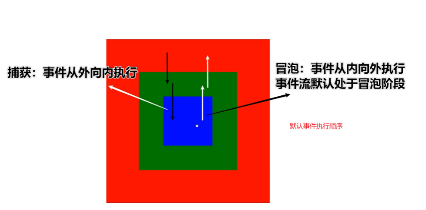
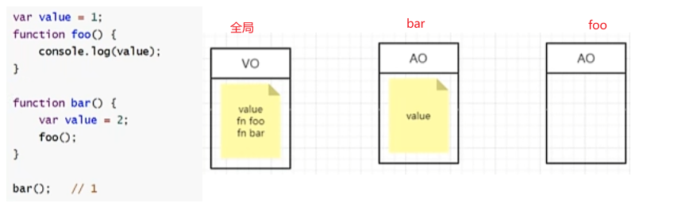
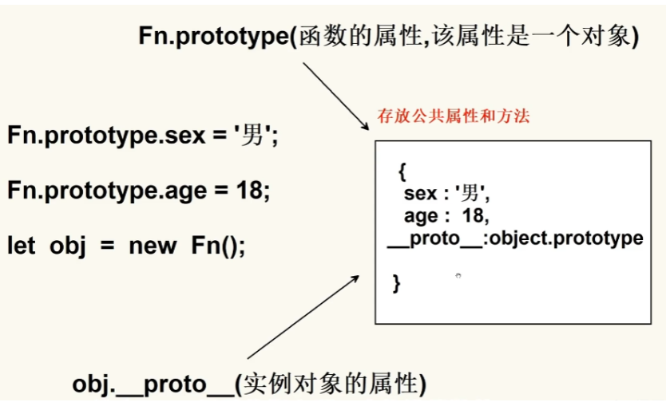

# welcome

<i class="iconfont icon-iconzhucetouxiang"></i>  嗨，是我了，这里是为了成为程序媛而发疯<i class="iconfont icon-avatar1"></i>的四月说，本网站会更新记录我的学习笔记，如果你有什么话想和我说，可以到<i class="iconfont icon-xiaohongshu"></i>上面搜四月说私信即可~

# 基于GitHub搭建个人网站

使用 Docsify 来搭建个人网站非常简单，特别适合用于文档展示或个人博客。下面是一步一步的指南来在 GitHub Pages 上部署 Docsify 网站：

1. **创建 GitHub 仓库**：首先，创建一个 GitHub 仓库，仓库名可以是你的用户名（例如，`<your-username>.github.io`）或者其他名字。这个仓库将用于托管你的网站。

2. **安装 Docsify**：在你的本地开发环境，安装 Docsify CLI（命令行工具），使用以下命令：

   ```
   npm i docsify-cli -g
   ```

3. **初始化 Docsify 项目**：在你的本地文件夹中，创建一个用于存储你的网站内容的目录。进入这个目录，然后运行以下命令来初始化 Docsify 项目：

   ```
   docsify init ./docs
   ```

   这将创建一个 `docs` 目录，其中包含一个 `index.html` 文件和一个 `README.md` 文件。

4. **编辑文档**：将你的文档内容编写在 `docs` 目录中的 Markdown 文件中。你可以创建子目录来组织文档。 Docsify 会自动将这些 Markdown 文件转换为网站页面。

5. **配置 Docsify**（可选）：你可以编辑 `docs/index.html` 文件以自定义网站的外观和配置。你可以设置标题、侧边栏、导航栏等等。

6. **预览你的网站**：在你的项目根目录下运行以下命令来预览你的网站：

   ```
   docsify serve docs
   ```

   这会启动一个本地服务器，并显示你的网站。你可以在浏览器中访问 `http://localhost:3000` 来查看你的网站。

7. **将项目推送到 GitHub**：一旦你满意了你的网站，将整个项目（包括 `docs` 目录）推送到你在步骤1中创建的 GitHub 仓库。

8. **启用 GitHub Pages**：进入你的 GitHub 仓库，点击 "Settings" 选项卡，然后滚动到 "GitHub Pages" 部分。在 "Source" 下拉菜单中，选择 "main branch"（或者你的默认分支），然后点击 "Save"。GitHub Pages 将会自动部署你的网站。

9. **访问你的网站**：一旦 GitHub Pages 部署完成，你可以在浏览器中访问 `https://<your-username>.github.io`（或者你的仓库名）来查看你的 Docsify 网站。

现在，你已经成功地使用 Docsify 搭建了个人网站，并将其部署在 GitHub Pages 上。你可以继续编辑和更新你的文档，并推送到 GitHub 仓库，你的网站会自动更新。

10. **若访问网站报错**：可以检查你的仓库文件列表里面是否有index.html


# Git
## 1.将项目推送到GitHub的步骤

- 1.初始化Git仓库（如果你的项目还没有关联Git仓库）：在你的项目目录中打开终端（命令行界面），运行以下命令来初始化Git仓库：

```powershell
git init
```

- 2.**将文件添加到暂存区**：运行以下命令将所有文件添加到 Git 的暂存区（暂存区是一个临时存储修改的地方）：

```powershell
git add .
```

这会将当前目录下的所有文件和文件夹添加到暂存区。

- 3.**提交到本地仓库**：运行以下命令将暂存区的文件提交到本地 Git 仓库：

```powershell
git commit -m "Initial commit"
```

这个命令会创建一个新的提交，提交信息为 "Initial commit"，你可以根据需要修改提交信息。

- 4.**关联远程 GitHub 仓库**：在 GitHub 上创建了仓库后，将本地 Git 仓库与远程 GitHub 仓库关联。在以下命令中，将 `<your-username>` 替换为你的 GitHub 用户名，`<your-repository>` 替换为你的仓库名：

```powershell
git remote add origin https://github.com/<your-username>/<your-repository>.git
```

- **推送到 GitHub**：运行以下命令将本地仓库的内容推送到 GitHub:

```powershell
git push -u origin main
```

> 如果你使用的是 Git 版本较老的仓库，可能需要将 `main` 替换为 `master`，这取决于你的默认分支名称。可以通过git branch查看本地分支列表以及当前所在的分支。

完成以上步骤后，你的项目就会被推送到 GitHub 仓库中了。在 GitHub 页面上刷新，你应该能够看到你的项目文件和文件夹。请确保你具有推送到仓库的权限。如果你的仓库是 private 的，你可能需要提供 GitHub 的用户名和密码或者使用个人访问令牌进行推送。

## 2.将修改后的代码推送到GitHub的步骤
- 1.添加修改的文件到暂存区：
```powershell
git add .
```
`这将会将所有修改的文件添加到暂存区`。如果你只想添加`特定文件`，可以使用 `git add 文件名 的方式`。
- 2.提交更改：
提交暂存区中的修改到本地仓库，可以使用如下命令：
```powershell
git commit -m "描述你的修改"
```
`将 "描述你的修改" 替换成对你所做修改的简要描述`。
- 3.推送到GitHub:
使用以下命令将本地的提交推送到你在GitHub上的远程仓库：
```powershell
git push origin 分支名
```
  将 "分支名" 替换成你要推送的分支的名称（通常是 main 或 master）。

  如果这是你第一次推送到GitHub，可能需要提供你的GitHub凭证来进行验证。

- 4.查看更新：

  刷新GitHub仓库页面，你应该能够看到刚刚推送的更新。

  现在，你的GitHub仓库应该包含了你所做的最新修改。

## 3.git push报错

原因：一般是因为服务器的SSL证书没有经过第三方机构的签署，所以才报错

解决办法：解除ssl验证后，再次git即可
```bash
git config --global http.sslVerify false
```

# HTML + CSS
## 1.盒模型
### 1.1 概念

> 盒模型分为`标准盒模型和IE盒模型（怪异盒模型）`
git 
- 标准盒模型：
  - width等于content的宽度
  - 总宽度:width+左右padding+左右border+margin左右
- IE盒模型：
  - 宽度width是整个盒子所占的宽度（content宽+左右padding+左右border）
  - 总宽度：width + margin左右
- CSS当中哪个属性可以定义计算一个元素的总宽度和总高度
  - box-sizing
  - 属性值为border-box时为IE盒模型（width 和 height 属性包括内容，内边距和边框，但不包括外边距）
  - 属性值为content-box时为标准盒模型（默认值，标准盒子模型。width 与 height 只包括内容的宽和高）

### 1.2 实现垂直居中的几种方法
- 1、绝对定位
  - 已知子元素高度:绝对定位+margin
    ```css
    .parent {
      position: relative;
      width: 300px;
      height: 300px;
      background-color: #000;
    }

    .son {
      position: absolute;
      top: 50%;
      left: 50%;
      width: 100px;
      height: 100px;
      margin-top: -50px;
      margin-left: -50px;
      background: red;
    }
    ```
  - 未知子元素高度：绝对定位+translate

  ```css
  .parent {
    position: relative;
    width: 300px;
    height: 300px;
    background-color: #000;
  }

  .son {
    position: absolute;
    top: 50%;
    left: 50%;
    transform: translate(-50%,-50%);
    background: red;
  }
  ```

- 2、利⽤table-cell将元素变成表格形式，之后⽤vertical-align：middle对⼦元素设置垂直居中

```css
.parent {
 display: table-cell;
 vertical-align: middle;
 text-align: center;
 width: 300px;
 height: 300px;
 background: #000;
}

.son {
 /*若需要水平居中设置margin: 0 auto;*/
 width: 100px;
 height: 100px;
 margin: 0 auto;
 background: red;
 color: #fff;
}
```

- 3、利⽤css3的flex布局
> 这⾥运⽤到了css3的flex布局，align-items将⼦元素垂直居中，之后justify-content则设置⽔平居中

```css
.parent {
 display: flex;
 align-items: center;
 justify-content: center;
 width: 300px;
 height: 300px;
 background: #000;
}

.son {
 width: 100px;
 height: 100px;
 background: red;
 color: #fff;
}
```


## 2.包含块

> - 子元素的宽高百分比是参考`包含块`来计算的，`不是参考父元素`：

- 1.如果元素的`position是relative或static（默认值）`，其包含块则是：`离他最近的块容器的内容区域（content area）`；
- 2.如果元素的`position是absolute`,则包含块为离它最近的`position值不为static`的祖先元素的`内边距区域`(加上padding区域)；
- 3.如果元素的`position是fixed,则包含块由视口建立`；
- 包含块不仅仅只是用来计算宽高的百分比，定位的top left 都是按照包含块来计算的；

## 3.BFC

​	BFC是`块级格式化上下文`（Block Formatting Context）的缩写。它是一个`独立的块级渲染区域`，`只有块级盒子参与`，该区域拥有一套渲染规则来约束块级盒子的布局，且与区域外部无关。

- **现象：一个盒子不设置height，当它的子元素都浮动时，无法撑起父元素，父元素没有高度，这个盒子就没有形成BFC**
- 如何给没有形成的盒子创建BFC：
  - 1.float的值不是none；
  - 2.position的值不是static或者relative
  - 3.display的值是inline-block.flex.或者inline-flex
  - 4.`overflow：hidden`【这种方式最好】

```js
<style>
    .father {
      border: 1px solid black;
      /* float: left; */
      /* position: absolute; */
      /* display: inline-block; */
      overflow: hidden;
    }

    .son {
      float: left;
      width: 300px;
      height: 300px;
      background-color: blue;
    }
</style>
<body>
  <div class="father">
    <div class="son"></div>
    <div class="son"></div>
    <div class="son"></div>
  </div>
</body>
```

- BFC的其他作用：
  - 1.`BFC可以取消盒子的margin塌陷`

```js
<style>
    .father {
      width: 200px;
      height: 300px;
      background-color: blueviolet;
    }

    .son {
      width: 100px;
      height: 100px;
      background-color: blue;
      margin-top: 20px; 
      /*我们想要的效果，子元素距离父元素顶部20px，但是实际效果是：子元素会带着父元素一起距离顶部有20px；
      BFC可以解决margin塌陷，所以我们可以让父盒子形成BFC加上overflow: hidden;*/
    }
  </style>
</head>

<body>
  <div class="father">
    <div class="son"></div>
  </div>
</body>
```

- 2.BFC可以阻止元素被浮动元素覆盖

```html
<style>
  .son {
    width: 200px;
    height: 200px;
    background-color: blue;
    float: left;
  }

.son-last {
  width: 200px;
  height: 300px;
  background-color: red;
  overflow: hidden;

  /*在css规范中，浮动元素会脱离原本的⽂档，就是通常说的脱离⽂档流，这个时候浮动元素是不占据空间的。浮动元素碰到包含它的元素边框或者浮动元素的边框停留。 
  实际情况：因为前面两个son元素设置了浮动，所以会覆盖掉son-last，所以son-last只会露出最下面的100px；
  因为BFC可以阻止元素被浮动元素覆盖，所以可以让被覆盖的盒子形成BFC，加上overflow: hidden; */
}
</style>
</head>

<body>
   <div>
  	<div class="son"></div>
		<div class="son"></div>
		<div class="son-last"></div>
	</div>
</body>
```


## 4.margin合并

- **相邻兄弟元素之间的下外边距和上外边距会合并**;
- **发生场景(块元素且上下结构)** ：
  - 外边距合并的设计初衷是为了` 解决段落之间垂直方向的空隙`，因此`只会发生在垂直方向`，不是水平方向；
  - `只发生在块级元素`；

```html
// d1和d2的外边距会合并，我们想设置两个盒子的外边距为40，但是只有20
<style>
  div {
    width: 200px;
    height: 200px;
  }

  .d1 {
    background-color: pink;
    margin-bottom: 20px;
  }

  .d2 {
    background-color: hotpink;
    margin-top: 20px;
  }
</style>
</head>

<body>
  <div class="d1"></div>
  <div class="d2"></div>
</body>
```

- 外边距计算：
  - 正数&&正数：取最大的数；50 20 取50
  - 负数&&负数：取绝对值最大的数；-50 -30 取-50
  - 正数&&负数：取相加的和；-50 30 取-20
- 解决方式：只给其中一个盒子设置margin即可；

## 5.margin塌陷

- 1.父子关系，`子元素设置了margin-top，但是看起来像是被父元素“抢走了”，就是父元素带着子元素一起往下移动了`；
- 解决方法：取消子级margin，**给父盒子加padding .border-top或形成BFC**
  - 现在父元素只有内容，没有任何边界，可以给父元素设置padding或者border，但是这样改变了盒子的大小，不建议；
  - 让盒子形成BFC：overflow：hidden；触发BFC

```html
<style>
  .father {
    width: 200px;
    height: 300px;
    background-color: gray;
    /* 触发BFC */
    overflow：hidden；
  }

  div div {
    width: 100px;
    height: 100px;
  }

  .son1 {
    background-color: pink;
    margin-bottom: 50px;
    margin-top: 30px;
  }

  .son2 {
    background-color: hotpink;
  }
</style>

<body>
  <div class="father">
    <div class="son1"></div>
    <div class="son2"></div>
  </div>
</body>
```

- 2.平时若给子元素设置了高度可以撑开未设置高度的父元素，但是**子元素如果设置了float元素之后就会导致未设置高度的父元素消失**

```html
<style>
  .father {
    border: 10px solid #000;
    width: 300px;
    background-color: gray;
  }

  div div {
    float: left;
    width: 100px;
    height: 100px;
  }

  .son1 {
    background-color: pink;
  }

  .son2 {
    background-color: hotpink;
  }
</style>
<body>
  <div class="father">
    <div class="son1"></div>
    <div class="son2"></div>
  </div>
</body>
```

- 解决方式：1).父盒子形成BFC：overflow：hidden；触发BFC

  ​			    2).清除浮动：双伪元素法
```html
<style>
    .father {
      border: 10px solid #000;
      width: 300px;
      background-color: gray;
      /* overflow: hidden; */
    }

    /* 父盒子清除浮动 */
    .clearfix::before,
    .clearfix::after {
      content: '';
      display: block;
    }

    .clearfix::after {
      clear: both;
    }

    div div {
      float: left;
      width: 100px;
      height: 100px;
    }

    .son1 {
      background-color: pink;
    }

    .son2 {
      background-color: hotpink;
    }
</style>
<body>
  <div class="father clearfix">
    <div class="son1"></div>
    <div class="son2"></div>
  </div>
</body>
```

## 6.flex布局

- 弹性布局，任何一个容器都可以指定为flex布局
- 当父盒子设为flex布局以后，资源的float.clear.和vertical-align属性将失效
- 采用flex布局的元素称为flex容器，所有子元素自动称为容器成员，成为flex项目，简称项目

> 通过给父盒子添加flex属性，来控制子盒子的位置和排列方式

### 6.1：父项常见属性

  - **flex-direction**：设置主轴(一般可以理解为X轴)的方向，属性值：
    - row：默认值 从左到右
    - column：从上到下
    - row-reverse：从右到左
    - column-reverse：从下到上


  - **justify-content：设置主轴上的子元素排列方式**
    - `flex-start：默认值从头部开始 如果主轴是x轴，则从左到右`
    - flex-end：从尾部开始排列
    - `center：在主轴居中对齐 (如果主轴是x轴则 水平居中）`
    - `space-around：平分剩余空间`
    - `space-between：先两边贴边 再平分剩余空间 (重要)`
    - `space-evenly`：项目会平均地分布在行里，包括两端的间距。


  - **flex-wrap：设置子元素是否换行：wrap换行，nowrap不换行**
  - align-content：设置侧轴(一般可以理解为Y轴，交叉轴)上的子元素的排列方式（特指多行，单行情况下无效）
    - flex-start：多行在弹性容器的交叉轴的起始位置对齐。
    - flex-end：在侧轴的尾部开始排列
    - `center：在侧轴中间显示`
    - space-around：子项在侧轴平分剩余空间
    - space-between：子项在侧轴先分布在两头，再平分剩余空间
    - stretch：设置子项元素高度平分父元素高度


  - **align-items**：设置侧轴上的子元素排列方式（单行）:
    - `flex-start`：项目在交叉轴的起始位置对齐。
    - `flex-end`：项目在交叉轴的末尾位置对齐。
    - `center`：项目在交叉轴的中间位置对齐。
    - `baseline`：项目以基线对齐。
    - `stretch`：项目被拉伸以适应容器。

  > 单行找align-items 多行找align-content；

  - flex-flow：复合属性，相当于同时设置了flex-direction和flex-wrap

### 6.2：felx布局子项常见属性

  - flex：定义子项目分配剩余空间，用flex来表示占多少份数。
  - align-slef：控制**子项自己**在侧轴的排列方式，align-self 属性允许单个项目有与其他项目不一样的对齐方式，可覆盖 align-items 属性。
    默认值为 auto，表示继承父元素的 align-items 属性，如没有父元素，则等同于 stretch。
  - order属性定义子项的排列顺序（前后顺序），数值越小，排列越靠前，默认为0.

### 6.3：常见面试题

- 1、如何实现内容宽度等分
```html
<div class="box">
 <div style="background: red;">html5</div>
 <div style="background: yellow;">css3</div>
 <div style="background: blue;">js</div>
</div>
```
```css
.box {
 display: flex;
}
.box div {
 flex:1;
}
```
- 左右布局，一侧定宽，另一侧自适应
```html
<div class="box">
 <div class="left">html5</div>
 <div class="right">css3</div>
</div>
```
```css
.box {
 display: flex;
}
.box .left {
 width: 300px;
 background: red;
}
.box .right {
 flex: 1;
 background: yellow;
}
```

## 7.圣杯布局

​	圣杯布局是一种网页布局技术，通常用于创建具有三个主要部分的网页布局：一个`固定宽度的左边和右边列`，以及`中间主要内容的自适应列`。主要内容区域会自动占据剩余的可用空间，使其在不同屏幕尺寸下能够自适应宽度。常见场景：搜索框

```css
.container {
  display: flex;
}

.main {
  flex: 1; // 剩下的空间独占
  height: 300px;
  background-color: green;
  margin-left: 20px;
  margin-right: 20px;
}

.left {
  width: 100px;
  height: 300px;
  background-color: red;
  order: -1 // order 属性控制在布局中的顺序，因为圣杯布局的html解构必须要保证main区域在第一位
}

.right {
  width: 200px;
  height: 300px;
  background-color: blue;
  order: 1
}

<body>
  <div class="container">
    <div class="main"></div>
    <div class="left"></div>
    <div class="right"></div>
  </div>
</body>
```

## 8.定位

- 相对定位relative：`不脱标，会占位，标签显示模式特点不变`；
- 绝对定位absolute：`脱标，不占位，标签显示模式改变，设置宽高生效（具备行内块元素的特点）；参照物找离自己最近的已经定位的祖先元素`；

```html
// 定位居中：子绝父相，子元素设置左，上移动50%，然后水平.垂直偏移50%；
<style>
  .fa {
    position: relative;
    border: 1px solid #000;
    width: 200px;
    height: 200px;
  }

  .son {
    position: absolute;
    width: 100px;
    height: 100px;
    top: 50%;
    left: 50%;
    transform: translate(-50%, -50%);
    background-color: pink;
  }
</style>

<body>
  <div class="fa">
    <div class="son"></div>
  </div>
</body>
```


## 9.透明度opacity

- background：rgba只能让背景变透明，opacity: 0.5;可以设置整个元素的透明度（包含背景和内容）

## 10.移动端适配
- rem（rem 单位的意思是“根元素的字体大小”）

  - rem是相对于html的字体大小
    比如，根元素设置的font-size:12px; 非根元素设置width:2rem, 则转换成px就是24px;

    优势：可以通过修改html的文字大小来改变页面中元素的大小，**可以整体控制**

  - 思路实现：
    - 第一步设置页面视口
    ```html
      <meta name="viewport" content="width=device-width,user-scalable=no, initial-scale=1.0,maximum-scale=1.0, minimum-scale=1.0">
    ```

    - 第二步配置rem单位
      - 安装postcss-pxtorem，⾃动将 px 转换成 rem 单位的插件

      ```git
      npm install postcss-pxtorem@5.1.1 -S
      ```

      - 安装amfe-flexible，⾃动检测当前设备屏幕宽度serveWidth，设置html⾥⾯的font-szie为serveWidth/10

      ```git
      npm install amfe-flexible -S
      ```

- media媒体查询(CSS3新语法)，media + rem

```html
// 通过媒体查询做移动端适配 用rem非常适合
<style>
  /* 默认样式 */
  p {
    font-size: 2rem;
  }

  /* 当屏幕宽度小于600px时应用以下样式 */
  @media (max-width: 600px) {
    p {
      font-size: 1rem;
    }
  }
</style>
```

- vm：`vm` 是一种相对长度单位，通常用于前端开发中的 CSS 样式。它表示视窗（viewport）的百分比，并根据视窗的大小进行计算。`1vm` 等于视窗宽度或高度的 1%。这意味着，如果你设置一个元素的宽度或高度为 `10vm`，它将占据视窗宽度的 10%（或高度的 10%）的空间，无论视窗的实际尺寸如何。
- media + vm

```html
<style>
/* 当视窗宽度小于 600px 时，文本大小为视窗宽度的 5% */
@media (max-width: 600px) {
  p {
    font-size: 5vw;
  }
}
</style>
```

## 

## 11.CSS练习题
### 11.1 css 动画 从左到右 时间2S
```css
div {
  position: relative;
  width: 100px;
  height: 100px;
  background-color: red;
  animation: move 2s linear;
}

@keyframes move {
  0% {
    left: 0px;
  }

  100% {
    /* calc(100% - 100px)，表示元素相对于父容器的左边距离是父容器宽度减去元素宽度。这样就可以实现从左到右的动画效果 */
    left: calc(100% - 100px);
  }
}
```
> 在CSS中，如果要应用动画效果，元素的定位必须是相对的，绝对的或固定的，而不能是静态的。这是因为动画本质上是基于元素的位置变化，而静态定位是不会引起元素位置的改变的。当你将元素的定位设置为相对定位时，它会在文档流中保留自己的空间，并可以使用 top.right.bottom 和 left 属性来调整其位置。因此，在你的代码中，当你给div元素设置了position: relative;时，它才能够响应left属性的变化，从而实现动画效果。这个属性告诉浏览器该元素的位置是相对于它在文档流中的初始位置而言的。

### 11.2 实现0.5px的细线
```css
<style>
  p {
    border-bottom: 1px solid #000;
    transform: scale(1, 0.5)
  }
</style>
<body>
  <p></p>
</body>
```

# JS-1：JS基础
- 变量、常量、数据类型、类型转换、运算符、语句、数组、函数、对象

## 1.JS介绍

### 1.1 JS组成
  JS是运行在客户端（浏览器）的编程语言，由ESCMscript、web APIS（BOM、DOM）组成；

    - `ES规定了js基础语法核心知识`，比如变量、分支语句、循环语句、对象等等；
    - DOM是文档对象模型，是`浏览器提供用来操作网页内容的`，可以开发网页内容特效和实现用户交互
    - DOM对象：浏览器根据html标签生成的JS对象，DOM的核心就是把网页内容当做对象来处理；
    - BOM是浏览器对象模型，定义了一套操作浏览器窗口的API；

### 1.2 预编译

```js
// 作用域的创建阶段 就是预编译的阶段
// 预编译的时候做了哪些事情：
// 函数作用域创建阶段：js的变量对象(AO对象) 供JS引擎自己去访问

/*  1、创建ao对象 
    2、找形参和变量的声明 作为AO对象的属性名 值是undefined
    3、实参和形参相统一 
    4、找函数声明 若函数声明和变量声明的名称一致 会覆盖变量的声明 
*/

function fn(a, c) {
  console.log(a) // function a() { }
  var a = 123
  console.log(a) // 123
  console.log(c) // function c() { }
  function a() { } // 函数声明
  if (false) {
    var d = 678
    }
  console.log(d) // undefined
  console.log(b) // undefined
  var b = function () { } // 函数表达式
  console.log(b) // function () {}
  function c() { } // 函数声明
  console.log(c) // function c() { }
}

fn(1, 2)
/* AO:{
      a:undefined 1 function a() { }
      c:undefined 2 function c() { }
      d:undefined
      b:undefined
  } 

  预编译结束 JS的解释执行 逐行执行
*/
```

## 2.数据类型（面试常问）

### 2.1 数据类型

- 基本数据类型：**Number、String 、 Boolean、 Undefined 、Null、  Symbol**(ES6新增，表示唯一且不可变的值，通常用于对象属性的键)
- 复杂数据类型：**Object**，**Map 和 Set**：是 ES6 引入的数据结构，用于存储键值对（Map）或唯一值（Set）

### 2.2 存储方式

- `基本数据类型存在在栈中`，变量名和值都在栈中，基本数据类型占据空间⼩、⼤⼩固定，属于被频繁使⽤数据，所以放⼊栈中存储；
- `复杂数据类型的变量名存储在栈中，值存储在堆中，变量名保留了值这个对象在堆当中地址的引用`。复杂数据类型占据空间⼤、⼤⼩不固定,如果存储在栈中，将会影响程序运⾏的性能；引⽤数据类型在栈中存储了指针，该指针指向堆中该实体的起始地址。当解释器寻找引⽤值时，会⾸先检索其在栈中的地址，取得地址后从堆中获得实体；


### 2.3 类型判断方式
- null和undefined的区别：undefined表示没有赋值，null表示赋值了，但是内容为空；

- 判断`基础数据类型一般用typeof`进行判断，`typeof校验undefined输出undefined，校验null输出object`，这是JS本身的一个bug，一直如此；

- 判断`复杂数据类型`一般只会考察如何判断一个数组，只要记住这个方法即可：`Object.prototype.toString.call(arr) === '[object Array]'`,为true即为数组

## 3.隐式转换

规则：

1、`+号两边只要有一个是字符串，都会把另外一个转成字符串` ；

2、`除了+以外的算术运算符，都会把数据转成数字类型`；

3、`空数组在进行类型转换时，会被转换为一个空字符串 ""，空对象在进行类型转换时，会被转换为字符串类型的值"[object Object]"`；

小技巧：`+号作为正号解析可以转换成数字型、任何数据和字符串相加结果都是字符串`


> 表单 prompt取过来的值都是字符串型，此时无法直接简单的进行数字运算，需要做类型转换；let age = prompt('请输入你的年龄：')，如果输入21，age=’21’，此时我们可以在prompt前面加上加号'+'，就可以隐式转换为数字类型了.


- 腾讯2018年前端笔试题


## 4.显示转换

- 转为数字型Number（数据）：
  - 如果数据里面有非数字，转换失败时结果为NaN；
- ParseInt(数据)：只保留整数
- ParseFloat(数据)：可以保留小数
- 转为字符型：String(数据) or 变量.toString()

## 5.运算符
> 除了false、0、’’、undefined、null、NaN的值为false，其他都为true；

  三元运算符：条件？满足条件执行的代码 ：不满足条件执行的代码


## 6.语句

- 表达式是可以被求值的代码，语句是一段可以执行的代码
- 语句分为分支和循环语句，分支有单分支 双分支 和多分支语句

## 7.循环语句

- if和switch的共同点和区别：都能实现多分支选择，但switch语句一般用于等值判断，if适合于区间判断；

switch语句进行判断后直接执行到程序的语句效率很高。当分支比较多用switch效率高；

- while循环就是在满足条件期间重复执行代码块；
  - **while循环需要三大要素：变量起始值、终止条件、变量变化量（自增或自减）**
- for循环：作用也是重复执行代码，如果**明确了循环的次数**推荐用for循环；一般用于循环数组
  - **for（变量起始值；终止条件；变量变化量）**

- 当**不明确循环次数**的时候用while循环；

## break和continue和return的区别

- break：退出整个循环，一般用于结果已经得到，后续的循环不需要的时候；
- continue：退出本次循环，继续下次循环，一般用于排除或者跳过某一个选项的时候；

## 8.索引

  索引是指对数据结构中元素的快速访问机制，它允许你通过指定位置或者标识符来获取或操作元素，不需要遍历整个数据结构。索引在很多数据结构中都存在（数组，字符串，队列，堆，哈希表），并且提供了一种高效访问元素的方式。

## 9.数组基础


## 10.对象基础
- 遍历对象用for in，for k in obj，k是对象的属性，获得对象的属性值是obj[k]
- 内置对象Math


- 如何生成N~M的随机整数


### 10.1 random练习题：获取20~50随机数

```js
//  Math.random() [0, 1)] 
function getNumber() {
   console.log(Math.random() * 30 + 20)
 }
getNumber()

// Math.round() 用于将一个数字四舍五入到最接近的整数
function randomNumber(min, max) {
  const range = max - min
  return Math.round(Math.random() * range + min)
}

randomNumber(20, 50)
```

## 11.数组练习题

### 11.1 手写实现数组map和数组filter

> 主要区别总结：

- `map` 用于对数组中的每个元素进行操作，并返回一个新数组，长度与原数组相同。
- `filter` 用于根据条件筛选数组中的元素，并返回一个新数组，长度可能不同于原数组，取决于满足条件的元素数量。
- `map` **负责转换数组元素**，`filter` **负责筛选数组元素**。


```js
const arr = [1, 2, 3]
console.log(arr.map(v => v + 1))
// 1、手写map函数
// 1.1、传入的是一个回调函数
// 1.2、会返回一个新的数组
// 调用者是一个数组 返回一个新的数组
Array.prototype.myMap = function (fn) {
  var newArr = []
  // this指向的就是调用者 
  for (var i = 0; i < this.length; i++) {

    newArr.push(fn(this[i]))
  }
  return newArr
}
console.log(arr.myMap(v => v + 1));
```

```js
// 2、手写filter方法，
// 2.1、传入的是一个回调函数
// 2.2、调用者是数组  返回一个新数组
Array.prototype.myFilter = function (fn) {
  let arr1 = []
  for (let i = 0; i < this.length; i++) {
    if (fn(this[i])) {
      arr1.push(this[i])
    }
  }
  return arr1
}
console.log(arr.myFilter(v => v > 2))
```

### 11.2 数组的reduce方法

```js
// reduce方法用于将数组中的所有元素按照指定的回调函数进行累积操作，最终返回一个单一的值。这个方法通常用于计算或累积数组中的值
arr.reduce(function(pre,cur,index,arr){
  ...
},init)

// arr表示操作的数组；pre表示上一次调用回调函数时的返回值，或者初始值init，如果没有初始值，那么pre的值就是数组的第一项。cur表示当前正在处理的数组元素。index(可选)表示当前正在处理的数组元素的索引，若提供init值，则索引为0，否则索引为1；init表示初始值。arr（可选）表示操作的数组；

// 应用1：将二维数组转化为一维数组
let arr = [[0, 1], [2, 3], [4, 5]]
let newArr = arr.reduce((pre, cur)=> {
  return pre.concat(cur)
}, []) 

// 应用2：将多维数组转化为一维数组
let arr = [[0, 1], [2, 3], [4, [5, 6, 7]]] 
let newArr = function(arr) {
  return arr.reduce((pre, cur) => {
   	return pre.concat(Array.isArray(cur) ? newArr(cur) : cur)
	}, [])
}

// 对象里的属性求和
var result = [
  {
    object: 'math',
    score: 10
  },
  {
    object: 'chinese',
    score: 80
  },
  {
    object: 'english',
    score: 20
  }
]

function getSum(arr) {
  return arr.reduce((pre, cur) => {
    // console.log(pre, cur.score);
    return pre += cur.score
  }, 0)
}
```

### 11.3 字符串中哪个字符出现次数最多，次数是多少

```js
let str = 'aaaaaaaccrrrr'
// reduce方法：pre用于存储中间计算结果，cur是当前处理的数组元素
// pre的初始值设置为一个空对象{}，最后返回pre；
function getNum(str) {
  let strArr = str.split('')
  return strArr.reduce((pre, cur) => {
    if (cur in pre) {
      pre[cur]++
    } else {
      pre[cur] = 1
    } 
    return pre
  }, {})
}
console.log(getNum(str)) // {a: 7, c: 2, r: 4}
let obj = getNum(str)
let maxStr = null
let max = 0
for (let key in obj) {
  if (max < obj[key]) {
    max = obj[key]
    maxStr = key
  }
}
console.log(`出现次数最多的是${maxStr},一共出现了${max}次`) 
// 出现次数最多的是a,一共出现了7次
```

### 11.3 数组的includes方法

> 用于检查数组是否包含特定的元素，并返回一个布尔值，指示是否包含。如果数组中包含指定的元素，该方法返回 true，否则返回 false。

- 语法：array.includes(searchElement, fromIndex)
  - searchElement 是要查找的元素。
  - fromIndex 是可选的，表示从数组的哪个索引开始搜索。如果省略 fromIndex，则默认从数组的第一个元素(索引为0)开始搜索。

  ```js
  const fruits = ["apple", "banana", "cherry", "date"];

  console.log(fruits.includes("banana")); // true
  console.log(fruits.includes("grape"));  // false
  console.log(fruits.includes("cherry", 2)); // true  从索引2开始搜索"cherry"
  ```

#### 11.3.1 使用includes优化代码
```js
const fruits = ["apple", "banana", "cherry", "date"];

console.log(fruits.includes("banana")); // true
console.log(fruits.includes("grape"));  // false
console.log(fruits.includes("cherry", 2)); // true  从索引2开始搜索"cherry"

function printAnimals(animal) {
  if(animal === 'dog' || animal === 'cat') {
    console.log(` I have a ${animal}`)
  }
}
printAnimals('dog')

// 上述代码改写 includes可以代替上面大量的或操作
function printAnimals(animal) {
  const animals = ['dog', 'cat', 'hamster']
  if (animals.includes(animal)) {
    console.log(`I have a ${animal}`)
  }
}
printAnimals('dog')
```

#### 11.3.2 网易面试题目【提前退出/返回】

```js
// 优化以下代码
function printAnimalsDetails(animal) {
  var result = null
  if(animal) {
    if(animal.type) {
      if(animal.name) {
        if(animal.gender) {
          result = `${animal.name} is a ${animal.gender} - ${animal.type}`
        } else {
          result = 'no animal gender'
        }
      } else {
        result = 'no animal name'
      }
    } else {
      result = 'no animal type'
    }
  } else {
    result = 'no animal'
  }
  return result
}
```

```js
// 优化后
// 考点：提前退出 和 提前返回 
  // ({type, name, gender} = {}) 这部分代码是一个ES6的解构赋值语法，用于函数的参数默认值和解构赋值。
    const printAnimalsDetails = ({type, name, gender} = {}) => {
      if(!type && !name && !gender) return 'no animal'
      if (!type) return 'no animal type'
      if (!name) return 'no animal name'
      if (!gender) return 'no animal gender'

      // 如果走到这一行 说明这个动物有类型 名字和性别
      return `${name} is a ${gender} - ${type}`
    }

    console.log(printAnimalsDetails({name: 'mike'}))
```

## 11.4 数组去重
### 11.4.1 展开运算符+Set

```js
const arr = [1, 1, 2, 4, 4, 5, 5, 6]
// 容易想到的方式
const arr1 = Array.from(new Set(arr)) // [1, 2, 4, 5, 6]
const arr2 = [...new Set(arr)] // [1, 2, 4, 5, 6]
```

### 11.4.2 双重for循环

```js
// 基本思路：在外部循环中遍历数组的元素，并在内部循环中检查是否有重复的元素，如果有则将其移除
function unique(arr) {
  for (var i = 0, len = arr.length; i < len; i++) {
    for (var j = i + 1, len = arr.length; j < len; j++) {
      if (arr[i] === arr[j]) {
        arr.splice(j, 1)
        j--
        len--
      }
    }
  }
  return arr
}
console.log(unique(arr))
```

### 11.4.3 indexOf

```js
// indexOf：用于在数组中查找指定元素的索引。它接受两个参数：要查找的元素和可选的起始位置。默认从数组的起始位置开始向后查找，找到第一个匹配的元素并返回其索引值。如果数组中不存在该元素，则返回 -1。
const arr = [1, 1, 2, 4, 4, 5, 5, 6]
    console.log(arr.indexOf(4, 0)); // 3
    console.log(arr.indexOf(4, 1)); // 3
    console.log(arr.indexOf(4, 2)); // 3
    console.log(arr.indexOf(4, 3)); // 3 
    console.log(arr.indexOf(4, 4)); // 4
    console.log(arr.indexOf(4, 5)); // -1
    console.log(arr.indexOf(4, 6)); // -1
    console.log(arr.indexOf(4, 7)); // -1

function unique(arr) {
  let arr1 = []
  for (var i = 0; i < arr.length; i++) {
    if (arr1.indexOf(arr[i]) === -1) {
      arr1.push(arr[i])
    }
  }
  return arr1
}
console.log(unique(arr))
```

### 11.4.4 includes
```js
// includes：它用于检查数组或字符串中是否包含指定的元素或子字符串，并返回一个布尔值。
function unique(arr) {
  let arr1 = []
  for (var i = 0; i < arr.length; i++) {
    if (!arr1.includes(arr[i])) {
      arr1.push(arr[i])
    }
  }
  return arr1
}
console.log(unique(arr))
```

### 11.4.5 reduce
```js
// filter是筛选数组内的元素，返回一个新数组；这里是通过比较每个元素的索引值和第一次出现的位置来筛选唯一的元素
function unique(arr) {
  return arr.reduce((pre, cur) => {
    if (!pre.includes(cur)) {
      return pre.concat(cur)
    }
    return pre
  }, [])
}
```

### 11.4.6 ES6新增数组方法 Array.some和Array.every
- `every` 方法用于检测数组中的所有元素是否满足指定的条件，如果所有元素都满足条件，则返回 `true`，否则返回 `false`
```js
// 手写every：1、传入的是一个回调函数。2、调用者是一个数组；3、返回的是一个布尔值
const fruits = [
  {name: 'apple', color: 'red'},
  {name: 'grape', color: 'green'}
]
const fruits2 = [
  {name: 'apple', color: 'red'},
  {name: 'strawberry', color: 'red'}
]
Array.prototype.myEvery = function (fn) {
  for (let i = 0; i < this.length; i++) {
    if (!fn(this[i])) {
      return false
    }
  }
  return true
}

console.log(fruits.myEvery(v => v.color === 'red')) // false
console.log(fruits2.myEvery(v => v.color === 'red')) // rue
```

- `some` 方法是数组的内置方法之一，用于检测数组中是否至少有一个元素满足指定的条件。如果存在满足条件的元素，则返回 `true`，否则返回 `false`
```js
// `some` 方法是数组的内置方法之一，用于检测数组中是否至少有一个元素满足指定的条件。如果存在满足条件的元素，则返回 `true`，否则返回 `false`
const arr = [1, 2, 3, 4]
Array.prototype.mySome = function (callback) {
  for (let i = 0; i < this.length; i++) {
    if (callback(this[i])) {
      return true
    }
  }
  return false
}
console.log(arr.mySome(v => v === 1)) // true
console.log(arr.mySome(v => v === 5)) // false
```

## 11.5 封装判断复杂数据类型
因为 JavaScript 中的 typeof 运算符在判断对象类型时并不准确。例如，对于数组、日期对象等特殊类型的对象，`typeof` 会返回 "object"，而无法进一步区分其具体类型。

`Object.prototype.toString.call` 这个表达式是用来获取一个对象的类型的标准方法。它的作用是返回一个以 "[object 类型]" 的字符串形式表示对象的类型。


>  Object.prototype.toString.call(obj)调用的是原型链顶端的toString，相当于是用Object原型上的toString方法作用在传入的obj的上下文中（通过call将this指向obj）；我们知道数组本身也有toString()方法，那我们为什么非要用Object顶端的toString方法，又为什么要用call呢？
```js
// 我们再来看一下toString()方法:此方法是将传入的数据类型转换成字符串输出（null和undefined除外）
var num = 666
num.toString() // '666'

var str = 'hello'
str.toString() // 'hello'

var bool = true
bool.toString() // 'true'

var arr = [1, 2, 3]
arr.toString()  // '1,2,3'

var obj = {age: 18}
obj.toString()  // '[object Object]'

var fn = function(){}
fn.toString()  // 'function(){}'

null.toString()  // Cannot read property 'toString' of null

undefined.toString() // Cannot read property 'toString' of undefined
```
```js
// 我们再看一下Object对象以及其原型上的toString方法，第一个返回的是一个函数，第二个返回的是值类型。
Object.toString()  //"function Object() { [native code] }"
Object.prototype.toString() //"[object Object]"
```
接下来让我们看一个表格：


> 这就是各种数据类型用 tostring()方法的返回值。由此我们看出不同数据类型都有其 tostring()方法,所以上述 tostring()方法来自于 Number、 string、 Boolean等等这些类。
> 我们又知道,在 Javascrip中,所有类都继承于Object，因此tostring()方法应该也继承了,但由上述可见事实并不是我们想的这样。其实各数据类型使用 tostring()后结果表现不一样的原因在于:所有类在承Object的时候,改写了 tostring()方法。 Object 原型上的方法是可以输出数据类型的,因比我们判断数据类型时,也只能使用原始方法。从而有了此方法: Object.prototype.toString.call(obj).

> 通过使用 call 方法，我们能够在指定的对象上调用 toString 方法，而不是全局上的 toString 方法，从而获取正确的类型信息

```js
  function getType(state) {
    if (typeof state !== "object") {
      return typeof state
    } else {
      /*这边可能有人用instanceof，它是一个运算符,最常用的运算就是来检测构造函数的 prototype 属性是否在对象的原型链上。如果是，instanceof 返回 true，否则返回 false.
      你可以理解为 instanceof 运算符用来检查一个对象是否在另一个对象的原型链上。具体来说，它检查一个对象是否是特定构造函数的实例，这个构造函数的 prototype 属性是否在对象的原型链中。如果是的话，instanceof 返回 true，否则返回 false。
      但是对象的constructor和__proto__都可以修改，所以用instanceof来判断不准确；*/
      if (Object.prototype.toString.call(state) === '[object Array]') return 'array'
      if (Object.prototype.toString.call(state) === '[object Object]') return 'object'
    }
  }
  console.log(getType({})); // object
  console.log(getType([])); // array
```

## 11.6 求未知参数的和
```js
// 写一个函数，计算传入参数的和（参数的个数是未知的）
// ...args 表示不定数量的参数,这些参数都会被收集到一个名为 args 的数组中
function getSum(...args) {
  console.log(args) // [6, 2, 3, 5]
  let sum = 0
  for (var i = 0; i < args.length; i++) {
    sum += Number(args[i])
  }
  return sum
}
console.log(getSum(6, 2, 3, 5)) // 16

/*
  * Array.prototype.slice.call() 是一个比较古老的方法，它需要调用数组原型上的 slice 方法，并传递类数组对象作为 this。相对来说，它的语法相对复杂，而且不太直观。
  * Array.from() 是 (ES6) 引入的一个新方法，用于将可迭代对象或类数组对象转换为数组。它的语法更加简洁明了
  * 总的来说，推荐使用 Array.from()，因为它更容易理解和使用.如果你需要兼容较旧的浏览器，你可能会继续使用 Array.prototype.slice.call()，但现代项目通常都不再需要考虑这个问题。
*/
function getSum() {
  // let arr = Array.from(arguments)
  let arr = Array.prototype.slice.call(arguments)
  let sum = 0
  for (var i = 0; i < arr.length; i++) {
    sum += Number(arr[i])
  }
  return sum
}
console.log(getSum(6, 2, 3, 5)) 
```
## 11.7 翻转一个字符串
```js
// 1.循环
const str = 'I love China'
const res = []
for (let i = str.length - 1; i >= 0; i--) {
  res.push(str[i])
}
console.log(res.join(''))

// 2.利用数组
const str = '123'
console.log(str.split('').reverse().join(''))
console.log(...str); // 1 2 3
console.log([...str].reverse().join(''))
// Array.from()接受一个可迭代的对象或类数组对象，返回一个新的数组，该数组包含对象的所有元素
console.log(Array.from(str)) // ['1', '2', '3']
console.log(Array.from(str).reverse().join(''))
```

## 11.8 找出任意html中的所有不重复的html标签
- 思路：先找出来 然后不重复
```js
const allTags = [...document.querySelectorAll('*')].map(v => v.tagName)
console.log(...(new Set(allTags)))
// Array.prototype.slice.call方法可以把伪数组转为真数组 是ES5方法  Array.from也可以转,是ES6的方法
console.log(...new Set(Array.prototype.slice.call(document.querySelectorAll('*')).map(v => v.tagName))
  );
```

## 11.9 web存储 (面试常问)
### 11.9.1 cookie
cookie是web缓存中的⼀种。在前端开发中cookie常常被⽤来储存登录信息token、缓存需要的信息等等，

### 11.9.2 cookies, sessionStorage和localStorage的区别

**都是用于在浏览器端存储数据的三种不同机制**：

- 1、**数据发送：**
  - cookie是网站为了标识用户身份而储存在用户本地终端（Client Side）上的数据（通常经过加密）
  - cookie`每次HTTP请求都会自动携带相应的Cookies数据`，发送给服务器。这使得Cookies适合用于在客户端和服务器之间`传递数据`,使⽤过多会影响性能。
  - sessionStorage和localStorage：`数据仅在浏览器端存储`，不会自动发送给服务器。这使得它们更`适合用于在客户端保留本地数据`，供JavaScript代码使用。
- 2、**存储大小：**
  - `cookie数据大小不能超过4K`
  - `sessionStorage和localStorage`也有存储大小的限制，但比cookie大的多，可以达到`5M`或更大；
- 3、**有期时间（生命周期）：**
  - `sessionStorage`数据在当前`浏览器窗口关闭后自动删除`；
  - `localStorage存储持久数据，浏览器关闭后数据不丢失除非主动删除数据`；
  - `cookie可设置失效时间，未设置的话，则默认关闭浏览器后失效`。

## 12 HTTP请求方式

### 12.1 http1.0定义了三种：
  `GET`: 向服务器`获取资源`，比如常见的`查询`请求`

  `POST`: 向服务器`提交数据`而发送的请求

  `Head`: 和get类似，返回的响应中没有具体的内容，用于`获取报头`

### 12.2 http1.1定义了六种
  `PUT`：一般是用于`更新请求，比如更新个人信息、商品信息全量更新`

  PATCH：PUT 方法的补充,`更新指定资源`的部分数据

  `DELETE`：用于`删除指定的资源`

  OPTIONS: 获取服务器支持的HTTP请求方法,服务器性能、跨域检查等

  CONNECT: 方法的作用就是把服务器作为跳板，让服务器代替用户去访问其它网页，之后把数据原原本本的返回给用户，网页开发基本不用这个方法，如果是http代理就会使用这个，让服务器代理用户去访问其他网页，类似中介

  TRACE：回显服务器收到的请求，主要用于测试或诊断

### 12.3 put 和 patch的区别
1、PUT请求： 用于`更新或创建一个资源`，通常是通过提供`完整的资源`表示来替换目标资源或创建一个新资源。`如果资源已存在，它会被完全替换；如果不存在，就会创建一个新的资源`。

2、PATCH请求：用于`对资源进行部分更新`。相比于 PUT，PATCH `不需要提供完整的资源表示，只需要提供需要更新的部分`。这使得 PATCH 更适合用于`资源的局部更新`。

总的来说，如果你`需要替换或创建整个资源，你可以使用 PUT 请求`。如果你只需要`更新资源的一部分，你可以使用 PATCH 请求`。选择使用哪种方法通常取决于你的应用场景和资源的结构。

# JS-2：web APIS
- 获取DOM对象、操作元素内容/属性、定时器-间歇函数、事件类型/对象、this、回调函数、事件流、事件委托、日期对象、节点操作、window对象、本地存储、正则表达式

> web APIS由BOM、DOM组成：

- DOM是文档对象模型，是`浏览器提供用来操作网页内容的`，可以开发网页内容特效和实现用户交互
- DOM对象：浏览器根据html标签生成的JS对象，DOM的核心就是把网页内容当做对象来处理；
- BOM是浏览器对象模型，定义了一套操作浏览器窗口的API；


## 1.DOM

- 获取DOM对象：根据CSS选择器来获取：选择匹配的第一个元素：`document.querySelector('CSS选择器')`
- 选择匹配的多个元素：`document.querySelectorAll('CSS选择器')`
- 包含一个或多个有效的CSS选择器字符串：`document.querySelectorAll('ul li')`
- 以上得到的都是一个`伪数组`

## 2.操作元素内容
- 如果想要修改标签元素的里面的`内容`，则可以使用如下几种方式 ：
  - 对象.innerText属性
  - 对象.innerHTML属性

innerText：文本中包含的标签不会被解析；
```js
info.innerText = `hello, 我是<strong>刘亦菲</strong>`
// 刘亦菲不会加粗
```

innerHTML：文本中包含的标签会被解析；
```js
info.innerHTML = `hello, 我是<strong>刘亦菲</strong>`
// 刘亦菲会加粗
```

## 3.操作元素样式

- 1、通过style属性操作CSS
  - 标签自带默认属性不需要添加style，不是默认属性都需要通过点.style加样式名来添加；比如img标签自带src属性，修改的时候就不需要加style了；

  ```js
  const box = document.querySelector('.box')
  // 修改元素样式
  box.style.backgroundColor = 'pink'
  box.style.width = '200px'
  ```
- 2、通过类名（className）操作CSS
    > 2.1 由于class是关键字，所以使用className代替
    > 2.2 className是使用新值换旧值，如果需要添加一个类，需要保留之前的类名

- 3、通过classList操作类控制CSS
  > 为了解决className容易覆盖以前的类名，我们可以通过classList方式追加和删除类名
  - 追加类语法：元素.classList.add('类名')
  - 删除类语法：元素.classList.remove('类名')
  - 切换类语法：元素.classList.toggle('类名')

## 4.自定义属性
- 在html5中推出了专门的`data-自定义属性`
- 在`标签上一律以data-开头`
- 在DOM对象上一律以`dataset对象方式获取`

```html
<div class="box" data-id="10">盒子</div>
```
```js
const box = document.querySelector('.box')
console.log(box.dataset.id) // 10

//若我们给标签添加了多个自定义属性，通过box.dataset会打印出自定义属性的集合，
// 是一个对象，所以我们访问其中一个属性的时候用对象.属性名获取，比如：box.dataset.spm

<div data-id="10" data-spm="不知道">1</div>
```

## 5.间歇函数

- 间隔固定的时间自动重复执行另一个函数，也叫定时器函数【可以开启和关闭】


## 6.延迟函数


## 7.this指向（面试常问）

- 环境对象指的是函数内部特殊的变量this，它代表着当前函数运行时所处的环境；
> 记住⼀个原则即可 谁调⽤this就指向谁（除了⼀些改变this指向的函数）
- 普通函数下this不受函数定义的环境影响，而是`取决于函数被谁调用`。箭头函数下的this取决于定义环境 

```js
// 函数直接使用
    function get(content) {
      console.log(content)
    }
    get('你好')
    // 这里的get其实就是window调用的，只是它简写了，window.get()，调用者为window，所以this指向window，而全局的变量声明相当于window.x
    get.call(window, '你好')
  
// 函数作为对象的方法被调用（谁调用我 我就指向谁）
    var person = {
      name: '张三',
      run: function (time) {
        console.log(`${this.name}在跑步, 已经跑了${time}分钟`);
      }
    }
    person.run(30)
    person.run.call(person, 30)

    // 题目
    var name = 222
    var a = {
      name: 111,
      say: function () {
        console.log(this.name);
      }
    }

    var fun = a.say
    fun() // fun.call(window) 222
    a.say() // a.say.call(a) 111

    var b = {
      name: 333,
      say: function (fun) {
        fun() // fun.call(window) 222
      }
    }
    b.say(a.say)
    b.say = a.say
    b.say() // b.say.call(b) 333
```

## 8.箭头函数this指向

- 箭头函数的this是`在定义函数的时候绑定，而不是在执行函数的时候绑定`；

- 箭头函数没有自己的this，导致内部的this就是外层代码块的this，正是因为它没有this，所以也不能用作构造函数；

- 所谓定义时候绑定，就是this是继承自父执行上下文中的this,这也解释了箭头函数本身是没有this的

  8.1 **绑定外层作用域的 this：**箭头函数中的 `this` 是根据上层（函数或全局）作用域确定的，而不是根据调用时的上下文。

  8.2 **不能修改 this：** 与常规函数不同，无法使用 `.call()`、`.apply()` 或 `.bind()` 等方法来显式地更改箭头函数的 `this` 值。它的 `this` 是不可变的。

  ```js
  var x = 11
  const obj = {
    x: 22,
    say: () => {
      console.log(this); // window
      console.log(this.x);
    }
  }
  obj.say() // 11
  /*say 方法是一个箭头函数。
  箭头函数的 this 指向是定义时的外层作用域，say方法定义就是obj定义，它的外层作用域即全局作用域。
  所以this.x 将会尝试访问全局上下文中的 x 变量，而不是 obj 对象中的 x 属性。*/
  ```

  ```js
  const obj1 = {
        birth: 1990,
        getAge: function () {
          console.log(this) // obj1
          var b = this.birth // 1990
          var fn = () => new Date().getFullYear() - this.birth // this指向obj对象
          return fn
        }
      }
      console.log(obj1.getAge()()) // 33
  /* 1.getAge 方法是一个普通的函数，其中使用了箭头函数 fn。
  2.在 getAge 函数内部，this 指向调用该函数的对象，即 obj1。
  3.箭头函数 fn 中的 this 会捕获到最近的普通函数作用域中的 this，即 getAge 函数的 this，也就是 obj1。
  4.因此，在箭头函数 fn 中，this.birth 获取的是 obj1 对象的 birth 属性值。

  总结：
  getAge 函数内部的 this 指向 obj1，因为它是作为 obj1 的方法被调用的。
  箭头函数 fn 内部的 this 也指向 obj1，因为箭头函数的 this 是词法作用域，与其定义时的上下文有关。
  */
  ```

  箭头函数在定义时会捕获外部的 `this`，而不是在调用时。普通函数会根据调用上下文来确定 `this` 的值。

## 9.回调函数

  回调函数:`当一个函数作为参数传递给另一个函数，并且在后者内部被调用，我们称之为回调函数`。**回调函数的作用是在特定的时间点或条件下执行特定的逻辑**。

## 10.JS执行机制 （面试常问）

### 10.1 同步异步
- `单线程，同一时间只能做一件事`，意味着所有任务需要排队，前一个任务结束，才会执行后一个任务，这样导致的问题是：如果JS执行的时间过长，就会造成页面的渲染不连贯，导致页面渲染加载阻塞的感觉；
- 为了解决这个问题，JS中出现了同步和异步
  - 同步：`前一个任务结束后在执行后一个任务；同步任务都在主线程上执行，形成一个执行栈`；
  - 异步：任务执行过程中还可以去处理其他任务；`JS的异步是通过回调函数实现的，异步任务添加到任务队列【消息队列】`中,
- 先执行执行栈中的同步任务，异步任务放入任务队列中，一旦执行栈中的所有同步任务执行完毕，系统就会按次序读取任务队列中的异步任务，于是被读取的异步任务结束等待状态，进入执行找开始执行；
- 由于主线程不断地重复获得任务，执行任务。再获取任务在执行的这种机制被称为事件循环；

### Promise的理解（面试常问）
- 概述
Promise是JavaScript中`用于处理异步操作的对象`。它代表了一个`异步操作的最终完成或失败，并且具有相关的返回值`。

- 原理
在Promise的内部，有⼀个`状态管理器`的存在，有三种状态：pending、fulfilled、
rejected。

  - Promise 对象`初始化状态为 pending`。
  - 当`调⽤resolve(成功)，会由pending => fulfilled`。
  - 当`调⽤reject(失败)，会由pending => rejected`.

> 需要记住的是`注意promsie状态只能由 pending => fulfilled/rejected, ⼀旦修改就不能再变`（记住，⼀定要记住，下⾯会考到）

当状态为`fulfilled`（rejected反之）时，`then的成功回调函数会被调⽤`，进⽽进⾏操作。`Promise.then⽅法每次调⽤，都返回⼀个新的Promise对象`, 所以可以`链式`写法（⽆论resolve还是reject都是这样）。

```js
let myPromise = new Promise((resolve, reject) => {
  // 模拟异步操作，比如从服务器获取数据
  setTimeout(() => {
    let data = '这是一些数据';
    // 如果操作成功，调用resolve并传递数据
    resolve(data);
    // 如果操作失败，调用reject并传递错误信息
    // reject('发生了错误');
  }, 2000);
});

// 使用Promise的then方法处理操作结果
myPromise.then((data) => {
  console.log('成功：' + data);
}).catch((error) => {
  console.log('失败：' + error);
});
```

**总结**

  ⾸先，`Promise是⼀个对象`，如同其字⾯意思⼀样，代表了`未来某时间才会知道结果`的时间，不受外界因素的印象。

  `Promise⼀旦触发，其状态只能变为fulfilled或者rejected，并且已经改变不可逆转`

  Promise的构造函数接受⼀个函数作为参数，该参数函数的`两个参数分别为resolve和reject`，其作⽤分别是将Promise的状态由pending转化为fulfilled或者rejected，并且`将成功或者失败的返回值传递出去`。then有两个函数作为Promise状态改变时的回调函数，当Promise状态改变时接受传递来的参数并调⽤相应的函数。then中的回调的过程为异步操作。`catch⽅法`是对.then(null,rejectFn)的封装（语法糖），`⽤于指定发⽣错误时的回掉函数`。⼀般来说，建议不要在then中定义rejected状态的回调函数，应该使⽤catch⽅法代替。

当然在es7时代，也出现了await/async的异步⽅案，这里不展开。

## 11.event-loop 事件循环机制（面试常问）

  - js语言特点：`单线程`【代码会按照顺序逐个执行，不会同时运行多个代码块】`非阻塞`的脚本语言；
    - 为什么 JS 是⼀⻔单线程的语⾔？

    > 因为在浏览器中，需要对各种的DOM操作；当JS是多线程的话，如果有两个线程同时对同⼀个DOM进⾏操作，⼀个是在这个DOM上绑定事件，另外⼀个是删除该DOM，此时就会产⽣歧义因此为了保证这种事情不会发⽣，所以JS以单线程来执⾏代码，保证了⼀致性

    - JS ⾮阻塞应该如何理解？

    > 当JS代码`从上往下执⾏`，遇到需要进⾏⼀项`异步任务`的时候，`主线程会挂起`这个任务，继续往下执⾏代码，然后`在异步任务返回结果的时候再根据⼀定规则去执⾏`

- 这个`⾮阻塞是`如何实现的呢？此时就需要⽤到`事件循环（event loop）`

  - event-loop：事件循环机制 由三部分组成

    - `调用栈`：JavaScript代码的执行从调用栈开始。`调用栈用于处理同步代码和函数调用`。 遇到函数调用，它会推入到调用栈中， 被推入的函数被称之为帧，然后在执行完成后被弹出；
    - `微任务队列`：`微任务`队列是一个用于存储微任务的队列，它的特点是它们比宏任务优先级更高。promise async await的异步操作会加入到微任务队列中区，等请求完成之后放入到任务队列，在调用栈清空的时候立即执行；
    - `消息队列`：消息队列是一个用于存储`宏任务`的队列。js中的异步操作包括定时器（`setTimeout`、`setInterval`）、事件处理器等。 推入到调用栈中的时候里面的消息会进入到消息队列中 等到调用栈清空后再执行；
    - **调用栈中加入的微任务会立马执行；**

  - `事件循环的基本流程是`：

    1、执行当前调用栈中的同步代码。

    2、检查微任务队列，如果有微任务，依次执行微任务直到微任务队列为空。

    3、检查消息队列，如果有宏任务，将宏任务中的任务推入调用栈执行，然后返回步骤1。

  这个流程不断循环，确保了JavaScript的异步代码按照一定的顺序和优先级执行。微任务队列中的任务优先级高于消息队列中的宏任务，因此微任务可以用来处理重要的异步操作，而不会被宏任务阻塞。

  ```js
  // 案例1：只涉及到调用栈
  function fun1() {
    console.log(1)
  }
  function fun2() {
    console.log(2)
    fun1()
    console.log(3)
  }
  fun2() // 2 1 3 

  // 案例2：宏任务定时器的打印4这个消息先放到消息队列中，然后执行函数fun3，打印3，执行同步代码打印5，调用栈此时清空，将宏任务的任务推入到调用栈执行，打印4；
  function fun3() {
    console.log(3)
  }
  function fun4() {
    setTimeout(() => {
      console.log(4)
    }, 0)
    fun3()
    console.log(5)
  }
  fun4() // 3 5 4

  // 案例3：调用栈中加入的微任务会立马执行，所以会立刻打印4，resolve(5)会在.then的时候输出，func2推入到调用栈中，定时器的消息推入到消息队列中，执行函数func1打印1然后弹出调用栈，再执行同步代码打印3，.then任务放入到微任务队列中，调用栈此时已被清空，先把微任务推入到调用栈，所以先打印5，调用栈此时已被清空，再把消息队列中的消息推入到调用栈中打印2；调用栈 微任务和消息队列全部清空 执行完毕
  var p = new Promise(resolve => {
    console.log(4)
    resolve(5)
  })
  function func1() {
    console.log(1)
  }
  function func2() {
    setTimeout(() => {
      console.log(2)
    }, 0)
    func1()
    console.log(3)
    p.then(resolve => {
      console.log(resolve)
    })
  }
  func2() // 4 1 3 5 2
  ```

  ```js
  // 美团面试题
  function fn() {
    return new Promise((resolve) => {
      console.log('Promise1')
      fn1()
      setTimeout(() => {
        console.log('Promise2');
        resolve()
        console.log('Promise3');
      }, 0);
    })
  }

  async function fn1() {
    var p = Promise.resolve().then(() => {
      console.log('Promise6');
    })
    // 出现了await 说明需要等待异步任务完成之后才会继续往下执行 所以顺序是Promise6, Promise7, end
    await p.then(() => {
      console.log('Promise7');
    })
    console.log('end');
  }
  console.log('script');
  setTimeout(() => {
    console.log('setTimeout')
  }, 0);

  fn().then(() => {
    console.log('Promise4');
  })

  // 结果：script，Promise1，Promise6, Promise7, end, setTimeout, Promise2， Promise3, Promise4, 

  // 调用栈：console.log('script');

  // 微任务： 
  /*1.console.log('Promise1')在fn调用的时候立即打印
    2.console.log('Promise6')、console.log('Promise7')、end*/

  // 消息队列(宏任务)：
  /*  1、console.log('setTimeout')， 
      2、console.log('Promise2');
        resolve() // 这个还要另外再放到微任务队列里面去，所以宏任务这边打印的是setTimeout, Promise2， Promise3，.then里面的Promise4最后打印出来；
        console.log('Promise3');*/
  ```

## 12.事件冒泡和捕获

### 12.1 事件流（面试常问）
> 谈谈你对事件流的理解：主要就是考察对事件冒泡和事件捕获的理解。⼤致说出对事件冒泡和事件捕获的理解即可。

- 事件流指的是`事件完整执行过程中的流动路径，分为捕获和冒泡阶段`；



> 事件流只会在`父子元素具有相同事件类型时才会产生影响`；

- 1. `事件冒泡`(fasle/不写)：当触发⼀个节点的事件时，会`从当前节点开始，依次触发其祖先节点的同类型事件，直到DOM根节点`。

- 2. `事件捕获`(true)：当触发⼀个节点的事件时，会`从DOM根节点开始，依次触发其祖先节点的同类型事件，直到当前节点⾃身`。

- 3. 什么时候事件冒泡？什么时候事件捕获？
  - 1. 当使⽤addEventListener绑定事件，第三个参数传为true时表示事件捕获；
  - 2. 除此之外的所有事件绑定均为事件冒泡。

- 4. `阻⽌事件冒泡：IE10之后，e.stopPropagation()`;

- 5. `阻⽌默认事件：IE10之后：e.preventDefault()`;

- 若是L0事件监听，则只有冒泡阶段，没有捕获；


> DOM.addEventListener(`事件类型，事件处理函数，是否使用捕获机制`)

- 事件监听`第三个参数，默认是false`，也就是`事件默认是处于冒泡流的`，如果要让事件处于捕获流，需要加上第三个参数，设置为true：


### 12.2 事件对象
  - 在事件绑定的回调函数的第一个参数就是事件对象，一般命名为event，ev，e，也是个对象，这个对象里有事件触发时的信息，比如鼠标点击时，事件对象就存了鼠标点击在哪个位置等信息，e.target

  ```js
  document.querySelector('button').addEventListener('click', function (e) {
    console.log(e.target.tagName) // BUTTON
    console.log(e.target) // <button>按钮</button>
  })
  ```

### 12.3 事件的捕获优先级大于冒泡
- 1、让绿色的第三个参数为true，处于捕获流，另外另个不变还是处于冒泡，**事件的执行顺序先执行捕获然后执行冒泡，所以点击蓝色盒子会先打印绿色，然后打印蓝色、 红色
- 2、让红色和蓝色处于捕获，绿色处于冒泡，此时打印顺序为**红色、蓝色、绿色**

```js
  <div class="red">
    <div class="green">
      <div class="blue"></div>
    </div>
  </div>
  const oRed = document.querySelector('.red')
  const oGreen = document.querySelector('.green')
  const oBlue = document.querySelector('.blue')
  // 事件捕获：点击最里面的蓝色盒子，第一时间是先触发的是最外面的div,会依次打印红色 绿色 蓝色；
  oRed.addEventListener('click', () => {
    console.log('红色');
  })
  oGreen.addEventListener('click', () => {
    console.log('绿色');
  })
  oBlue.addEventListener('click', (e) => {
    e.stopPropagation() // 阻止事件冒泡 此时点击蓝色盒子只会打印蓝色
    // 如果不阻止事件冒泡，点击蓝色盒子会依次打印蓝色 绿色 红色
    console.log('蓝色');
  })
```
### 12.4 阻止冒泡
阻止事件的流动，`保证事件只在当前元素被执行`，因为默认就有冒泡模式的存在，所以容易影响到其他对应的祖先元素：语法：`事件对象.stopPropagation()`，此方法可以阻断事件流动传播，不光在冒泡阶段有效，捕获阶段也有效；

## 13.事件委托

- 事件冒泡：当一个元素触发事件后，会依次向上调用所有父级元素的`同名事件`；
- 事件委托： 把子元素的事件委托给父元素执行。优点就是减少注册次数，可以提高程序性能；
- 13.1 面试题：写一个事件委托

  ```html
    <ul>
      <li>1</li>
      <li>2</li>
      <li>3</li>
      <li>4</li>
      <li>5</li>
    </ul>
    <script>
      // 写一个事件委托
      const ul = document.querySelector('ul')
      ul.addEventListener('click', (e) => {
        if (e.target.tagName = 'LI') {
          alert(e.target.innerHTML)
        }
      })
    </script>
  ```


- 13.2树洞留言demo
  <div class="wrapper">
    <ul>
      <li>你们在干嘛呀</li>
      <li>好无聊啊，去打球呗</li>
      <li>谁知道最近有哪些好看的电影</li>
      <li>周杰伦准备发新歌啦</li>
    </ul>
    <input type="text">
    <button>树洞留言</button>
  </div>

```js
    const oUl = document.querySelector('ul')
    const oButton = document.querySelector('button')
    const oText = document.querySelector('input')
    const oLis = document.querySelectorAll('li')

    // 把点击事件委托在li的父元素ul身上
    oUl.addEventListener('click', (e) => {
      // e.target可以通过事件捕获从外向内找到最里面发生点击的这个元素对象
      oUl.removeChild(e.target)
    })
    oButton.addEventListener('click', () => {
      const oLi = document.createElement('li')
      oLi.innerHTML = oText.value
      oUl.appendChild(oLi)
      oText.value = ''
    })
```

## 14.日期对象

- 面试题：每隔一秒打印当前时间 时间格式是：YYYY-MM-DD hh:mm:ss

```js
function getTime() {
  let time = new Date()
  let year = time.getFullYear()
  let month = (time.getMonth() + 1).toString().padStart(2, '0')
  let day = time.getDate().toString().padStart(2, '0')
  let hour = time.getHours().toString().padStart(2, '0')
  let min = time.getMinutes().toString().padStart(2, '0')
  let sec = time.getSeconds().toString().padStart(2, '0')
  console.log(`${year}-${month}-${day} ${hour}:${min}:${sec}`);
}

setInterval(() => {
  getTime()
}, 1000)

// padStart() 可以在当前字符串的开头（左侧）填充指定的字符，直到字符串达到指定的长度。如果当前字符串长度已经大于或等于指定的长度，则不会进行任何操作，直接返回当前字符串。
// padStart() 方法需要传入两个参数，第一个参数指定字符串的目标长度，第二个参数指定用来填充的字符。如果不传入第二个参数，默认使用空格字符填充。
```

```js
// getTime 方法可以返回当前时间距 1970 年 1 月 1 日 00:00:00（UTC）之间的毫秒数
/*  
     let now = new Date()
     console.log(now.getTime()) // 1697032758261 
     console.log(now.toLocaleDateString()) // 2023/10/11
     console.log(now.toLocaleTimeString()) // 21:59:18
     console.log(now.toLocaleString()) // 2023/10/11 21:59:18 */

/* let time = now.toLocaleString()
    time.split('/').join('-') */

function getTime() {
  let now = new Date()
  let time = now.toLocaleString()
  console.log(time.split('/').join('-'))
}

setInterval(getTime, 1000)
```

## 15.查找节点

- 子元素.parentNode：返回最近一级的父节点，找不到返回null
- childNodes：获得`所有子节点`包括文本节点（空格、换行）、注释节点等
- children：仅获得`所有元素节点`，返回的是一个伪数组，父元素.children

```html
<body>
  <ul>
    <li>HTML</li>
    <li>CSS</li>
    <li>JS</li>
    <li>web APIs</li>
  </ul>
  <script>
    const ul = document.querySelector('ul')
    // 所有的子节点[text, li, text, li, text, li, text, li, text]
    console.log(ul.childNodes);
    //  只包含元素子节点[li, li, li ,li]
    console.log(ul.children);
  </script>
</body>
```

- 父元素.appendChild（要插入的元素），在父元素的最后插入一个子元素
- 父元素.removeChild(要删除的元素)，如不存在父子关系则删除不成功

## 16.重绘和回流（面试常问）

说说你对重绘和重排的理解和如何避免？

### 16.1 定义

- 重排(回流)：当部分或全部元素的`尺寸、结构、布局等发生改变`，浏览器就会`重新渲染`部分或全部文档的过程称为回流；

- 重绘：当元素的`样式改变`并`不影响在文档流中的位置和文档布局`时，比如修改颜色 ，重排完成之后，将重新构建的渲染树渲染描绘到⻚⾯上，这就是重绘；

- ⽣成完渲染树后，下⼀步就是绘制，所以重排必然会带来重绘，但是重绘不⼀定会带来重排。⽐如，当我们修改元素的颜⾊，背景这些都不会构成重排。

### 16.2 如何避免
- 在元素的`显示隐藏`上尽量⽤ `opacity 替代 visibility（重绘）`
- `元素定位`时使⽤ `transform 代替top、left（重排）`
- 尽量不使⽤ table 布局，因为⼀个⼩的改动会造成整个 table 重新布局（重排）
- 减少直接操作DOM元素（重排）
- `为元素添加类，样式都在类中改变（重绘）`

### 16.3对应元素

- 引起重绘的元素：color、background/image/position/repeat/size、border-style/radius、text-decoration、visibility、box-shadow、outline、outline-style、outline-color、outline-width
> outline与border属性有所不同。`outline不占据空间，不影响元素的尺寸或布局`，而border会占据空间并影响元素的布局[因为border实际上是元素的一部分，影响元素的尺寸和布局]。outline通常用于`突出显示元素`，而不会改变元素的尺寸或位置,比如用户点击按钮或输入框时提供视觉反馈而不改变页面布局。

- 常见的重排元素：width height padding margin display border border-width position top left right bottom  font-size font-family font-weight float overflow line-height vertical-align clear white-space min-height offsetTop offsetLeft offsetWidth offsetHeight scrollTop scrollWidth scrollHeight scrollLeft clientTop clientLeft clientWidth clientHeight

### 16.3 你知道浏览器输入URL后经历了哪些流程吗？
- 1、浏览器输⼊url, 解析url地址是否合法
- 2、浏览器检查是否有缓存, 如果有直接显示。如果没有跳到第三步
- 3、在发送http请求前，需要域名解析（DNS解析），解析获取对应的ip地址
- 4、浏览器向服务器发起tcp链接，完成tcp三次握⼿
- 5、握⼿成功后，浏览器向服务器发送http请求
- 6、服务器收到处理的请求，将数据返回⾄浏览器
- 7、浏览器收到http响应　　
- 8、四次挥⼿（TCP）
- 9、浏览器解析响应。如果响应可以缓存，则存⼊缓存
- 10、浏览器进⾏⻚⾯渲染
  - 浏览器获取HTML文件，然后对文件进行解析，形成DOM Tree
  - 与此同时，进行CSS解析，生成CSS Tree
  - 接着将DOM Tree与CSS Tree合成为Render Tree
  - 接着进入布局（layout）阶段，也就是为每个节点分配一个应出现在屏幕上的确切坐标
  - 随后调用GPU进行绘制，遍历Render Tree的节点，并将元素呈现出来

  


## 17.localStorage本地存储

- 实现数据持久化，可以将数据存储在本地（用户电脑），页面刷新或者关闭不丢失数据；
- 容量较大，sessionStorage和localStorage约5M左右
- 语法：
  - `存储数据：localStorage.setItem(key, value)`
  - `获取数据：localStorage.getItem(key)`
  - `删除数据：localStorage.removeItem(key)`

> 本地存储只能存字符串数据类型，无法存储复杂数据类型，所以我们可以将复杂数据类型通过JSON.stringify()转为JSON字符串存储到本地，然后需要用的时候在通过JSON.parse()转为对象使用

## 18.正则表达式

- / /是正则表达式的字面量，正则表达式也是对象；

- 元字符【是一些具有特殊含义的字符】：

  - 边界符：`^ 表示匹配行首的文本（以谁开始）` `$表示匹配行尾的文本（以谁结束）`.
  - `如果^和$在一起，表示必须是精确匹配`
  ```js
  console.log(/^二哈$/.test('二哈二哈')) // false
  console.log(/^二哈$/.test('二哈')) // true
  ```

  - 量词：用来设定某个模式出现的次数：
    - *代表重复0到正无穷
    - +代表重复1到正无穷
    - ？代表重复【0,1】
    - {n}代表重复n次
    - {n,}代表重复n到正无穷
    - {n,m}代表重复【n,m】
  - 字符类：
    - \d匹配0-9之间的任1个数字，相当于[0,9]
    - \w匹配任意的字母、数字和下划线、相当于[A-Za-z0-9_]
    - \s匹配空格（包括换行符、制表符、空格符等）

- `修饰符`：**i**是单词ignore的缩写，正则匹配时`字母不区分大小写`；**g**是global的缩写，匹配`所有满足`正则表达式的结果

```js
console.log(/a/i.test('a')) // true
console.log(/a/i.test('A')) // true
```
- 替换：字符串.replace（/正则表达式/，'替换的文本'）

```js
// | 代表或的意思，用***替换满足正则表达式的所有文字
const res = text.value.replace(/垃圾|基情|死/g, '***')
```

## 19.判断是否有类

- 元素.calssList.contains() 看看有没有包含某个类，有则返回true，没有就返回false
```js
<div class="box"></div>
const div = document.querySelector('.box')
console.log(div.classList.contain('box')) // true
```

## 20.模块化（面试常问）
讲述⼀下你对于模块化的理解，使⽤过哪些模块化
> 前端模块化就是将复杂程序根据规范拆分成若干模块，一个模块包括输入和输出。而且模块的内部实现是私有的，它通过对外暴露接口与其他模块通信，而不是直接调用

- 当下的JS模块化规范只要有`CommonJS、ES6、AMD`
- `ES6：import、 export`
- CommonJS：`require、module.export`、export
- AMD： require、defined

- require和import的区别有什么
  1、require是AMD规范的引⼊⽅式
  2、import是ES6的⼀个语法标准
  3、`import是编译时调⽤，必须放在⽂件开头`
  4、require是`值拷⻉的过程，导出值改变不会影响导⼊值`，其实require的结果就是对象、数字、字符串、函数等，再把require的结果赋值给某个变量
  5、import是解构赋值过程，`指向内存地址，导⼊值会随导出值⽽变化`，但是⽬前所有的引擎都还没有实现import，我们使⽤bebel⽀持ES6，讲ES6转码为ES5再执⾏，import语法会被转码为require

- CommonJS和ESModule规范对比
  CommonJS模块输出的是`值的拷贝`，ES6模块输出的是`值的引用`
  CommonJS模块是`运行时加载`，ES6模块是`编译时输出接口`
  CommonJS是单个值导出，ES6 Module可以导出多个
  CommonJS是`同步加载`，ES6 Module是`支持异步加载，通过import()来实现`
  CommonJS的this是当前模块，ES6 Module的this是undefined
  CommonJS和ES6 Module的语法不同
  CommonJS是`Node.js默认采用的模块化规范`，Node14后默认支持ESM。ESM是`浏览器默认采用的模块化规范`。


# JS-3：JS进阶

> 作用域、作用域链、闭包、变量/函数提升、动态参数、剩余参数、箭头函数、解构赋值、深浅拷贝、构造函数、原型对象、原型链

## 1.作用域/词法环境（面试常问）
- 执⾏上下⽂和作⽤域有什么区别？
> 函数定义时，作⽤域就已经确认了，每次函数调⽤时与变量的访问有关， 并且每次调⽤都是独⽴的。⽽执⾏上下⽂主要是关键字this的值，这个是由函数运⾏时决定的，简单来说就是谁调⽤此函数，this就指向谁

- **作用域是确定当前代码对变量的访问权限。作用域分为全局和局部（函数和块级）作用域**，JS采用词法作用域，也就是静态作用域，就是**在函数定义的时候作用域就已经确定了**；

- `使用{}包裹的代码称为块代码块`

- script标签和.js文件的最外层就是所谓的全局作用域，再此声明的变量任何其他作用域都可以访问；

  变量对象：是当前代码块中，所有的变量（变量 函数 形参 arguments）组成的一个对象；`arguments` 是 JavaScript 函数内部的一个特殊对象，它包含了所有传递给函数的参数。变量对象是在执行上下文中被激活的，只有变量对象被激活了，这段代码中菜鸟使用所有的变量；

  变量对象分为全局变量对象和局部（函数）变量对象，全局称为：VO，函数由于执行才被激活 称为active Object ：AO

  

## 2.var、let 及 const 区别（面试常问）

- 使⽤ `var 声明的变量`会被提升到作⽤域的顶部(`变量提升`)，并且`函数声明优先于变量声明`；优先的意思就是函数声明会覆盖变量声明；

- `let`是在ECMAScript 6（ES6）中引入的新的变量声明关键字， 使用let声明的变量具有`块级作用域`，而var声明的变量具有函数作用域。块级作用域意味着变量在声明的块（通常是一对花括号 {}）内有效，而`在外部是不可见的`。

```js
// 使用 let
if (true) {
  let x = 10;
  console.log(x); // 可访问
}
console.log(x); // 报错，x is not defined

// 使用 var
if (true) {
  var y = 20;
  console.log(y); // 可访问
}
console.log(y); // 20
```

- 常量用`const`声明，常量与变量的本质区别是`常量必须要有值且不允许被重新赋值`，常量只为对象时其属性和方法允许被重新赋值，因为对象是复杂数据类型，地址引用不会改变；

```js
var a = 1
let b = 1
const c = 1
console.log(window.a) // 1
console.log(window.b) // undefined
console.log(window.c) // undefined
function test(){
console.log(a)
let a
}
test() // 报错，a is not defined
```

- 总结：

  > var定义的变量，没有块的概念，可以跨块访问，不能跨函数访问，会造成变量提升

  > let定义的变量，只能在块作⽤域⾥访问，不能跨块访问，也不能跨函数访问。不会造成变量提升

  > const⽤来定义常量，使⽤时必须初始化(即必须赋值)，只能在块作⽤域⾥访问，⽽且不能修改。不会造成变量提升

  > （var是ES6前⽤来定义变量，会造成变量提升。let和const书是ES6才出现的，⼀个⽤来定义变量，⼀个定义常量）

## 3.作用域链(面试常问)

​	定义：在JS中，`函数存在一个隐式属性[[Scopes]]，这个属性用来保存当前函数的执行上下文环境`，由于在`数据结构上是链式`的，因为被称作作用域链，我们可以把他理解为一个数组，是**一系列的变量对象组成的一个链式结构**；

​	作用：`保证执行环境里有权访问的变量和函数是有序的`，作用域链的变量只能**向上访问**，变量访问到window对象即被终止，作用域链向下访问变量是不被允许的；

​	最直观的表现就是：函数内部可以访问到函数外部声明的变量；作⽤域的特点就是，先在⾃⼰的变量范围中查找，如果找不到，就会沿着作⽤域往上找。

```js
var global
function a() {
  var a = 123
  function b() {
    var bb = 234
    }
  b()
}
a()
```

- 1、a函数生成

- 2、a函数调用

- 3、b函数生成（a函数调用导致b函数生成）它们指向同一个作用域

- 4、b函数调用


b执行的时候先访问b函数的AO（函数变量对象），然后是a函数的AO，最后是VO（全局变量对象）

函数执行完就销毁，所谓销毁就是断掉途中的线，作用域链断链

## 4.闭包（面试常问）

- 闭包`是一个函数`加上该`函数创建时所处的作用域`。闭包的核心作用：**使变量可以驻留在内存，不被回收**，闭包的特点：

  - 1、`函数内嵌套函数，嵌套的函数需要return`；
  - 2、`内层函数可以访问外层函数的变量`；
  - 3、`参数和变量不会被回收`
> 一句话总结：闭包就是一个可以访问其他函数内部变量的函数

- 当一个`函数被定义`时，它会创建一个执行环境（execution context）并将该环境保存在内存中。这个执行环境包含了`函数内部的局部变量、参数以及对父级作用域的引用`。`当函数执行完毕后，根据垃圾回收机制，通常会释放掉该执行环境所占用的内存`。

> 但是，在某些情况下，如果`一个函数返回了另一个函数，并且内部函数引用了外部函数的变量，则内部函数仍然保持对外部变量的引用。这样就形成了闭包`。

> 实际上，闭包背后的`原理是JavaScript中的作用域链机制`。当内部函数引用外部变量时，JavaScript引擎会在当前作用域找不到变量的情况下继续向上一级作用域查找，直到全局作用域。因此，即使外部函数执行完毕并释放了内存，由于内部函数仍然保持对外部变量的引用，这些变量不会被垃圾回收机制回收。

> 在函数里面return另一个函数 一般就是闭包,这个变量就会存放在闭包里面，当我们把外层函数执行了，也就把这个闭包创建了，闭包最大的特点就是让变量可以长时间驻留在内存，但是这个可能会造成内存的泄露

```html
<script>
function a() {
      var aa = 123
      return function b() {
        console.log(aa);
      }
    }
    var res = a()
    res() // 123
  /*常见误区：a执行完之后变量aa被回收，b函数执行的时候就无法访问到变量aa了；
  正确理解：因为a函数执行的时候正是b函数定义的时候，所以他们指向同一个作用域，按照垃圾回收机制也就是a函数执行完之后它的作用域链要断了，但是b定义的时候作用域链还在，所以b函数执行的时候依然可以访问到变量aa；*/
</script>
```

也就是我们通常理解的外部函数可以访问内部函数的变量，以上就是闭包的底层原理，变量没有被垃圾站回收，因为它的作用域链就没有断裂；

### 4.1 美团面试题
```js
// 请补全下面的JS代码中的add方法
function add(n) {
  /* TODO */ 
}
// 补全add函数，输出对应结果
add(1)(2)() // 3
add(1)(2)(3)(4)() // 10
add(1)(1)(1)(1)(1)(1)(1)(1)(1)(1)() // 10
```
```js
function add(n) {
  return function inner(m) {
    if (m === undefined) {
      return n;
    } else {
      return add(n + m);
    }
  }
}
  const res = add(1)(2)()
  console.log(res)
  console.log(add(1)(2)(3)(4)())
  console.log(add(1)(1)(1)(1)(1)(1)(1)(1)(1)(1)())
```

### 4.2闭包可以解决什么问题

#### 4.2.1、回调函数
- `当一个函数作为参数传递给另一个函数，并且在后者内部被调用，我们称之为回调函数`。**回调函数的作用是在特定的时间点或条件下执行特定的逻辑**。

​	通过闭包，`回调函数可以访问外部函数的变量和状态，实现了数据共享和访问的需求`。这在异步操作的处理、事件处理等场景中非常常见和有用:

```js
function outerFunction(callback) {
  var outerVariable = 'Hello';

  // 在内部函数中调用回调函数
  function innerFunction() {
    var innerVariable = 'World';
    callback(outerVariable + ' ' + innerVariable);
  }

  // 调用内部函数
  innerFunction();
}

function callbackFunction(message) {
  console.log(message);
}

// 传递回调函数给外部函数
outerFunction(callbackFunction); // 输出：Hello World
```

​	在上述示例中，`outerFunction` 是一个外部函数，它接受一个回调函数作为参数。在内部函数 `innerFunction` 中，我们可以访问外部函数的变量 `outerVariable` 和内部函数的变量 `innerVariable`。然后，我们调用传递进来的回调函数，并将两个变量拼接后作为参数传递给回调函数。

#### 4.2.2、防抖节流（面试常问）

- **防抖节流的共同点都是对高频触发的事件进行优化**；
- 区别就是**属于不同的优化方案**；`防抖是对于这些事件我们只在最后一次触发的时候来执行需要的操作，而节流是在规定的时间里面执行一次操作，但是它不一定只执行一次`；


- 1、**防抖：当持续触发事件，一定时间内没有再触发事件，事件处理函数才会执行一次，如果在设定的时间到来之前，又触发了事件，就重新开始延时**。
- 防抖实际应用：`输入搜索`：输入结束后n秒才进行搜索请求，n秒内又输入的内容，就重新计时；

```html
<script>
    const input = document.querySelector('#input')
    // 防抖函数
    function debounce(delay) {
      let timer = null
      return function (value) {
        clearTimeout(timer)
        /*
          不想打印 之前已经输入的结果，就要清除以前触发的定时器
          我们要清除的是setTimeout，应该存储这个timer变量，
          timer变量需要一直保存在内存当中，内存的泄露：闭包（函数return函数）
        */
        timer = setTimeout(function () {
          console.log(value)
        }, delay)
      }
    }

    // 效果：输入框的结果只出现一次，在用户键盘抬起不再输入后的1秒之后
    let debounceFun = debounce(1000)
    input.addEventListener('input', function (e) {
      debounceFun(e.target.value)
    })

    /*
      事件处理函数内部的 this 指向触发事件的 DOM 元素（也就是事件的目标元素）。
      这里的this就是input元素，注意用到this的情况时不要用箭头函数
    */
    input.addEventListener('keyup', function () {
      debounceFun(this.value)
    })
  </script>
```

- 2、节流：当持续触发事件的时候，保证一段时间内，只调用一次事件处理函数【**一段时间内 只做一件事情**】

- 节流实际案例：滚动条滚动事件、表单提交，鼠标不断点击触发，规定在n秒内多次点击只有一次生效

  ```html
  <body>
    <button>点击</button>
    <script>
      // 节流函数
      function throttle(func, wait) {
        let timerOut // undefined
        return function () {
          // 进入判断之后 让timerOut等于定时器函数 说明timerOut有值，就算用户在wait
          // 时间内点击都不会进入判断来执行定时器函数，这样保证了wait时间内只执行一次
          // 执行完之后需要重复之前的逻辑，允许让用户点击的时候再次触发
          // 所以需要让timerOut等于一个false的值
          if (!timerOut) {
            timerOut = setTimeout(() => {
              func()
              timerOut = null
            }, wait);
          }
        }
      }
      function handle() {
        console.log(Math.random());
      }
      document.querySelector('button').onclick = throttle(handle, 2000)
    </script>
  </body>
  ```

#### 4.2.3、使用闭包封装私有变量
> 这种方法是把一些变量封装在闭包的内部，只暴露一些接口和外界通信

```js
var user = (function () {
  var _name = 'jack';
  var _age = 29;
  return {
    getUserInfo: function () {
      return _name + '-' + _age
    }
  }
})()

// console.log(_name) // _name is not defined
console.log(user.getUserInfo()) // jack-29
```

#### 4.2.4、定时器传参

```js
function createCounter(start) {
  let counter = start;
  return function increment() {
    counter++;
    console.log(counter);
  }
}
const myCounter = createCounter(0);

// 使用闭包创建了一个计数器，并将初始值设置为 0
// myCounter 是一个函数，每次调用会将计数器的值增加 1 并输出

setTimeout(myCounter, 1000); // 1
setTimeout(myCounter, 2000); // 2
setTimeout(myCounter, 3000); // 3

// 每隔一秒钟调用一次 myCounter 函数，
// 由于使用了闭包，计数器的值会在每次调用时保持增加
```

#### 4.2.5、封装判断数据类型的函数

```js
function isType(type) {
  return function(target) {
    return `[object ${type}]` === Object.prototype.toString.call(target)
  }
}
console.log(isType('String')('123')); // true
```

#### 4.2.6、闭包实现单例模式
> 单例模式是一种设计模式，其目的是`确保一个类只有一个实例`，并提供一个`全局访问点来访问该实例`。这种模式在许多情况下都很有用，特别是当一个对象需要协调对系统资源的访问，或者当你`希望在整个应用程序中共享某些状态或配置时`。
- 单例模式的主要特点包括：

  - `一个私有的构造函数：单例模式的类通常具有一个私有的构造函数`，以防止直接实例化多个对象。

  - 一个私有的静态变量：该类通常会包含一个私有的静态变量，用来存储唯一的实例。

  - 一个公共的静态方法：类提供一个公共的静态方法，允许客户端代码获取该唯一的实例。这个方法通常会检查静态变量是否已经实例化，如果没有，则创建一个实例并返回它。

单例模式可以用于许多情况，如配置管理、数据库连接池、线程池、日志记录器等。它有助于`确保在整个应用程序中只有一个共享的实例，避免了资源浪费和一致性问题`。

在不同编程语言中，实现单例模式的具体方式会有所不同。以下是一个简单的示例，演示了如何在JavaScript中实现单例模式：

```js
// 在这个示例中，构造函数 Singleton 会检查是否已经存在实例
// 如果已经存在则返回现有实例，否则创建一个新实例。这确保了只有一个实例存在。
// Singleton.instance 是一个静态属性，用来存储单例模式的唯一实例
class Singleton {
  constructor() {
    if (Singleton.instance) {
      return Singleton.instance;
    }
    this.data = "This is a singleton instance.";
    Singleton.instance = this;
    // Singleton 是构造函数，this 在构造函数内部指代当前正在创建的实例,即 Singleton 的一个实例
    // Singleton.instance = this; 将当前实例赋值给 Singleton 类的静态属性 instance。这样，在后续的实例化尝试中，构造函数会检查 Singleton.instance 是否已经有一个实例，如果有，它将直接返回这个现有的实例
  }

  getData() {
    return this.data;
  }
}

const instance1 = new Singleton();
const instance2 = new Singleton();

console.log(instance1 === instance2); // true，两个变量引用同一个实例

console.log(instance1.getData()); // "This is a singleton instance."
console.log(instance2.getData()); // "This is a singleton instance."
```

- 请实现一个仅创建一个登录弹窗的功能，确保全局只有一个登录弹窗实例存在，通过点击按钮来显示该弹窗

  - 实现思路：在闭包内部，使用变量 `div` 来保存登录弹窗的引用。在第一次调用 `creatLoginLayer` 函数时，会创建一个新的 `<div>` 元素，并将其添加到页面中。随后的调用将会直接返回之前创建的 `<div>` 元素。这样的设计利用了闭包的特性，确保只有一个登录弹窗的实例存在，避免重复创建登录弹窗、节省内存和资源方面非常有用

```js
<button id="login">登录</button>
<script>
  var creatLoginLayer = (function () {
    let div = null
    return function () {
      if (!div) {
        div = document.createElement('div')
        div.innerHTML = '我是登录弹窗'
        div.style.display = 'none'
        document.body.append(div)
      }
      return div
    }
  })()

document.querySelector('#login').addEventListener('click', () => {
  let loginLayer = creatLoginLayer()
  // console.log(loginLayer);  
  // <div style="display: none">我是登录弹窗</div>
  loginLayer.style.display = 'block'
})
</script>
```

```js
// 上述代码可以优化，因为不仅仅只创建一个登录弹窗，可能会创建其他单例，所以我们可以把公共部分抽离出来，也就是创建元素的部分；
// 单一职责 各自做各自的事情
let getSingle = function (fn) {
  let result = null
  return function () {
    // 这里放创建的业务逻辑 比如创建登录弹窗 iframe.....
		// result = fn()
    // return result  如果这样写 页面只要点击登录就会创建一个登录弹窗，我们应该判断是否有，没有才创建
    return result || (result = fn())
  }
}

let createLoginLayer = function () {
  let div = document.createElement('div')
  div.innerHTML = '我是登录弹窗'
  div.style.display = 'none'
  document.body.append(div)
  return div
}

let createSingleLogin = getSingle(createLoginLayer)
document.querySelector('#login').addEventListener('click', () => {
  let loginLayer = createSingleLogin()
  // console.log(loginLayer); // <div style="display: none">我是登录弹窗</div>
  loginLayer.style.display = 'block'
})
```

- ES6的静态方法优化代码：如果在一个方法前，加上static关键字，就表示该方法不会被实例继承，而是直接通过类来调用，这就称为“静态方法”.

这段代码实现了一个单例模式的实例，用于确保一个类只有一个实例，并提供一个全局访问点来获取该实例

```js
class SingleApple {
  constructor(name, creator, products) {
    this.name = name;
    this.creator = creator;
    this.products = products;
  }
  // 静态方法
  static getInstance(name, creator, products) {
    if (!this.instance) {
      this.instance = new SingleApple(name, creator, products);
    }
    return this.instance
  }

}

let appleCompany = SingleApple.getInstance('苹果公司', '乔布斯', ['iphone', 'imac'])
let copyApple = SingleApple.getInstance('苹果公司', '阿辉', ['iphone', 'imac'])

appleCompany === copyApple // true
```

## 5.变量/函数提升

### 5.1 变量提升
变量提升是 JavaScript 中比较“奇怪”的现象，它允许在变量声明之前即被访问
```js
console.log(str + ' world') // undefined world
// 声明变量 str
var str = 'hello'
console.log(str + ' world') // hello world

// 上面的代码等价于
var str
console.log(str + ' world') // undefined world
str = 'hello'
console.log(str + ' world') // hello world
```
> 1、变量用var声明之前即被访问，变量的值为undefined

> 2、let声明的变量不存在变量提升，推荐使用let

> 3、变量提升出现在相同作用域当中

> 4、实际开发中推荐先声明再访问变量

### 5.2 函数
#### 5.2.1 函数提升
函数提升与变量提升比较类似，是指函数在声明之前即可被调用。

```js
// 调用函数
  foo()
  // 声明函数
  function foo() {
    console.log('声明之前就被调用');
  }

  // 不存在提升现象
  bar() // 报错
  var bar = function () {
    console.log('函数表达式不存在提升现象');
  }
```
> 1、函数提升能够使函数的声明调用更灵活

> 2、函数表达式不存在提升的现象

> 3、函数提升出现在相同作用域当中

#### 5.2.2 函数参数
- 默认值


- 动态参数
`arguments 是函数内部内置的伪数组变量，它包含了调用函数时传入的所有实参`


> arguments是一个伪数组，它的作用是动态获取函数的实参

- 剩余参数
 - ...是语法符号，置于最末函数形参之前，用于获取多余的实参
 - 借助...获取的剩余实参，是个真数组
 

#### 5.2.3 箭头函数（面试常问）
箭头函数是一种声明函数的简洁语法，它与普通函数并无本质的区别，差异性更多体现在语法格式上。
> 箭头函数总结：不需要function关键字来创建函数、省略return关键字、继承当前上下⽂的 this 关键字

 
 

> 箭头函数属于`表达式函数，所以不存在函数提升`

> 箭头函数只有一个参数时可以省略圆括号()

> 箭头函数函数体只有一行代码时可以省略花括号{}， 并自动作为返回值被返回

> 箭头函数中没有`arguments，只能使用剩余参数...动态获取实参`


箭头函数不会创建自己的this，它只会`从自己的作用域链的上一层沿用this`


#### 5.2.4 函数柯里化（面试常问）
- 请把这个箭头函数转换回普通函数：var A = (a)=>(b)=>{return a + b}

```js
var A = function (a) {
  return function (b) {
    return a + b
  }
}
```
这个就是高阶函数的一种特殊写法，函数柯里化，调用时：A(参数一)(参数二)

- 这样的写法跟我们平时传两个参数A(参数⼀，参数⼆)有什么不同呢，这样写的好处是什么？
  - **不同**：在一次性传递多个参数的情况下，我们直接`将所有参数一次性传递给函数`。而在函数柯里化的情况下，我们通过`嵌套的方式，逐步传递每个参数给返回的新函数`

  一次性传递多个参数：
  ```js
  function add(a, b) {
    return a + b;
  }

  var result = add(2, 3); // 直接传递两个参数
  ```
  函数柯里化：
  ```js
  function curriedAdd(a) {
    return function(b) {
      return a + b;
    };
  }

  var add2 = curriedAdd(2);
  var result = add2(3); // 逐步传递参数
  ```
  

  - **函数柯里化的好处：解耦逻辑，让逻辑更清晰**，主要体现在以下几个方面：

    1、`模块化和复用`： 函数柯里化允许你`将一个函数拆分成多个步骤`，每个步骤只处理一个参数。这种模块化的设计使得代码更容易理解和维护。`每个步骤都是相对独立的功能单元，可以更容易地复用在其他地方`。

    2、`参数复用`： 可以先传递一部分参数，然后在后续的调用中继续传递其他参数，实现了参数的复用。

    3、`延迟执行`： 函数柯里化允许我们先`传递一部分参数并返回一个新函数`，这个新函数可以在`稍后的时候调用`。这种延迟执行的特性有助于在需要的时候再真正执行函数。

    4、`代码简洁性和可读性`： 柯里化可以使代码更加`模块化、简洁，每个函数只负责接受一个参数，降低了函数的复杂度，提高了可读性`。


## 6.ES6对象解构基本用法

```js
let person = {
  name: 'John',
  age: 20
}
let {name: username, age, hobby} = person
console.log(username, age, hobby) // John 20 undefined
console.log(age, hobby, username) // 20 undefined 'John'

let arr = [1, 2, 3]
let [a, c, b] = arr
console.log(a, b, c) // 1 3 2

// 数组的解构 实现值的互换
let x = 1;
let y = 2;
([x, y] = [y, x])
console.log(x, y) // 2 1
```

- `对象解构赋值的 默认值，默认值想生效的话，对象与之对应的属性值一定要是undefined`

```js
let person = {
  name: 'John',
  age: 20
}
let {name: username, age, hobby = '打游戏'} = person
console.log(username, age, hobby) // John 20 打游戏

let person2 = {
  name: 'John',
  age1: 20,
  hobby1: 'play'
}
let {name, age11, hobby1 = '打游戏'} = person2
console.log(username, age, hobby1) // John 20 play
```

```js
// 默认值生效的场景[记住：默认值想生效的话，对象与之对应的属性值一定要是undefined]
    let {name = 'John'} = {name: undefined}
    console.log(name) // John

    let {username = 'john'} = {username: null}
    console.log(username) // null

    let {age = 20} = {age: 12}
    console.log(age) // 12

    let {x = 3} = {}
    // 等价于 let {x = 3} = { x = undefined}
    console.log(x) // 3

    let {y, z = 4} = {y: 1}
    console.log(y, z) // 1 4

    let {a: b = 5} = {}
    // console.log(a) // a is not defined 因为a重命名为b了
    console.log(b) // 5

    let {c: d = 6} = {c: 7}
    console.log(d) // 7

    let {e: f = 6} = {e: undefined}
    console.log(f) // 6
```

```js
// 数组的本质是对象 所以可以对数组进行对象属性的解构
let arr = [1, 2, 3]
let {0: first, [arr.length - 1]: last} = arr
console.log(first, last) // 1 3
```

```js
// 解构赋值实战的应用：函数传参，比如传过来的是一个对象，我们可以解构。或者函数返回值是一个对象的情况下，也可以解构
function(state, { index }) { }

function fn() {
  return {
    name: 'jack',
    age: 20
  }
}

let {name, age} = fn()
console.log(name, age) // jack 20
```

## 7.递归

递归2要素：`函数里面自己调用自己，需要终止条件`

```js
<body>
  <!-- 通过递归把P的先辈节点都输出 -->
  <div>
    <span>
      <p></p>
    </span>
  </div>

  <script>
    let arr = []
    function fn(dom) {
      if (dom.parentNode) {
        arr.push(dom.parentNode)
        fn(dom.parentNode)
      }
    }
    fn(document.querySelector('p'))
    console.log(arr) //  [span, div, body, html, document]
  </script>
</body>
```

## 8.深浅拷贝

- 数据类型

  - 基本数据类型：**Number、String 、 Boolean、 Undefined 、Null、  Symbol**(ES6新增，表示唯一且不可变的值，通常用于对象属性的键)
  - 复杂数据类型：**Object**，**Map 和 Set**：是 ES6 引入的数据结构，用于存储键值对（Map）或唯一值（Set）

- `基本数据类型存在在栈中，变量名和值都在栈中，复杂数据类型的变量名存储在栈中，值存储在堆中，变量名保留了值这个对象在堆当中地址的引用`

### 8.1 浅拷贝
- **实现浅拷贝有几种方式**：
> 浅拷贝的定义：`浅拷贝会创建一个新的对象 有一个新的地址`。
浅拷贝是对原始对象的属性值有一份精确的拷贝：
  1、如果属性是基本数据类型拷贝的就是值。
  2、如果是复杂数据类型就是赋值（拷贝的就是地址，说明拷贝之后的会影响拷贝之前的 前提是复杂数据类型）  	
  - 1、`拷贝对象：Object.assgin()、展开运算符{...obj}拷贝对象`

  - 2、`拷贝数组：Array.prototype.concat()或者展开运算符[...arr]`

    ```js
    // Object.assgin()
    const obj1 = {
      uname: 'jack',
      age: 42
    }
    const obj2 = Object.assign({}, obj1)
    obj2.uname = 'rose' 
    obj2['age'] = 20 // {uname: 'rose', age: 20} obj1 = {uname: 'jack', age: 42}

    // Array.prototype.concat()
    const arr = [1, 2, 3, 4]
    const arr1 = Array.prototype.concat(arr)
    arr1[0] = 78 // arr1 = [78, 2, 3, 4]  arr = [1, 2, 3, 4]
    arr2 = [...arr]
    arr2[0] = 90 // arr2 = [90, 2, 3, 4] arr = [1, 2, 3, 4]
    ```
    - **手写浅拷贝**

    ```html
    <script>
    const person = {
      name: '张三'
    }
    const person1 = person
    person.name = '李四'
    console.log(person === person1) // true
    console.log(person1.name) // 李四
    // 这个是浅拷贝吗？（不是因为它没有新的地址，上面这个是赋值）
    // 赋值：赋值是将一个变量的值复制给另一个变量。这意味着两个变量最终引用相同的内存位置，它们指向相同的对象。如果其中一个变量被修改，另一个变量也会受到影响，因为它们共享相同的数据。

    function shallowClone(source) {
      // 注意：新对象 新地址
      let target = {}
      for (let i in source) {
        target[i] = source[i]
      }
      return target
    }

    const person = {
      name: '张三'
    }

    const person2 = shallowClone(person)
    person2.name = '李四'
    console.log(person === person2) // false
    console.log(person2.name) // 李四
    console.log(person.name) // 张三
  </script>
  ```

### 8.2 深拷贝
> 深拷贝用于创建一个与原始对象在内存中完全独立的副本，包括所有嵌套的对象和属性。深拷贝确保无论您如何修改副本，原始对象都不受影响，因为它们占用不同的内存空间

- 实现深拷贝有几种方式：

  - 1、`通过递归实现深拷贝`
  - 2、`JS的lodash库：cloneDeep`

  ```js
  // 需要先引入lodash库
  const newArr = _.cloneDeep(oldArr)
  ```
  - 3、`通过JSON.stringify()实现`

  ```js
  const obj1 = {
    uname: 'jack',
    age: 42,
    hobby: ['swimming', 'readdinng']
  }
  // 把对象转换为JSON字符串 ，字符串不再指向原先的对象
  const str = JSON.stringify(obj1) // '{"uname":"jack","age":42,"hobby":["swimming","readdinng"]}'
  // 再转为对象，会开启一个新的空间
  const obj4 = JSON.parse(str) // {uname: 'jack', age: 42, hobby: ['swimming', 'readdinng']}
  obj4.hobby[0] = 'sport' // {uname: 'jack', age: 42, hobby: ['sport', 'readdinng']} obj1不变
  ```
- 手写深拷贝
```html
<script>
  function deepCopy(newObj, oldObj) {
      for (let k in oldObj) {
        if (typeof oldObj[k] !== 'object') {
          newObj[k] = oldObj[k]
        } else {
          newObj[k] = oldObj[k] instanceof Array ? [] : {}
          deepCopy(newObj[k], oldObj[k])
        }
      }
    }
    const oldArr = [1, 3, {uname: 'jack', age: 20}, 'china']
    let newArr = []
    deepCopy(newArr, oldArr)
  
   function deepClone(oldData) {
      if (typeof oldData === 'object' && typeof oldData !== null) {
        let newData = Array.isArray(oldData) ? [] : {}
        for (let key in oldData) {
          if (oldData.hasOwnProperty(key)) {
           // if里面的是终止条件 函数内自己调用自己  所以深拷贝使用的是递归实现 
            newData[key] = deepClone(oldData[key])
          }
        }
        return newData
      } else {
        return oldData
      }
    }

    const originalObject = {
      name: 'john',
      age: 18,
      fn: function() {
        console.log(this.name)
      },
      hobbies: [read, write]
    }
    const newObj = deepClone(originalObject)
    originalObject.name = 'mike'
    originalObject.hobbies[0] = 'Swiming'
    originalObject.fn = function () {
      console.log(this.age);
    }
    console.log(newObj); // 和原对象一样
    console.log(originalObject); // 名字、爱好的第一个和函数都变了
</script>
```

`instanceof` 是 JavaScript 中的运算符，用于检查对象是否是某个构造函数（或类）的实例.
  
  - 语法：object instanceof constructor。 其中：
    - `object` 是要检查的对象。
    - `constructor` 是构造函数或类。

## 9.bind call apply

 >  `.bind()`, `.call()`, 和 `.apply()` 是 JavaScript 中用于管理函数执行上下文（`this` 的值）的方法。		
 
 1、.bind() 方法： `.bind()` 方法用于`创建一个新函数`，将指定的值绑定到函数的 `this` 上，并在以后调用该新函数时保持这个绑定。`.bind()` 方法`不会立即调用函数，而是返回一个新函数，需要手动调用`。例如：

  ```js
  const obj = { name: 'Alice' };

  function sayHello() {
    console.log(`Hello, ${this.name}`);
  }

  const boundFunction = sayHello.bind(obj); // 创建一个绑定了obj作为this的新函数
  boundFunction(); // 输出 "Hello, Alice"
  ```

  2、.call() 方法： `.call()` 方法用于`立即调用函数`，并将指定的值绑定到函数的 `this` 上。它接受一个参数列表，第一个参数是要绑定到 `this` 的值，后续参数是传递给函数的参数。例如：

  ```js
  const obj = { name: 'Bob' };

  function sayHello(greeting) {
    console.log(`${greeting}, ${this.name}`);
  }

  sayHello.call(obj, 'Hi'); // 输出 "Hi, Bob"
  ```

  3、.apply() 方法: `.apply()` 方法与 `.call()` 类似，也是立即调用函数，并将指定的值绑定到函数的 `this` 上，但不同之处在于它`接受一个参数数组`而不是参数列表。例如：

  ```js
  const obj = { name: 'Charlie' };

  function sayHello(greeting) {
    console.log(`${greeting}, ${this.name}`);
  }

  sayHello.apply(obj, ['Hola']); // 输出 "Hola, Charlie"
  ```

  这些方法在不同情况下用于管理函数的执行上下文，允许您明确设置函数内部的 `this` 值。`.bind()` 创建一个新函数，而 `.call()` 和 `.apply()` 则立即执行函数。

  ### 9.1 手写实现call

  `call()` 是 JavaScript 中的一个函数方法，用于**调用函数并指定函数执行时的上下文（即 this 值）和参数**。

  `call()` 方法的语法如下：

  ```js
  function.call(thisArg, arg1, arg2, ...)
  /*
  thisArg：在调用函数时要设置的 this 值。即函数执行时的上下文对象。
  arg1, arg2, ...：要传递给函数的参数列表
  */
  ```

  - **call的作用**

    - `call` 函数的目标是`调用函数`，并将指定的上下文（`this`）和参数传递给该函数。

      `call` 主要有两个作用：

      1. **改变函数的上下文（this）：** 通过 `call` 方法，你可以指定函数在执行时的上下文对象，即将函数内部的 `this` 指向指定的对象。
      2. **传递参数给函数：** 除了指定上下文，`call` 方法还可以传递任意数量的参数给函数，这些参数将作为函数的参数在调用时传递进去。!

    ```js
    var name = '李四'
    var peoson = {
      getName: function () {
        return this.name
      }
    }
    var man = {
      name: '张三'
    }
    // console.log(peoson.getName.call(man)); // 张三
    // 核心是：     
      // 1、getName函数要执行（getName函数的this本身指向的是window）
      // 2、getName函数的this要指向man
    
    // 手写call其实考察的就是call的原理：call 方法的原理是通过改变函数内部的 this 值来实现，以及传递参数，从而让函数在指定的上下文中执行；
    //现在我们通过在原型上定义一个myCall函数,可以实现call的功能
    Function.prototype.myCall = function (context) {
      // call的原理就是谁调用我 我就指向谁 
      // 第一步是要getName函数执行，myCall就是getName调用的
      // 所以this就是getName this()就是getName函数执行
      // 首先检查当前this是否为函数
      if(typeof this !== "function") {
        throw new Error('this is not a function')
      }
      // 如果未提供上下文，则默认为全局对象window
      context = context || window
      // 取参数 要去掉第一个 因为第一个传的是改变this指向的参数
      const args = [...arguments].slice(1)

      // 将当前函数作为上下文对象的一个属性,我们传过来的是man对象
      // 也就是让getName覆盖掉man里面的函数，即fn这个属性
      context.fn = this
      // 使用上下文对象调用函数，传递参数
      const res = context.fn(...args)
      // 删除添加的属性
      delete context.fn
      
      return res

    }
    console.log(peoson.getName.myCall(man));
    ```

    在这个示例中，我们在 `Function.prototype` 上添加了一个名为 `myCall` 的函数，它接受一个上下文对象和任意数量的参数。在函数内部，我们将当前函数作为上下文对象的属性，然后使用该上下文对象来调用函数，并传递参数。最后，我们删除了添加的属性并返回函数执行的结果。

  ### 9.2 call的使用场景

    - 1、继承和构造函数

      ```js
      function Parent(name) {
        this.name = name;
      }

      function Child(name, age) {
        Parent.call(this, name); // 继承父类属性
        this.age = age;
      }
      ```

    - 2、判断复杂数据类型

      `Object.prototype.toString.call` 是 JavaScript 中的一种语法，用于获取给定对象的类标签（class tag）。它的作用是返回一个以 "[object 类型]" 的字符串形式表示对象的类型。

      因为 JavaScript 中的 typeof 运算符在判断对象类型时并不准确。例如，对于数组、日期对象等特殊类型的对象，`typeof` 会返回 "object"，而无法进一步区分其具体类型。

      ```js
      console.log(Object.prototype.toString.call({})) // [object Object]
      console.log(Object.prototype.toString.call([])) // [object Array]
      ```

    - 3、es5把伪数组转为数组

      ```js
      function get() {
            console.log(arguments)
            console.log(Array.prototype.slice.call(arguments))
            console.log([...arguments])
          }
      get(1, 2, 3)
      ```

  ### 9.3 手写实现apply

      **.apply() 方法：** `.apply()` 方法与 `.call()` 类似，也是立即调用函数，并将指定的值绑定到函数的 `this` 上，但不同之处在于它`接受一个参数数组`而不是参数列表

      ```js
          var name = 'mike'
          var obj = {
            getName: function () {
              console.log(this.name)
              let sum = 0
              for (var i = 0; i < arguments.length; i++) {
                sum += arguments[i]
              }
              console.log(sum)
            }
          }
          var woman = {
            name: 'rose'
          }

          Function.prototype.myApply = function (context) {
            if (typeof this !== 'function') {
              throw new Error('this is not a function')
            }
            context = context || window
            context.fn = this
            let res
            if (arguments[1]) {
              // 如果有参数数组，则使用展开运算符将参数传递给函数
              res = context.fn(...arguments[1])
            } else {
              // 如果没有参数数组，则直接调用函数
              res = context.fn()
            }
            delete context.fn
            return res
          }

          obj.getName.myApply(woman, [5, 23])
      ```

## 10.面向对象（面试常问）
### 10.1 概念
  - 面向过程就是分析出解决问题所需要的步骤，然后用函数把这些步骤一步步实现，使用的时候再一个一个依次调用；

  - 面向对象是把事务分解成一个个对象，然后由对象之间分工合作，每一个对象都是功能中心，具有明确分工。面向对象编程具有灵活、代码可复用、容易维护和开发的优点，更适合多人合作的大型项目；

  - 面向对象的特点：**继承性、封装性**、多态性

    `JS面向对象可以通过构造函数实现封装，将变量和函数组合到一起并能通过this实现数据的共享，但是借助构造函数创建出来的实例对象之间是彼此独立不影响的；`

  **1、构造函数体现了面向对象的封装特性**

  **2、构造函数实例创建的对象彼此独立、互不影响**

  构造函数方法很好用，但是 存在浪费内存的问题，因为每次实例化对象都要定义一个函数（每次实例化对应的函数都是独立的 不相等）造成内存浪费；我们希望所有的对象使用同一个函数，这样就可以节省内存，那么要怎么做呢？

 ### 10.2 原型 构造函数 实例之间的关系

  

  - 1、构造函数通过**原型分配的函数是所有对象所共享的**；
  - 2、每一个**构造函数都有一个prototype属性**，指向另一个**对象**，所以我们也称为**原型对象**；
  - 3、这个对象可以挂载函数，对象实例化不会多次创建原型上的函数，节约内存；
  - 4、我们可以把那些**不变的方法，直接定义在prototype对象上，这样所有对象的实例就可以共享**
  - 5、**构造函数和原型对象的this都指向实例化的对象**；
  - 6、每个原型对象里面都有一个**constructor属性，指向该原型对象的构造函数**；
  - 7、**对象都会有一个属性proto，指向构造函数的prototype原型对象**，之所有我们可以使用构造函数prototype原型对象的属性和方法，就是因为对象有__proto__原型的存在；
  
  

  - 8、__proto__对象原型里面也有一个constructor属性，指向创建该实例对象的构造函数；

  - 总结： `构造函数和原型对象的this都指向实例对象`，实例对象的__proto__指向构造函数的prototype，prototype是对象，也有__proto__属性，指向它的构造函数的prototype

- 

- 9、原型链继承：**子类的原型指向父类的实例，使子类实例对象可以访问到父类原型对象中定义的属性和方法**， 弊端 其中一个子类修改了某个属性，会影响到所有实例【复杂数据类型才会影响，基本数据类型不影响】

- 10、**构造函数继承(在子类的构造函数中 执行父类的构造函数 并且为其绑定子类的this(改变this指向)**，弊端：继承不到父类原型上的方法和属性；

- 11、**组合式继承（结合构造函数继承和原型链继承）**，因为改变了this指向，所以无法继承父类原型上的方法和属性，我们可以通过原型继承再继承过来；

## 11.原型链（面试常问）



- `prototype是函数的属性，这个属性是一个对象，它包含了构造函数创建的实例对象所共享的属性和方法。当通过 new 关键字创建一个对象时，该对象的 __proto__ 属性会指向构造函数的 prototype 对象，又或者说它们两个是完全相等的`；

- __proto__是实例对象的属性；它指向该实例对象的原型，也就是创建它的构造函数的 prototype 属性。

- `原型链`：js⾥万物皆对象，所以⼀直访问 __proto__ 属性就会产⽣⼀条链条；链条的尽头是null (Object.prototype. __proto__ )；当js引擎查找对象的属性时，会先判断对象本身是否存在该属性，不存在的属性就会沿着原型链往上找；

- `通过原型链⼀个对象可以拥有定义在其他对象中的属性和⽅法`

- 通过Parent构造函数创建的实例都是一个个对象，都会给他们分配一个存储空间，为了避免空间浪费，我们可以把所有实例`公共的属性都写到prototype`上面，然后通过实例创建的对象就是通过__proto__属性来使用这些公共的方法和属性；

- prototype是一个对象，所以也会有__proto__属性，这个proto具体指向哪一个构造函数的prototype，就看我们有没有专门让它指向另外一个构造函数的prototype，如果没有的话就会一直往外面找，一直找到Object


### 11.1 原型链继承
- 下面代码中的Parent是构造函数，也是函数，所以Parent就有prototype属性
```js
// 原型链继承的缺点：对某一个构造函数的实例的父类引用类型数据的修改，会影响到所有实例
    function Parent() {
      this.name = ['jack']
    }
    Parent.prototype.getName = function () {
      return this.name
    }
    function Child() { }

    // 原型链继承：子类的原型指向父类的实例，使子类实例对象可以访问到父类原型对象中定义的属性和方法
    Child.prototype = new Parent()

    const child = new Child()
    console.log(child.name) // ['jack']
    console.log(child.getName()) // ['jack']

    // 弊端 其中一个子类修改了某个属性，会影响到所有实例【复杂数据类型才会影响，基本数据类型不影响】
    const child2 = new Child()
    child2.name[0] = 'rose'
    console.log(child.name); // ['rose']
    console.log(child2.name); // ['rose']
```
### 11.2 构造函数继承
```js
// 1、解决方案：构造函数继承(在子类的构造函数中 执行父类的构造函数 并且为其绑定子类的this[改变this指向)
    function Animals(name) {
      this.name = [name]
    }

    Animals.prototype = {
      getName: function () {
        return this.name
      },
      age: '4'
    }

    function Dog() {
      Animals.call(this, '柴犬') // 这个也是call的实际应用 构造函数继承
    }

    const dog1 = new Dog()
    const dog2 = new Dog()
    dog1.name[0] = '比熊'
    console.log(dog1.name) // ['比熊']
    console.log(dog2.name) // ['柴犬']
    console.log(dog1.age) // undefined
    console.log(dog2.age) // undefined
    //dog1.getName() // dog1.getName is not a function 缺点：继承不到父类原型上的方法和属性
```
### 11.3 组合式继承
```js
    // 2、解决方案：组合式继承(结合构造函数继承和原型链继承)
    function Car(name) {
      this.name = [name]
    }
    Car.prototype = {
      getName: function () {
        return this.name
      },
      birth: '1990'
    }
    // 构造函数继承
    function Bmw(name) {
      Car.call(this, name)
    }
    /* 原型链继承：Bmw.prototype = new Car()
      缺点：会降低性能，因为每次new Bmw()都会执行一次new Car()，然后又执行Car.call；
      因为Car创建的实例也是一个对象，对象的__proto__都指向构造函数Car的prototype，所以我们可以写成Bmw.prototype = Car.prototype；
      但是这样写的话，Bmw每次改变原型上的属性或者方法都会影响到父类Car的原型，所以我们写成下面的浅拷贝的方式

    /* Object.create方法创建的新对象是浅拷贝，因为它只复制了原型对象的引用，
      而不是复制原型对象的属性值。修改原型对象的属性时，新对象也会改变。
      但当修改新对象上的属性时，原型对象不会受到影响  */
    Bmw.prototype = Object.create(Car.prototype)
    // 原型链的一个规则：
    Bmw.prototype.constructor = Bmw

    const bmw1 = new Bmw('宝马三系')
    const bmw2 = new Bmw('宝马五系')
    bmw1.name[0] = '宝马七系'
    console.log(bmw1.name) // ['宝马七系']
    console.log(bmw2.name) // ['宝马五系']
    console.log(bmw1.getName()) // ['宝马七系']
    console.log(bmw2.getName()) // ['宝马五系']
    console.log(bmw1.birth) // 1990
    console.log(bmw2.birth)// 1990
```

> 当构造函数Person中定义了与原型对象中相同名称的方法，这时实例对象调用的则是构造函数中的方法sayHi


## 12.ES5和ES6面向对象的用法和区别

```js
// 用es5实现面向对象编程，用的就是函数，没有class，这个函数它既是类也是构造函数
    function Person(name) {
      this.name = name
    }
    Person.prototype.showName = function () {
      console.log(this.name);
    }

    // 子类想要继承父类的属性和方法
    function Worker(name, age) {
      // 属性继承
      Person.call(this, name)
      this.age = age
    }
    // 继承父类的方法
    Worker.prototype = new Person()
    // 自己的构造器指回自己这个构造函数{这一步写不写都不影响继承}
    Worker.prototype.constructor = Worker

    Worker.prototype.showAge = function () {
      console.log(this.age)
    }

    let w = new Worker('rose', 18)
    w.showAge() // 18
    w.showName() // rose
```

```js
// es6实现面向对象编程
    class Person {
      constructor(name) {
        this.name = name
      }
      showName() {
        console.log(this.name);
      }
    }
    // 子类想要继承父类的属性和方法
    // 方法不需要再单独写，只要是extends 就默认是已经继承过来了
    class Worker extends Person {
      constructor(name, age) {
        super(name) // 通过super继承属性
        // 子类添加自己的属性
        this.age = age
      }
      // 子类添加自己的方法
      showAge() {
        console.log(this.age);
      }
    }

    let w = new Worker('rose', 18)
    w.showAge() // 18
    w.showName() // rose
```

## 13.es13面向对象新特性

```js
class Person {
      // gender作为公共属性 实例的对象都可以访问到
      gender = 'male';
      // 私有属性，外部无法直接访问，在属性名前加#。可以通过在类里面写方法访问这个属性，但如果方法也加了#那还是访问不到
			// #age = 19;
      // 静态属性实例对象无法访问，只有Person本身才能访问到，静态方法也是同理
      // 静态属性和方法也可以是私有的，同上加上#即可，逻辑同理
      static job = 'sales';
      static fn() {
        return this.job
      };
      static {
        // 静态代码块自动执行，不需要实例化对象，它的代码是最先执行的
        console.log('初始操作');
      }
      constructor(name) {
        this.name = name
      }
      showName() {
        console.log(this.name);
      }
    }
    console.log(Person.fn()) // sales
```

## 14.js逻辑赋值运算符

```js
let a = 5
a ||= 10 // a = a || 10
console.log(a) // 5

let b = 0
b ||= 10 // b = b || 10
console.log(b) // 10

// 应用场景
function fn(obj) {
  // obj.methods = obj.methods || 'post' 等价于下面的逻辑赋值运算符
  obj.methods ||= 'post'
  console.log(obj.methods)
}

fn({methods: 'get', url: 'http://127.0.0.1'}) // get
fn({url: 'http://127.0'}) // post
```

## 15.ES6扩展运算符

- 扩展运算符(`...`)可以应用于多种数据类型，包括：数组、对象、字符串、Set和Map

```js
const arr1 = [1, 2, 3];
const arr2 = [4, 5, 6];
const arr3 = [...arr1, ...arr2]; // [1, 2, 3, 4, 5, 6]

const obj1 = { a: 1, b: 2 };
const obj2 = { c: 3, d: 4 };
const obj3 = { ...obj1, ...obj2 }; // { a: 1, b: 2, c: 3, d: 4 }

const str = 'hello';
const arr = [...str]; // ['h', 'e', 'l', 'l', 'o']

const set1 = new Set([1, 2, 3]); // {1, 2, 3}
const set2 = new Set([4, 5, 6]);
const set3 = new Set([...set1, ...set2]); // Set {1, 2, 3, 4, 5, 6}

const map1 = new Map([['a', 1], ['b', 2]]);
const map2 = new Map([['c', 3], ['d', 4]]);
const map3 = new Map([...map1, ...map2]); // Map { 'a' => 1, 'b' => 2, 'c' => 3, 'd' => 4 }
```

```js
// 合并数组
const arr1 = [1, 2, 3]
const arr2 = ['c']
const arr3 = ['d', 'e']
const arr4 = arr1.concat(arr2.concat(arr3))
const arr5 = arr1.concat(arr2, arr3)

console.log([...arr1, ...arr2, ...arr3])

// 和数组的解构赋值想结合
const [first, ...reset] = [1, 2, 34, 34, 3]
console.log(first) // 1
console.log(reset); // [2, 34, 34, 3]

const [first, ...reset] = []
console.log(first) // undefined
console.log(reset); // []
```

- 扩展运算符的作用，可以替代apply的方法

```js
// 1、传入数组求和
function getSum(x, y, z) {
  return x + y + z
}

var arr = [1, 2, 3]
console.log(getSum(...arr)) // 6

// ES5是怎么实现的呢？apply第一个参数是改变this指向，这边不需要改变，所以可以传null或者windw,第二个参数是数组
console.log(getSum.apply(null, arr)) // 6

// 2、求数组的最大值
const maxArr = [1, 2, 4]
Math.max(...maxArr) // 4
Math.min(...maxArr) // 1
Math.max.apply(null, maxArr) // 4

// 3、将一个数组添加到另一个数组的尾部
const arr1 = [1, 2, 3]
const arr2 = [4, 5, 6]

for (let i = 0; i < arr2.length; i++) {
  arr1.push(arr2[i])
} 
console.log(arr1) //  [1, 2, 3, 4, 5, 6]

arr1.push(...arr2)
console.log(arr1) //  [1, 2, 3, 4, 5, 6]

// ES5怎么实现呢
Array.prototype.push.apply(arr1, arr2)
console.log(arr1) //  [1, 2, 3, 4, 5, 6]
```

```js
// 我们能否用某种方式为下面的语句使用展开运算而不导致类型错误？
const obj = {
  x: 1,
  y: 2,
  z: 3
}
console.log(...obj)
// 因为对象本身没有迭代器 所以需要手写一个
// 给obj添加一个自定义的迭代器,
// 返回一个对象，这个对象包含了一个 next() 方法和一个 index 属性
// next() 方法用于返回一个迭代器对象，对象包含两个属性：value 和 done。
// value 属性表示当前迭代器所指向的值，done 属性表示迭代器是否已经完成
obj[Symbol.iterator] = function () {
  return {
    next: function () {
      // Reflect.ownKeys(obj) 方法获取对象 obj 的所有属性名
      let objArr = Reflect.ownKeys(obj) //  ['x', 'y', 'z', Symbol(Symbol.iterator)]
      // 通过判断 this.index 是否小于 objArr 数组的长度，来决定是否继续迭代
      if (this.index < objArr.length - 1) {
        let key = objArr[this.index]
        this.index++
        return {
          value: obj[key]
        }
      } else {
        return {done: true}
      }
    },
    index: 0
  }
}

console.log(...obj) // 1 2 3

// ES7写法
console.log({...obj})
```
## 16.Symbol

- 诞生的背景：`为了解决对象属性名重复，导致属性值被覆盖的情况，而需要一个独一无二的数据类型诞生`；

- 介绍：

  - 1、唯一性：`创建一个Symbol类型不需要用new操作符`，因为生成的Symbol是一个原始类型的值，不是对象。直接let s = `Symbol()`，就是Symbol类型了；

  - 2、数据类型的修饰：let s = Symbol('a')，字符串a表示一种修饰，对你当前创建的Symbol类型的一种修饰，作为区分使用，否则当你创建多个Symbol数据时，容易混淆；

  - 3、与其他数据类型的转换：Symbol不能用四则运算进行操作，它只能用显示的方式转为字符串和布尔值，即：String(Symbol( ))，Boolean(Symbol( ))

  - 4、作为对象的属性：注意要用以下三种方式来书写：

    ```js
    let mySymbol = Symbol()
        // 第一种写法
        let a = { }
        a[mySymbol] = 'Hello!'

        // 第二种写法(常用)
        let a = { 
          [mySymbol]: 'Hello!'
        }

        // 第三种写法
        let a = {} 
        Object.defineProperty(a, mySymbol, {value: 'Hello!'})
    // Object.defineProperty 是 JavaScript 中用于定义对象属性的方法。
    // 语法：Object.defineProperty(object, propertyName, descriptor)
    /*
    object: 要定义属性的目标对象。
    propertyName: 要定义或修改的属性的名称。
    descriptor: 一个包含属性特性的对象，它可以包括以下属性：
      value: 设置属性的值（可选）。
      writable: 是否可写（true 或 false，默认为 false）。
      enumerable: 是否可枚举（true 或 false，默认为 false）。
      configurable: 是否可配置（true 或 false，默认为 false）。
      get: 获取属性值的函数（可选）。
      set: 设置属性值的函数（可选）。
    */
    ```

    - 对象属性的遍历：`Reflect.ownKeys（）这个方法可以返回对象所有的属性，也就是字符串属性和Symbol属性`；
    - Symbol属性不会出现在for...in、for...of循环中，也不会被Object.keys（）返回；所以这里要留意Reflect.ownKeys（）方法

    ```js
    const person = {
      name: 'rose',
      age: 23,
      [Symbol('level')]: 'A'
    }

    console.log(Object.keys(person)) // ['name', 'age']
    console.log(Reflect.ownKeys(person)) // ['name', 'age', Symbol(level)]
    ```

  - 5、Symbol.for( ), Symbol.keyFor( )：若我们希望重新使用同一个Symbol值，可以用Symbol.for。Symbol.keyFor( )方法是返回一个已登记的Symbol类型值的key。下面代码中s3属于未登记的Symbol值，所以返回underfind，Symbol.keyFor( )方法主要是服务于Symbol.for的；

    ```js
    let s1 = Symbol.for('a')
    let s2 = Symbol.for('a')
    console.log(s1 === s2) // true

    let s3 = Symbol('a')
    console.log(Symbol.keyFor(s1)) // a
    console.log(Symbol.keyFor(s3)) // undefined
    ```

## 17.Map的应用

```js
const obj1 = {
  name: 'jack'
}

const obj2 = {
  name: 'rose'
}

const obj3 = {
  [obj1]: '11',
  [obj2]: '22'
}
//在给对象属性赋值时，属性名会被转换为字符串类型。将 obj1 和 obj2 作为属性名时，它们会被转换为字符串 "[object Object]"，因为默认在ES5中： 对象都是键值对的形式，且键会隐式通过toString()转为字符串型。
console.log(Object.keys(obj1)) // ['name']
console.log(obj3) // {[object Object]: '22'}
console.log(Object.keys(obj3)) // ['[object Object]']

// 在obj3中使用对象作为属性名，可以考虑使用 ES6 中的 Map 数据结构，它可以支持对象作为键.
const map = new Map();
map.set(obj1, '11');
map.set(obj2, '22');
console.log(map); // 输出：Map { { name: 'jack' } => '11', { name: 'rose' } => '22' }

// 应用 通过颜色打印对应的水果
const fruits = new Map().set('red', 'apple').set('green', 'grape').set('yellow', 'orange')
console.log(fruits)
function printFruits(color) {
  return fruits.get(color) || ''
}
console.log(printFruits(null))
console.log(printFruits('yellow')) // orange
```

## 18.使用json-server配置静态资源服务器

前后端数据交互联调过程,主是用来配置图片、音频、视频资源，mock根据接口文档 制造假数据，不耽误前端获取数据

1、前后端分离的架构：**前端通过调用后端接口，后端去请求数据库，把数据库的数据通过接口返回给前端**

2、假设一开始后端接口没有写好，先出了接口文档，前端可以根据**mock模拟出数据** 提升开发效率

3、**json-server是mock-server的搭建工具**

### 18.1 使用json-server来创建模拟的RESTful API服务器通常包括以下步骤：

1. 安装Node.js：首先，确保您的计算机上安装了Node.js。您可以从Node.js官方网站（https://nodejs.org/）下载并安装Node.js。

2. 安装json-server：在命令行中，使用npm（Node.js包管理器）来全局安装json-server。打开终端或命令提示符，并运行以下命令：

```
npm install -g json-server
```

这将在全局范围内安装json-server，使您可以在任何目录中使用它。

3. 创建JSON数据文件：准备您的模拟数据，将其保存为一个JSON文件。这个JSON文件将充当您的模拟RESTful API的数据存储。例如，您可以创建一个名为`db.json`的文件，并在其中定义您的数据结构。以下是一个简单的示例：

```json
{
  "posts": [
    { "id": 1, "title": "Post 1" },
    { "id": 2, "title": "Post 2" },
    { "id": 3, "title": "Post 3" }
  ]
}
```

4. 启动json-server：在终端或命令提示符中，进入包含您的`db.json`文件的目录，并运行以下命令以启动json-server：

```
json-server --watch db.json
```

这将启动json-server，并它将监听默认端口3000上的HTTP请求。

5. 访问API：您的模拟RESTful API现在已经运行。您可以通过访问`http://localhost:3000`来访问API，并使用HTTP请求（GET、POST、PUT、DELETE等）来与模拟数据进行交互。例如，要获取所有`posts`，您可以使用`GET`请求访问`http://localhost:3000/posts`。

json-server还提供了许多其他功能，如筛选、排序、分页等，您可以在其文档中找到更多信息。您还可以根据需要自定义路由和中间件，以满足您的模拟API需求。

这些是使用json-server创建模拟RESTful API服务器的基本步骤。这对于开发和测试前端应用程序时非常有用，因为它允许您在没有真实后端服务器的情况下模拟数据和API行为。

> 通过命令行配置路由，数据文件，监控等会让命令变的很长，而且容易敲错，json-server允许我们把所有的配置放到一个配置文件中，这个配置文件一般命名为json_sever_config.json;

```json
{
  "port": 3000, // 端口
  "watch": true, // 是否监视文件的改变
  "static": "./public", // 静态资源目录
  "read-only": false, // 是否只读
  "no-cors": false, // 是否支持跨域
  "no-gzip": false
}
```

新建文件：package.json，配置一段脚本，之后运行的时候直接执行npm run mock即可
```json
{
  "scripts": {
    "mock": "json-server --c json_sever_config.json db.json"
  }
}
```
## 19.数据结构之把数组转为树形结构

### 19.1 概念

- 在树形结构中，常常会使用两个重要的属性 pid 和 id，它们代表以下含义：
    
    id（Identifier）：表示当前节点或对象的唯一标识符或标识符。
    每个`节点或对象都应该有一个独一无二的 id 值，以便在树形结构中唯一标识节点`。通常，id 是一个数字或字符串。
    
    pid（Parent Identifier）：表示当前节点或对象的`父节点`的标识符。
    `pid 值指向当前节点的父节点的 id 值`。`如果一个节点没有父节点（通常是根节点）`，则其 pid 值通常为空或特殊值（例如，null）。
    
    这些属性通常用于组织层次结构的数据，例如树状结构、目录结构或组织结构。
    通过 id 和 pid，可以轻松地在树形结构中导航、查找子节点、父节点和兄弟节点等。
    例如，考虑以下树形结构示例：
    
    id  |  pid  |   Name
    ----|------|----------
    1   | null |   Root
    2   | 1    |   Node A
    3   | 1    |   Node B
    4   | 2    |   Node A.1
    5   | 2    |   Node A.2
    6   | 3    |   Node B.1
    在这个示例中，每个节点都有一个唯一的 id，并`通过 pid 指示其父节点的 id`。
    例如，节点 "Node A" 的 id 为 2，它的 pid 为 1，表示它是根节点 "Root" 的子节点。节点 "Node A.1" 的 id 为 4，它的 pid 为 2，表示它是 "Node A" 的子节点，
    依此类推。这种组织结构有助于在树形数据中进行快速的遍历和查找操作。

### 19.2 练习题
> 将下面的数组转换为树形结构，需要将这个数组转换为[{id: "", parent: "", children:[]}]的数组形式，其中children为节点的子节点，通过id和parent关联，根节点是root，id为-1；

```js
let dataArray = [];
  dataArray.push({id: -1, parent: null, name: 'root'});
  for (let i = 0; i < 100; i++) {
    dataArray.push({id: i, parent: i % 10 !== 0 ? i % 10 : i - 1, name: 'name' + i});
  }
```

```js
function buildTreeFromArray(dataArray) {
  // 创建一个空对象 tree 用于存储以 id 作为键的节点
  const tree = {};

  // 创建一个根节点，parent 为 null，id 为 -1
  const root = {id: -1, parent: null, name: 'root', children: []};

  // 遍历输入的数组
  dataArray.forEach(item => {
    const id = item.id;
    const parent = item.parent;

    // 如果树中没有当前节点的条目，则创建一个新的节点
    if (!tree[id]) {
      // 复制当前元素并创建一个 children 数组用于存储子节点
      tree[id] = {...item, children: []};
    } else {
      // 如果已经存在具有相同 id 的节点，则更新该节点的属性
      tree[id] = {...item, children: tree[id].children};
    }

    if (parent === id) {
      // 如果当前节点的 pid 等于其自身的 id，将其视为根节点的子节点
      root.children.push(tree[id]);
    } else if (parent !== id && tree[parent]) {
      // 如果 pid 不等于 id，并且父节点存在于树中，将当前节点添加到其父节点的 children 数组中
      tree[parent].children.push(tree[id]);
    }
  });

  return root; // 返回根节点，它包含了整个树的结构
}

const treeRoot = buildTreeFromArray(dataArray);
console.log(treeRoot); // 输出包含树形结构的根节点
```

