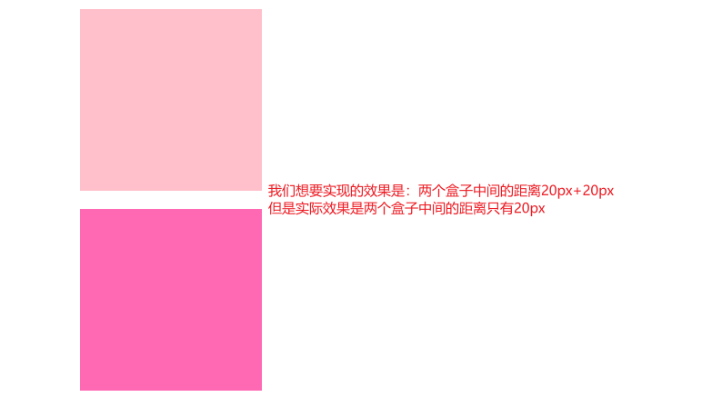

# 基于GitHub搭建个人网站

使用 Docsify 来搭建个人网站非常简单，特别适合用于文档展示或个人博客。下面是一步一步的指南来在 GitHub Pages 上部署 Docsify 网站：

1. **创建 GitHub 仓库**：首先，创建一个 GitHub 仓库，仓库名可以是你的用户名（例如，`<your-username>.github.io`）或者其他名字。这个仓库将用于托管你的网站。

2. **安装 Docsify**：在你的本地开发环境，安装 Docsify CLI（命令行工具），使用以下命令：

   ```
   npm i docsify-cli -g
   ```

3. **初始化 Docsify 项目**：在你的本地文件夹中，创建一个用于存储你的网站内容的目录。进入这个目录，然后运行以下命令来初始化 Docsify 项目：

   ```
   docsify init ./docs
   ```

   这将创建一个 `docs` 目录，其中包含一个 `index.html` 文件和一个 `README.md` 文件。

4. **编辑文档**：将你的文档内容编写在 `docs` 目录中的 Markdown 文件中。你可以创建子目录来组织文档。 Docsify 会自动将这些 Markdown 文件转换为网站页面。

5. **配置 Docsify**（可选）：你可以编辑 `docs/index.html` 文件以自定义网站的外观和配置。你可以设置标题、侧边栏、导航栏等等。

6. **预览你的网站**：在你的项目根目录下运行以下命令来预览你的网站：

   ```
   docsify serve docs
   ```

   这会启动一个本地服务器，并显示你的网站。你可以在浏览器中访问 `http://localhost:3000` 来查看你的网站。

7. **将项目推送到 GitHub**：一旦你满意了你的网站，将整个项目（包括 `docs` 目录）推送到你在步骤1中创建的 GitHub 仓库。

8. **启用 GitHub Pages**：进入你的 GitHub 仓库，点击 "Settings" 选项卡，然后滚动到 "GitHub Pages" 部分。在 "Source" 下拉菜单中，选择 "main branch"（或者你的默认分支），然后点击 "Save"。GitHub Pages 将会自动部署你的网站。

9. **访问你的网站**：一旦 GitHub Pages 部署完成，你可以在浏览器中访问 `https://<your-username>.github.io`（或者你的仓库名）来查看你的 Docsify 网站。

现在，你已经成功地使用 Docsify 搭建了个人网站，并将其部署在 GitHub Pages 上。你可以继续编辑和更新你的文档，并推送到 GitHub 仓库，你的网站会自动更新。

# Git
## 1、将项目推送到GitHub的步骤

- 1、初始化Git仓库（如果你的项目还没有关联Git仓库）：在你的项目目录中打开终端（命令行界面），运行以下命令来初始化Git仓库：

```powershell
git init
```

- 2、**将文件添加到暂存区**：运行以下命令将所有文件添加到 Git 的暂存区（暂存区是一个临时存储修改的地方）：

```powershell
git add .
```

这会将当前目录下的所有文件和文件夹添加到暂存区。

- 3、**提交到本地仓库**：运行以下命令将暂存区的文件提交到本地 Git 仓库：

```powershell
git commit -m "Initial commit"
```

这个命令会创建一个新的提交，提交信息为 "Initial commit"，你可以根据需要修改提交信息。

- 4、**关联远程 GitHub 仓库**：在 GitHub 上创建了仓库后，将本地 Git 仓库与远程 GitHub 仓库关联。在以下命令中，将 `<your-username>` 替换为你的 GitHub 用户名，`<your-repository>` 替换为你的仓库名：

```powershell
git remote add origin https://github.com/<your-username>/<your-repository>.git
```

- **推送到 GitHub**：运行以下命令将本地仓库的内容推送到 GitHub:

```powershell
git push -u origin main
```

> 如果你使用的是 Git 版本较老的仓库，可能需要将 `main` 替换为 `master`，这取决于你的默认分支名称。可以通过git branch查看本地分支列表以及当前所在的分支。

完成以上步骤后，你的项目就会被推送到 GitHub 仓库中了。在 GitHub 页面上刷新，你应该能够看到你的项目文件和文件夹。请确保你具有推送到仓库的权限。如果你的仓库是 private 的，你可能需要提供 GitHub 的用户名和密码或者使用个人访问令牌进行推送。

## 2、将修改后的代码推送到GitHub的步骤
- 1、添加修改的文件到暂存区：
```powershell
git add .
```
`这将会将所有修改的文件添加到暂存区`。如果你只想添加`特定文件`，可以使用 `git add 文件名 的方式`。
- 2、提交更改：
提交暂存区中的修改到本地仓库，可以使用如下命令：
```powershell
git commit -m "描述你的修改"
```
`将 "描述你的修改" 替换成对你所做修改的简要描述`。
- 3、推送到GitHub:
使用以下命令将本地的提交推送到你在GitHub上的远程仓库：
```powershell
git push origin 分支名
```
  将 "分支名" 替换成你要推送的分支的名称（通常是 main 或 master）。

  如果这是你第一次推送到GitHub，可能需要提供你的GitHub凭证来进行验证。

- 4、查看更新：

  刷新GitHub仓库页面，你应该能够看到刚刚推送的更新。

  现在，你的GitHub仓库应该包含了你所做的最新修改。

# HTML + CSS
## 1、盒模型

> 盒模型分为`标准盒模型和IE盒模型（怪异盒模型）`

- 标准盒模型：
  - width等于content的宽度
  - 总宽度:width+左右padding+左右border+margin左右
- IE盒模型：
  - 宽度width是整个盒子所占的宽度（content宽+左右padding+左右border）
  - 总宽度：width + margin左右
- CSS当中哪个属性可以定义计算一个元素的总宽度和总高度
  - box-sizing
  - 属性值为border-box时为IE盒模型（width 和 height 属性包括内容，内边距和边框，但不包括外边距）
  - 属性值为content-box时为标准盒模型（默认值，标准盒子模型。width 与 height 只包括内容的宽和高）

## 2、包含块

> - 子元素的宽高百分比是参考`包含块`来计算的，`不是参考父元素`：

- 1、如果元素的`position是relative或static（默认值）`，其包含块则是：`离他最近的块容器的内容区域（content area）`；
- 2、如果元素的`position是absolute`,则包含块为离它最近的`position值不为static`的祖先元素的`内边距区域`(加上padding区域)；
- 3、如果元素的`position是fixed,则包含块由视口建立`；
- 包含块不仅仅只是用来计算宽高的百分比，定位的top left 都是按照包含块来计算的；

## 3、BFC

​	BFC是`块级格式化上下文`（Block Formatting Context）的缩写。它是一个`独立的块级渲染区域`，`只有块级盒子参与`，该区域拥有一套渲染规则来约束块级盒子的布局，且与区域外部无关。

- **现象：一个盒子不设置height，当它的子元素都浮动时，无法撑起父元素，父元素没有高度，这个盒子就没有形成BFC**
- 如何给没有形成的盒子创建BFC：
  - 1、float的值不是none；
  - 2、position的值不是static或者relative
  - 3、display的值是inline-block、flex、或者inline-flex
  - 4、`overflow：hidden`【这种方式最好】

```js
<style>
    .father {
      border: 1px solid black;
      /* float: left; */
      /* position: absolute; */
      /* display: inline-block; */
      overflow: hidden;
    }

    .son {
      float: left;
      width: 300px;
      height: 300px;
      background-color: blue;
    }
</style>
<body>
  <div class="father">
    <div class="son"></div>
    <div class="son"></div>
    <div class="son"></div>
  </div>
</body>
```

- BFC的其他作用：
  - 1、`BFC可以取消盒子的margin塌陷`

```js
<style>
    .father {
      width: 200px;
      height: 300px;
      background-color: blueviolet;
    }

    .son {
      width: 100px;
      height: 100px;
      background-color: blue;
      margin-top: 20px; 
      /*我们想要的效果，子元素距离父元素顶部20px，但是实际效果是：子元素会带着父元素一起距离顶部有20px；
      BFC可以解决margin塌陷，所以我们可以让父盒子形成BFC加上overflow: hidden;*/
    }
  </style>
</head>

<body>
  <div class="father">
    <div class="son"></div>
  </div>
</body>
```

- 2、BFC可以阻止元素被浮动元素覆盖

```js
<style>
  .son {
    width: 200px;
    height: 200px;
    background-color: blue;
    float: left;
  }

.son-last {
  width: 200px;
  height: 300px;
  background-color: red;
  overflow: hidden;
  /* 实际情况：因为前面两个son元素设置了浮动，所以会覆盖掉son-last，所以son-last只会露出最下面的100px；
       因为BFC可以阻止元素被浮动元素覆盖，所以可以让被覆盖的盒子形成BFC，加上overflow: hidden; */
}
</style>
</head>

<body>
   <div>
  	<div class="son"></div>
		<div class="son"></div>
		<div class="son-last"></div>
	</div>
</body>
```


## 4、margin合并

- **相邻兄弟元素之间的下外边距和上外边距会合并**;
- **发生场景(块元素且上下结构)** ：
  - 外边距合并的设计初衷是为了` 解决段落之间垂直方向的空隙`，因此`只会发生在垂直方向`，不是水平方向；
  - `只发生在块级元素`；

```html
// d1和d2的外边距会合并，我们想设置两个盒子的外边距为40，但是只有20
<style>
  div {
    width: 200px;
    height: 200px;
  }

  .d1 {
    background-color: pink;
    margin-bottom: 20px;
  }

  .d2 {
    background-color: hotpink;
    margin-top: 20px;
  }
</style>
</head>

<body>
  <div class="d1"></div>
  <div class="d2"></div>
</body>
```

- 外边距计算：
  - 正数&&正数：取最大的数；50 20 取50
  - 负数&&负数：取绝对值最大的数；-50 -30 取-50
  - 正数&&负数：取相加的和；-50 30 取-20
- 解决方式：只给其中一个盒子设置margin即可；

## 5、margin塌陷

- 1、父子关系，`子元素设置了margin-top，但是看起来像是被父元素“抢走了”，就是父元素带着子元素一起往下移动了`；
- 解决方法：取消子级margin，**给父盒子加padding 、border-top或形成BFC**
  - 现在父元素只有内容，没有任何边界，可以给父元素设置padding或者border，但是这样改变了盒子的大小，不建议；
  - 让盒子形成BFC：overflow：hidden；触发BFC

```html
<style>
  .father {
    width: 200px;
    height: 300px;
    background-color: gray;
    /* 触发BFC */
    overflow：hidden；
  }

  div div {
    width: 100px;
    height: 100px;
  }

  .son1 {
    background-color: pink;
    margin-bottom: 50px;
    margin-top: 30px;
  }

  .son2 {
    background-color: hotpink;
  }
</style>

<body>
  <div class="father">
    <div class="son1"></div>
    <div class="son2"></div>
  </div>
</body>
```

- 2、平时若给子元素设置了高度可以撑开未设置高度的父元素，但是**子元素如果设置了float元素之后就会导致未设置高度的父元素消失**

```html
<style>
  .father {
    border: 10px solid #000;
    width: 300px;
    background-color: gray;
  }

  div div {
    float: left;
    width: 100px;
    height: 100px;
  }

  .son1 {
    background-color: pink;
  }

  .son2 {
    background-color: hotpink;
  }
</style>
<body>
  <div class="father">
    <div class="son1"></div>
    <div class="son2"></div>
  </div>
</body>
```

- 解决方式：1)、父盒子形成BFC：overflow：hidden；触发BFC

  ​			    2)、清除浮动：双伪元素法
```html
<style>
    .father {
      border: 10px solid #000;
      width: 300px;
      background-color: gray;
      /* overflow: hidden; */
    }

    /* 父盒子清除浮动 */
    .clearfix::before,
    .clearfix::after {
      content: '';
      display: block;
    }

    .clearfix::after {
      clear: both;
    }

    div div {
      float: left;
      width: 100px;
      height: 100px;
    }

    .son1 {
      background-color: pink;
    }

    .son2 {
      background-color: hotpink;
    }
</style>
<body>
  <div class="father clearfix">
    <div class="son1"></div>
    <div class="son2"></div>
  </div>
</body>
```

## 6、flex布局

- 弹性布局，任何一个容器都可以指定为flex布局
- 当父盒子设为flex布局以后，资源的float、clear、和vertical-align属性将失效
- 采用flex布局的元素称为flex容器，所有子元素自动称为容器成员，成为flex项目，简称项目

> 通过给父盒子添加flex属性，来控制子盒子的位置和排列方式

- **1：父项常见属性**

  - **flex-direction**：设置主轴(一般可以理解为X轴)的方向，属性值：
    - row：默认值 从左到右
    - column：从上到下
    - row-reverse：从右到左
    - column-reverse：从下到上


  - **justify-content：设置主轴上的子元素排列方式**
    - `flex-start：默认值从头部开始 如果主轴是x轴，则从左到右`
    - flex-end：从尾部开始排列
    - `center：在主轴居中对齐 (如果主轴是x轴则 水平居中）`
    - ``space-around：平分剩余空间`
    - `space-between：先两边贴边 再平分剩余空间 (重要)`
    - `space-evenly`：项目会平均地分布在行里，包括两端的间距。


  - **flex-wrap：设置子元素是否换行：wrap换行，nowrap不换行**
  - align-content：设置侧轴(一般可以理解为Y轴，交叉轴)上的子元素的排列方式（特指多行，单行情况下无效）
    - flex-start：多行在弹性容器的交叉轴的起始位置对齐。
    - flex-end：在侧轴的尾部开始排列
    - `center：在侧轴中间显示`
    - space-around：子项在侧轴平分剩余空间
    - space-between：子项在侧轴先分布在两头，再平分剩余空间
    - stretch：设置子项元素高度平分父元素高度


  - **align-items**：设置侧轴上的子元素排列方式（单行）:
    - `flex-start`：项目在交叉轴的起始位置对齐。
    - `flex-end`：项目在交叉轴的末尾位置对齐。
    - `center`：项目在交叉轴的中间位置对齐。
    - `baseline`：项目以基线对齐。
    - `stretch`：项目被拉伸以适应容器。

  > 单行找align-items 多行找align-content；

  - flex-flow：复合属性，相当于同时设置了flex-direction和flex-wrap

- **2：felx布局子项常见属性**

  - flex：定义子项目分配剩余空间，用flex来表示占多少份数。
  - align-slef：控制**子项自己**在侧轴的排列方式，align-self 属性允许单个项目有与其他项目不一样的对齐方式，可覆盖 align-items 属性。
    默认值为 auto，表示继承父元素的 align-items 属性，如没有父元素，则等同于 stretch。
  - order属性定义子项的排列顺序（前后顺序），数值越小，排列越靠前，默认为0.


## 7、圣杯布局

​	圣杯布局是一种网页布局技术，通常用于创建具有三个主要部分的网页布局：一个`固定宽度的左边和右边列`，以及`中间主要内容的自适应列`。主要内容区域会自动占据剩余的可用空间，使其在不同屏幕尺寸下能够自适应宽度。常见场景：搜索框

```css
.container {
  display: flex;
}

.main {
  flex: 1; // 剩下的空间独占
  height: 300px;
  background-color: green;
  margin-left: 20px;
  margin-right: 20px;
}

.left {
  width: 100px;
  height: 300px;
  background-color: red;
  order: -1 // order 属性控制在布局中的顺序，因为圣杯布局的html解构必须要保证main区域在第一位
}

.right {
  width: 200px;
  height: 300px;
  background-color: blue;
  order: 1
}

<body>
  <div class="container">
    <div class="main"></div>
    <div class="left"></div>
    <div class="right"></div>
  </div>
</body>
```

## 8、定位

- 相对定位relative：`不脱标，会占位，标签显示模式特点不变`；
- 绝对定位absolute：`脱标，不占位，标签显示模式改变，设置宽高生效（具备行内块元素的特点）；参照物找离自己最近的已经定位的祖先元素`；

```html
// 定位居中：子绝父相，子元素设置左，上移动50%，然后水平、垂直偏移50%；
<style>
  .fa {
    position: relative;
    border: 1px solid #000;
    width: 200px;
    height: 200px;
  }

  .son {
    position: absolute;
    width: 100px;
    height: 100px;
    top: 50%;
    left: 50%;
    transform: translate(-50%, -50%);
    background-color: pink;
  }
</style>

<body>
  <div class="fa">
    <div class="son"></div>
  </div>
</body>
```


## 9、透明度opacity

- background：rgba只能让背景变透明，opacity: 0.5;可以设置整个元素的透明度（包含背景和内容）

## 10、CSS练习题

```css
/*css 动画 从左到右 时间2S*/
div {
  position: relative;
  width: 100px;
  height: 100px;
  background-color: red;
  animation: move 2s linear;
}

@keyframes move {
  0% {
    left: 0px;
  }

  100% {
    /* calc(100% - 100px)，表示元素相对于父容器的左边距离是父容器宽度减去元素宽度。这样就可以实现从左到右的动画效果 */
    left: calc(100% - 100px);
  }
}
```
> 在CSS中，如果要应用动画效果，元素的定位必须是相对的，绝对的或固定的，而不能是静态的。这是因为动画本质上是基于元素的位置变化，而静态定位是不会引起元素位置的改变的。当你将元素的定位设置为相对定位时，它会在文档流中保留自己的空间，并可以使用 top、right、bottom 和 left 属性来调整其位置。因此，在你的代码中，当你给div元素设置了position: relative;时，它才能够响应left属性的变化，从而实现动画效果。这个属性告诉浏览器该元素的位置是相对于它在文档流中的初始位置而言的。


